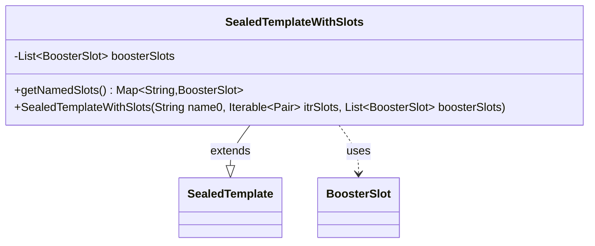

---
aliases:
  - SealedTemplateWithSlots
tags:
  - java/class
  - module/forge-core
  - pkg/forge/item
fqn: forge.item.SealedTemplateWithSlots
package: forge.item
module: forge-core
kind: Class
---

# SealedTemplateWithSlots

**Package:** `forge.item` &nbsp; **Module:** `forge-core` &nbsp; **Kind:** Class



## Relationships
**Extends:**
- [[forge.item.SealedTemplate|SealedTemplate]]
**Uses:**
- [[forge.item.BoosterSlot|BoosterSlot]]

## Source
`forge-core/src/main/java/forge/item/SealedTemplateWithSlots.java`

```java
package forge.item;

import org.apache.commons.lang3.tuple.Pair;

import java.util.List;
import java.util.Map;
import java.util.function.Function;
import java.util.stream.Collectors;

public class SealedTemplateWithSlots extends SealedTemplate {
    private final List<BoosterSlot> boosterSlots;

    public SealedTemplateWithSlots(String name0, Iterable<Pair<String, Integer>> itrSlots, List<BoosterSlot> boosterSlots) {
        super(name0, itrSlots);
        this.boosterSlots = boosterSlots;
    }

    public Map<String, BoosterSlot> getNamedSlots() {
        return boosterSlots.stream().collect(Collectors.toMap(BoosterSlot::getSlotName, Function.identity()));
    }
}
```
