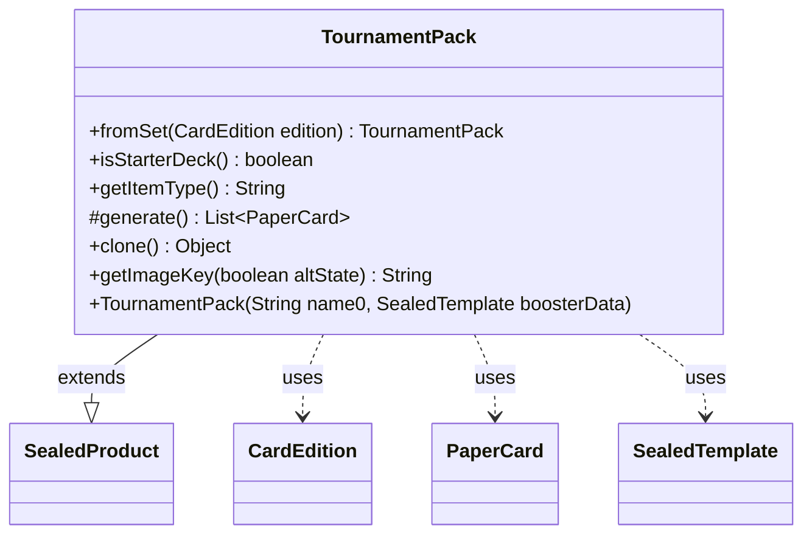

---
aliases:
  - TournamentPack
tags:
  - java/class
  - module/forge-core
  - pkg/forge/item
fqn: forge.item.TournamentPack
package: forge.item
module: forge-core
kind: Class
---

# TournamentPack

**Package:** `forge.item` &nbsp; **Module:** `forge-core` &nbsp; **Kind:** Class



## Relationships
**Extends:**
- [[forge.item.SealedProduct|SealedProduct]]
**Uses:**
- [[forge.card.CardEdition|CardEdition]]
- [[forge.item.PaperCard|PaperCard]]
- [[forge.item.SealedTemplate|SealedTemplate]]

## Design Description

TournamentPack models a Magic: the Gathering tournament-pack product, a fixed assortment of cards sold to bootstrap a player's collection. It extends SealedProduct, inheriting the named-contents and card-generation lifecycle while specializing the product type. The static `fromSet` factory builds an instance for a given CardEdition by looking up its SealedTemplate in StaticData's registry of tournament packs, and `generate()` delegates to BoosterGenerator to produce the actual List of PaperCards from those contents.

The class collaborates with SealedTemplate to describe slot composition and overrides several hooks to reflect product identity: `getItemType` and `isStarterDeck` distinguish a true tournament pack from a starter deck by inspecting the commons slot count (an acknowledged hack), while `getImageKey` and `clone` supply art lookup and copy semantics. The design intent is a thin, edition-driven specialization that defers heavy lifting to its supertype and the booster-generation machinery.

## Source
`forge-core/src/main/java/forge/item/TournamentPack.java`

```java
/*
 * Forge: Play Magic: the Gathering.
 * Copyright (C) 2011  Forge Team
 *
 * This program is free software: you can redistribute it and/or modify
 * it under the terms of the GNU General Public License as published by
 * the Free Software Foundation, either version 3 of the License, or
 * (at your option) any later version.
 * 
 * This program is distributed in the hope that it will be useful,
 * but WITHOUT ANY WARRANTY; without even the implied warranty of
 * MERCHANTABILITY or FITNESS FOR A PARTICULAR PURPOSE.  See the
 * GNU General Public License for more details.
 * 
 * You should have received a copy of the GNU General Public License
 * along with this program.  If not, see <http://www.gnu.org/licenses/>.
 */
package forge.item;

import forge.ImageKeys;
import forge.StaticData;
import forge.card.CardEdition;
import forge.item.generation.BoosterGenerator;

import java.util.List;

public class TournamentPack extends SealedProduct {

    public static TournamentPack fromSet(CardEdition edition) {
        SealedTemplate d = StaticData.instance().getTournamentPacks().get(edition.getCode());
        return new TournamentPack(edition.getName(), d);
    }

    public TournamentPack(final String name0, final SealedTemplate boosterData) {
        super(name0, boosterData);
    }

    public final boolean isStarterDeck() {
        return contents.getSlots().get(0).getRight() < 30; // hack - getting number of commons, they are first in list
    }

    @Override
    public final String getItemType() {
        return !isStarterDeck() ? "Tournament Pack" : "Starter Deck";
    }

    @Override
    protected List<PaperCard> generate() {
        return BoosterGenerator.getBoosterPack(this.contents);
    }

    @Override
    public final Object clone() {
        return new TournamentPack(name, contents);
    }

    @Override
    public String getImageKey(boolean altState) {
        return ImageKeys.TOURNAMENTPACK_PREFIX + getEdition();
    }
}
```

## Python
`forge/item/TournamentPack.py`

```python
from forge.ImageKeys import ImageKeys
from forge.StaticData import StaticData
from forge.card.CardEdition import CardEdition
from forge.item.generation.BoosterGenerator import BoosterGenerator
from forge.item.SealedProduct import SealedProduct
from forge.item.PaperCard import PaperCard
from forge.item.SealedTemplate import SealedTemplate


class TournamentPack(SealedProduct):

    @staticmethod
    def fromSet(edition: CardEdition) -> "TournamentPack":
        d = StaticData.instance().getTournamentPacks().get(edition.getCode())
        return TournamentPack(edition.getName(), d)

    def __init__(self, name0: str, boosterData: SealedTemplate):
        super().__init__(name0, boosterData)

    def isStarterDeck(self) -> bool:
        return self.contents.getSlots().get(0).getRight() < 30  # hack - getting number of commons, they are first in list

    def getItemType(self) -> str:
        return "Tournament Pack" if not self.isStarterDeck() else "Starter Deck"

    def generate(self) -> list[PaperCard]:
        return BoosterGenerator.getBoosterPack(self.contents)

    def clone(self) -> object:
        return TournamentPack(self.name, self.contents)

    def getImageKey(self, altState: bool) -> str:
        return ImageKeys.TOURNAMENTPACK_PREFIX + self.getEdition()
```
