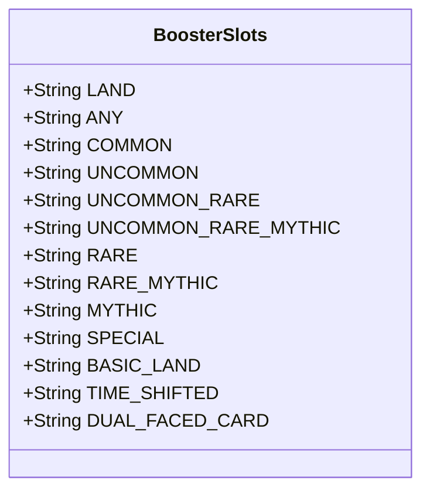

---
aliases:
  - BoosterSlots
tags:
  - java/class
  - module/forge-core
  - pkg/forge/item/generation
fqn: forge.item.generation.BoosterSlots
package: forge.item.generation
module: forge-core
kind: Class
---

# BoosterSlots

**Package:** `forge.item.generation` &nbsp; **Module:** `forge-core` &nbsp; **Kind:** Class



## Design Description

The BoosterSlots class serves as a centralized repository of string constants that name the distinct slot types used when generating Magic: The Gathering booster packs. Each public static final field maps a symbolic identifier (LAND, COMMON, RARE_MYTHIC, MYTHIC, SPECIAL, etc.) to the literal string token the booster-generation system recognizes, including special cases like basic lands, time-shifted cards, and dual-faced cards.

As a constants holder within the forge.item.generation package, it has no supertype or behavior of its own; it exists purely to be referenced by booster-configuration and pack-assembly logic. The design intent is to eliminate magic strings and prevent typos across the generation subsystem by funneling all slot-type names through one authoritative source, ensuring consistent matching between booster template definitions and the code that fills each slot.

## Source
`forge-core/src/main/java/forge/item/generation/BoosterSlots.java`

```java
package forge.item.generation;

public class BoosterSlots {
    public static final String LAND = "Land";
    public static final String ANY = "Any";
    public static final String COMMON = "Common";
    public static final String UNCOMMON = "Uncommon";
    public static final String UNCOMMON_RARE = "UncommonRare";
    public static final String UNCOMMON_RARE_MYTHIC = "UncommonRareMythic";
    public static final String RARE = "Rare";
    public static final String RARE_MYTHIC = "RareMythic";
    public static final String MYTHIC = "Mythic";
    public static final String SPECIAL = "Special";
    public static final String BASIC_LAND = "BasicLand";
    public static final String TIME_SHIFTED = "TimeShifted";
    public static final String DUAL_FACED_CARD = "dfc";
}
```

## Python
`forge/item/generation/BoosterSlots.py`

```python
class BoosterSlots:
    LAND = "Land"
    ANY = "Any"
    COMMON = "Common"
    UNCOMMON = "Uncommon"
    UNCOMMON_RARE = "UncommonRare"
    UNCOMMON_RARE_MYTHIC = "UncommonRareMythic"
    RARE = "Rare"
    RARE_MYTHIC = "RareMythic"
    MYTHIC = "Mythic"
    SPECIAL = "Special"
    BASIC_LAND = "BasicLand"
    TIME_SHIFTED = "TimeShifted"
    DUAL_FACED_CARD = "dfc"
```
