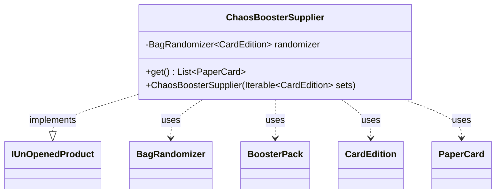

---
aliases:
  - ChaosBoosterSupplier
tags:
  - java/class
  - module/forge-core
  - pkg/forge/item/generation
fqn: forge.item.generation.ChaosBoosterSupplier
package: forge.item.generation
module: forge-core
kind: Class
---

# ChaosBoosterSupplier

**Package:** `forge.item.generation` &nbsp; **Module:** `forge-core` &nbsp; **Kind:** Class



## Relationships
**Implements:**
- [[forge.item.generation.IUnOpenedProduct|IUnOpenedProduct]]
**Uses:**
- [[forge.card.CardEdition|CardEdition]]
- [[forge.item.BoosterPack|BoosterPack]]
- [[forge.item.PaperCard|PaperCard]]
- [[forge.util.BagRandomizer|BagRandomizer]]

## Design Description

Booster Pack is a Chaos draft generator that supplies a single randomly chosen booster pack on each draw. Implementing the `IUnOpenedProduct` interface, it fulfills the contract's `get()` method to return a list of `PaperCard` objects, allowing it to be used interchangeably wherever an unopened product is expected.

To produce randomness, it delegates to a `BagRandomizer<CardEdition>` seeded with the supplied set of editions; the bag-style randomizer ensures editions are drawn without immediate repetition rather than via naive independent selection. Each `get()` call pulls the next `CardEdition`, constructs a `BoosterPack` from that edition's code and booster template, and returns the opened cards. The class holds no other state, keeping its responsibility narrowly focused on edition selection and pack delegation.

## Source
`forge-core/src/main/java/forge/item/generation/ChaosBoosterSupplier.java`

```java
package forge.item.generation;

import forge.card.CardEdition;
import forge.item.BoosterPack;
import forge.item.PaperCard;
import forge.util.BagRandomizer;

import java.util.List;

public class ChaosBoosterSupplier implements IUnOpenedProduct {
    private BagRandomizer<CardEdition> randomizer;

    public ChaosBoosterSupplier(Iterable<CardEdition> sets) throws IllegalArgumentException {
        randomizer = new BagRandomizer<>(sets);
    }

    @Override
    public List<PaperCard> get() {
        final CardEdition set = randomizer.getNextItem();
        final BoosterPack pack = new BoosterPack(set.getCode(), set.getBoosterTemplate());
        return pack.getCards();
    }
}
```

## Python
`forge/item/generation/ChaosBoosterSupplier.py`

```python
package = "forge.item.generation"

from forge.card.CardEdition import CardEdition
from forge.item.BoosterPack import BoosterPack
from forge.item.PaperCard import PaperCard
from forge.util.BagRandomizer import BagRandomizer
from forge.item.generation.IUnOpenedProduct import IUnOpenedProduct

from typing import Iterable, List


class ChaosBoosterSupplier(IUnOpenedProduct):
    def __init__(self, sets: Iterable[CardEdition]):
        self.randomizer: BagRandomizer[CardEdition] = BagRandomizer(sets)

    def get(self) -> List[PaperCard]:
        set = self.randomizer.getNextItem()
        pack = BoosterPack(set.getCode(), set.getBoosterTemplate())
        return pack.getCards()
```
