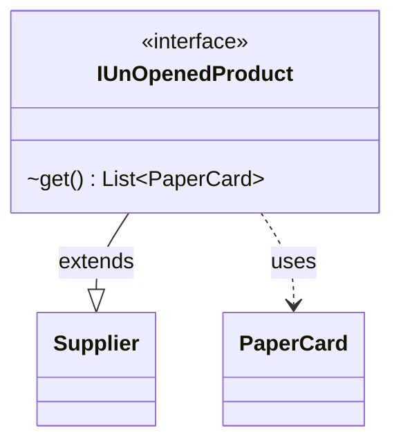

---
aliases:
  - IUnOpenedProduct
tags:
  - java/interface
  - module/forge-core
  - pkg/forge/item/generation
fqn: forge.item.generation.IUnOpenedProduct
package: forge.item.generation
module: forge-core
kind: Interface
---

# IUnOpenedProduct

**Package:** `forge.item.generation` &nbsp; **Module:** `forge-core` &nbsp; **Kind:** Interface



## Relationships
**Uses:**
- [[forge.item.PaperCard|PaperCard]]

## Source
`forge-core/src/main/java/forge/item/generation/IUnOpenedProduct.java`

```java
package forge.item.generation;

import forge.item.PaperCard;

import java.util.List;
import java.util.function.Supplier;

/**
 * TODO: Write javadoc for this type.
 *
 */

public interface IUnOpenedProduct extends Supplier<List<PaperCard>> {
    List<PaperCard> get();
}
```
