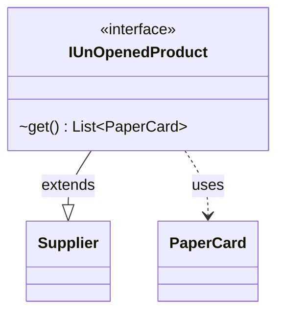

---
aliases:
  - IUnOpenedProduct
tags:
  - java/interface
  - module/forge-core
  - pkg/forge/item/generation
fqn: forge.item.generation.IUnOpenedProduct
package: forge.item.generation
module: forge-core
kind: Interface
---

# IUnOpenedProduct

**Package:** `forge.item.generation`   **Module:** `forge-core`   **Kind:** Interface



## Relationships
**Uses:**
- [[forge.item.PaperCard|PaperCard]]

## Design Description

The IUnOpenedProduct interface defines the contract for any source that produces a sealed, "unopened" Magic product—booster packs, tournament packs, or similar—yielding a concrete list of cards when opened. As a functional interface it extends `Supplier<List<PaperCard>>`, redeclaring `get()` to return a `List<PaperCard>`; this lets implementations be supplied as lambdas or method references while collaborating with the `PaperCard` type that models physical card instances. By specializing the generic `Supplier`, the interface narrows a general-purpose abstraction into a domain-specific role within the card-generation package, decoupling consumers that open products from the varied logic that assembles each product's contents.

## Source
`forge-core/src/main/java/forge/item/generation/IUnOpenedProduct.java`

```java
package forge.item.generation;

import forge.item.PaperCard;

import java.util.List;
import java.util.function.Supplier;

/**
 * TODO: Write javadoc for this type.
 *
 */

public interface IUnOpenedProduct extends Supplier<List<PaperCard>> {
    List<PaperCard> get();
}
```

## Python
`forge/item/generation/IUnOpenedProduct.py`

```python
from forge.item.PaperCard import PaperCard
from abc import ABC, abstractmethod


class IUnOpenedProduct(ABC):
    """TODO: Write javadoc for this type."""

    @abstractmethod
    def get(self) -> list[PaperCard]:
        ...
```
