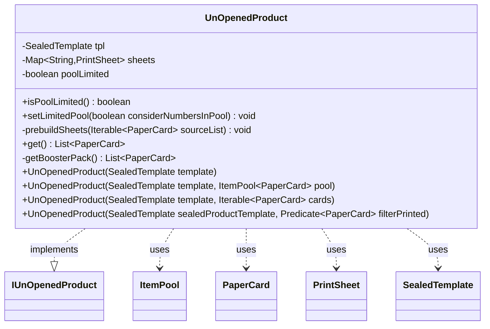

---
aliases:
  - UnOpenedProduct
tags:
  - java/class
  - module/forge-core
  - pkg/forge/item/generation
fqn: forge.item.generation.UnOpenedProduct
package: forge.item.generation
module: forge-core
kind: Class
---

# UnOpenedProduct

**Package:** `forge.item.generation`   **Module:** `forge-core`   **Kind:** Class



## Relationships
**Implements:**
- [[forge.item.generation.IUnOpenedProduct|IUnOpenedProduct]]
**Uses:**
- [[forge.card.PrintSheet|PrintSheet]]
- [[forge.item.PaperCard|PaperCard]]
- [[forge.item.SealedTemplate|SealedTemplate]]
- [[forge.util.ItemPool|ItemPool]]

## Design Description

UnOpenedProduct represents a sealed Magic product (booster pack) that can be opened to yield a list of cards. Implementing IUnOpenedProduct, it is constructed from a SealedTemplate describing the pack's slot structure, and optionally from a constrained card pool supplied as an ItemPool, a raw Iterable of PaperCards, or a Predicate filter applied to the global card database.

The design distinguishes two generation modes: when given a specific pool it eagerly prebuilds a PrintSheet per template slot (cached in a TreeMap and delegated to BoosterGenerator.makeSheet), whereas with no pool it defers entirely to BoosterGenerator using the default database, avoiding pointless caching. The optional pool-limited flag makes generation consume cards—removing drawn cards from their sheets and throwing IllegalStateException when a slot's sheet is depleted—supporting limited formats where the pool must not be reused.

## Source
`forge-core/src/main/java/forge/item/generation/UnOpenedProduct.java`

```java
package forge.item.generation;

import forge.StaticData;
import forge.card.PrintSheet;
import forge.item.PaperCard;
import forge.item.SealedTemplate;
import forge.util.ItemPool;
import forge.util.IterableUtil;
import org.apache.commons.lang3.tuple.Pair;

import java.util.ArrayList;
import java.util.List;
import java.util.Map;
import java.util.TreeMap;
import java.util.function.Predicate;


public class UnOpenedProduct implements IUnOpenedProduct {

    private final SealedTemplate tpl;
    private final Map<String, PrintSheet> sheets;
    private boolean poolLimited = false; // if true after successful generation cards are removed from printsheets.

    public final boolean isPoolLimited() {
        return poolLimited;
    }

    public final void setLimitedPool(boolean considerNumbersInPool) {
        this.poolLimited = considerNumbersInPool; // TODO: Add 0 to parameter's name.
    }

    // Means to select from all unique cards (from base game, ie. no schemes or avatars)
    public UnOpenedProduct(SealedTemplate template) {
        tpl = template;
        sheets = null;
    }

    // Invoke this constructor only if you are sure that the pool is not equal to default carddb
    public UnOpenedProduct(SealedTemplate template, ItemPool<PaperCard> pool) {
        this(template, pool.toFlatList());
    }

    public UnOpenedProduct(SealedTemplate template, Iterable<PaperCard> cards) {
        tpl = template;
        sheets = new TreeMap<>();
        prebuildSheets(cards);
    }

    public UnOpenedProduct(SealedTemplate sealedProductTemplate, Predicate<PaperCard> filterPrinted) {
        this(sealedProductTemplate, IterableUtil.filter(StaticData.instance().getCommonCards().getAllCards(), filterPrinted));
    }

    private void prebuildSheets(Iterable<PaperCard> sourceList) {
        for(Pair<String, Integer> cc : tpl.getSlots()) {
            sheets.put(cc.getKey(), BoosterGenerator.makeSheet(cc.getKey(), sourceList));
        }
    }

    @Override
    public List<PaperCard> get() {
        if (sheets != null) {
            return getBoosterPack();
        }

        return BoosterGenerator.getBoosterPack(tpl);
    }

    // If they request cards from an arbitrary pool, there's no use to cache printsheets.
    private List<PaperCard> getBoosterPack() {
        List<PaperCard> result = new ArrayList<>();
        for(Pair<String, Integer> slot : tpl.getSlots()) {
            PrintSheet ps = sheets.get(slot.getLeft());
            if(ps.isEmpty() &&  poolLimited ) {
                throw new IllegalStateException("The cardpool has been depleted and has no more cards for slot " + slot.getKey());
            }

            List<PaperCard> foundCards = ps.random(slot.getRight(), true);
            if(poolLimited)
                ps.removeAll(foundCards);
            result.addAll(foundCards);
        }
        return result;
    }

}
```

## Python
`forge/item/generation/UnOpenedProduct.py`

```python
from forge.StaticData import StaticData
from forge.card.PrintSheet import PrintSheet
from forge.item.PaperCard import PaperCard
from forge.item.SealedTemplate import SealedTemplate
from forge.util.ItemPool import ItemPool
from forge.util.IterableUtil import IterableUtil
from forge.item.generation.IUnOpenedProduct import IUnOpenedProduct
from forge.item.generation.BoosterGenerator import BoosterGenerator


_UNSET = object()


class UnOpenedProduct(IUnOpenedProduct):

    def __init__(self, template, second=_UNSET):
        self.tpl = None
        self.sheets = None
        self.poolLimited = False  # if true after successful generation cards are removed from printsheets.

        if second is _UNSET:
            # Means to select from all unique cards (from base game, ie. no schemes or avatars)
            self.tpl = template
            self.sheets = None
        elif isinstance(second, ItemPool):
            # Invoke this constructor only if you are sure that the pool is not equal to default carddb
            self._initFromCards(template, second.toFlatList())
        elif callable(second):
            self._initFromCards(template, IterableUtil.filter(StaticData.instance().getCommonCards().getAllCards(), second))
        else:
            self._initFromCards(template, second)

    def _initFromCards(self, template, cards):
        self.tpl = template
        self.sheets = {}
        self.prebuildSheets(cards)

    def isPoolLimited(self) -> bool:
        return self.poolLimited

    def setLimitedPool(self, considerNumbersInPool: bool) -> None:
        self.poolLimited = considerNumbersInPool  # TODO: Add 0 to parameter's name.

    def prebuildSheets(self, sourceList) -> None:
        for cc in self.tpl.getSlots():
            self.sheets[cc.getKey()] = BoosterGenerator.makeSheet(cc.getKey(), sourceList)

    def get(self) -> list[PaperCard]:
        if self.sheets is not None:
            return self.getBoosterPack()

        return BoosterGenerator.getBoosterPack(self.tpl)

    # If they request cards from an arbitrary pool, there's no use to cache printsheets.
    def getBoosterPack(self) -> list[PaperCard]:
        result = []
        for slot in self.tpl.getSlots():
            ps = self.sheets.get(slot.getLeft())
            if ps.isEmpty() and self.poolLimited:
                raise RuntimeError("The cardpool has been depleted and has no more cards for slot " + slot.getKey())

            foundCards = ps.random(slot.getRight(), True)
            if self.poolLimited:
                ps.removeAll(foundCards)
            result.extend(foundCards)
        return result
```
