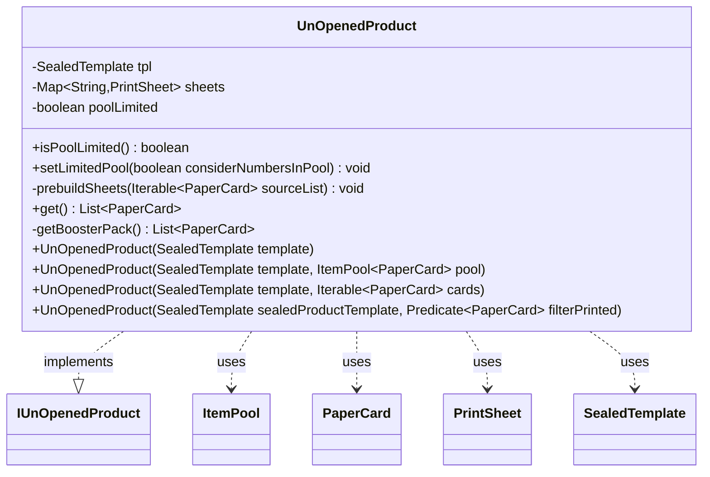

---
aliases:
  - UnOpenedProduct
tags:
  - java/class
  - module/forge-core
  - pkg/forge/item/generation
fqn: forge.item.generation.UnOpenedProduct
package: forge.item.generation
module: forge-core
kind: Class
---

# UnOpenedProduct

**Package:** `forge.item.generation` &nbsp; **Module:** `forge-core` &nbsp; **Kind:** Class



## Relationships
**Implements:**
- [[forge.item.generation.IUnOpenedProduct|IUnOpenedProduct]]
**Uses:**
- [[forge.card.PrintSheet|PrintSheet]]
- [[forge.item.PaperCard|PaperCard]]
- [[forge.item.SealedTemplate|SealedTemplate]]
- [[forge.util.ItemPool|ItemPool]]

## Source
`forge-core/src/main/java/forge/item/generation/UnOpenedProduct.java`

```java
package forge.item.generation;

import forge.StaticData;
import forge.card.PrintSheet;
import forge.item.PaperCard;
import forge.item.SealedTemplate;
import forge.util.ItemPool;
import forge.util.IterableUtil;
import org.apache.commons.lang3.tuple.Pair;

import java.util.ArrayList;
import java.util.List;
import java.util.Map;
import java.util.TreeMap;
import java.util.function.Predicate;


public class UnOpenedProduct implements IUnOpenedProduct {

    private final SealedTemplate tpl;
    private final Map<String, PrintSheet> sheets;
    private boolean poolLimited = false; // if true after successful generation cards are removed from printsheets.

    public final boolean isPoolLimited() {
        return poolLimited;
    }

    public final void setLimitedPool(boolean considerNumbersInPool) {
        this.poolLimited = considerNumbersInPool; // TODO: Add 0 to parameter's name.
    }

    // Means to select from all unique cards (from base game, ie. no schemes or avatars)
    public UnOpenedProduct(SealedTemplate template) {
        tpl = template;
        sheets = null;
    }

    // Invoke this constructor only if you are sure that the pool is not equal to default carddb
    public UnOpenedProduct(SealedTemplate template, ItemPool<PaperCard> pool) {
        this(template, pool.toFlatList());
    }

    public UnOpenedProduct(SealedTemplate template, Iterable<PaperCard> cards) {
        tpl = template;
        sheets = new TreeMap<>();
        prebuildSheets(cards);
    }

    public UnOpenedProduct(SealedTemplate sealedProductTemplate, Predicate<PaperCard> filterPrinted) {
        this(sealedProductTemplate, IterableUtil.filter(StaticData.instance().getCommonCards().getAllCards(), filterPrinted));
    }

    private void prebuildSheets(Iterable<PaperCard> sourceList) {
        for(Pair<String, Integer> cc : tpl.getSlots()) {
            sheets.put(cc.getKey(), BoosterGenerator.makeSheet(cc.getKey(), sourceList));
        }
    }

    @Override
    public List<PaperCard> get() {
        if (sheets != null) {
            return getBoosterPack();
        }

        return BoosterGenerator.getBoosterPack(tpl);
    }

    // If they request cards from an arbitrary pool, there's no use to cache printsheets.
    private List<PaperCard> getBoosterPack() {
        List<PaperCard> result = new ArrayList<>();
        for(Pair<String, Integer> slot : tpl.getSlots()) {
            PrintSheet ps = sheets.get(slot.getLeft());
            if(ps.isEmpty() &&  poolLimited ) {
                throw new IllegalStateException("The cardpool has been depleted and has no more cards for slot " + slot.getKey());
            }

            List<PaperCard> foundCards = ps.random(slot.getRight(), true);
            if(poolLimited)
                ps.removeAll(foundCards);
            result.addAll(foundCards);
        }
        return result;
    }

}
```
