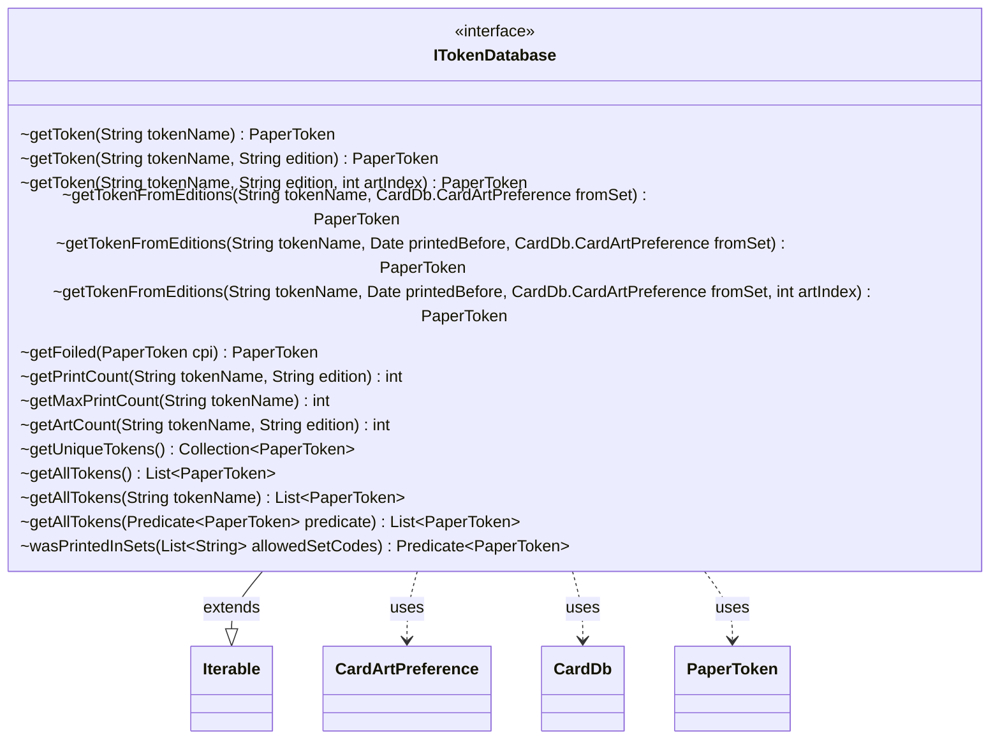

---
aliases:
  - ITokenDatabase
tags:
  - java/interface
  - module/forge-core
  - pkg/forge/token
fqn: forge.token.ITokenDatabase
package: forge.token
module: forge-core
kind: Interface
---

# ITokenDatabase

**Package:** `forge.token`   **Module:** `forge-core`   **Kind:** Interface



## Relationships
**Uses:**
- [[forge.card.CardDb|CardDb]]
- [[forge.card.CardDb.CardArtPreference|CardArtPreference]]
- [[forge.item.PaperToken|PaperToken]]

## Design Description

The ITokenDatabase interface defines the contract for a catalog of Magic: The Gathering token cards, exposing lookup, enumeration, and metadata operations over `PaperToken` instances. It provides overloaded `getToken` and `getTokenFromEditions` methods that resolve tokens by name, edition, art index, printing date, and art-preference policy, alongside accessors for print and art counts, foil variants, and filtered or unique token collections.

By extending `Iterable<PaperToken>`, it allows clients to traverse the full token catalog directly. It collaborates closely with `CardDb` and its `CardArtPreference` enum to mirror the card database's edition-selection semantics for tokens, and uses `Predicate<PaperToken>` for composable filtering—exposing `wasPrintedInSets` as a reusable predicate factory. The interface-only design decouples consumers from concrete storage, allowing alternative token-database implementations.

## Source
`forge-core/src/main/java/forge/token/ITokenDatabase.java`

```java
package forge.token;

import forge.card.CardDb;
import forge.item.PaperToken;

import java.util.Collection;
import java.util.Date;
import java.util.List;
import java.util.function.Predicate;

public interface ITokenDatabase extends Iterable<PaperToken> {
    PaperToken getToken(String tokenName);
    PaperToken getToken(String tokenName, String edition);
    PaperToken getToken(String tokenName, String edition, int artIndex);
    PaperToken getTokenFromEditions(String tokenName, CardDb.CardArtPreference fromSet);
    PaperToken getTokenFromEditions(String tokenName, Date printedBefore, CardDb.CardArtPreference fromSet);
    PaperToken getTokenFromEditions(String tokenName, Date printedBefore, CardDb.CardArtPreference fromSet, int artIndex);

    PaperToken getFoiled(PaperToken cpi);

    int getPrintCount(String tokenName, String edition);
    int getMaxPrintCount(String tokenName);

    int getArtCount(String tokenName, String edition);

    Collection<PaperToken> getUniqueTokens();
    List<PaperToken> getAllTokens();
    List<PaperToken> getAllTokens(String tokenName);
    List<PaperToken> getAllTokens(Predicate<PaperToken> predicate);

    Predicate<? super PaperToken> wasPrintedInSets(List<String> allowedSetCodes);
}
```

## Python
`forge/token/ITokenDatabase.py`

```python
from abc import ABC, abstractmethod
from datetime import datetime
from typing import Callable, Collection, Iterable, List

from forge.card.CardDb import CardDb
from forge.card.CardDb.CardArtPreference import CardArtPreference
from forge.item.PaperToken import PaperToken


class ITokenDatabase(Iterable, ABC):
    @abstractmethod
    def getToken(self, tokenName: str, edition: str = None, artIndex: int = None) -> PaperToken:
        ...

    @abstractmethod
    def getTokenFromEditions(self, tokenName: str, printedBefore: datetime = None,
                             fromSet: CardArtPreference = None, artIndex: int = None) -> PaperToken:
        ...

    @abstractmethod
    def getFoiled(self, cpi: PaperToken) -> PaperToken:
        ...

    @abstractmethod
    def getPrintCount(self, tokenName: str, edition: str) -> int:
        ...

    @abstractmethod
    def getMaxPrintCount(self, tokenName: str) -> int:
        ...

    @abstractmethod
    def getArtCount(self, tokenName: str, edition: str) -> int:
        ...

    @abstractmethod
    def getUniqueTokens(self) -> Collection[PaperToken]:
        ...

    @abstractmethod
    def getAllTokens(self, arg=None) -> List[PaperToken]:
        ...

    @abstractmethod
    def wasPrintedInSets(self, allowedSetCodes: List[str]) -> Callable[[PaperToken], bool]:
        ...
```
