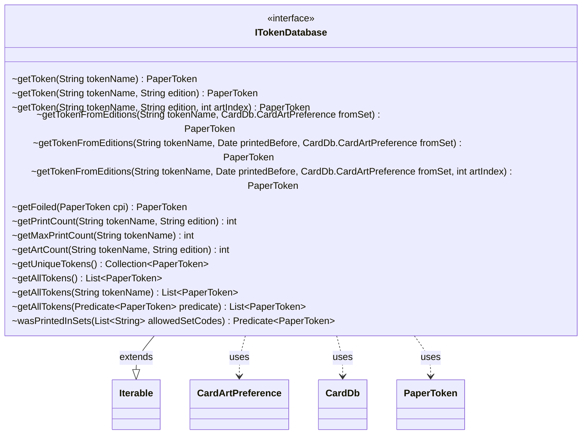

---
aliases:
  - ITokenDatabase
tags:
  - java/interface
  - module/forge-core
  - pkg/forge/token
fqn: forge.token.ITokenDatabase
package: forge.token
module: forge-core
kind: Interface
---

# ITokenDatabase

**Package:** `forge.token` &nbsp; **Module:** `forge-core` &nbsp; **Kind:** Interface



## Relationships
**Uses:**
- [[forge.card.CardDb|CardDb]]
- [[forge.card.CardDb.CardArtPreference|CardArtPreference]]
- [[forge.item.PaperToken|PaperToken]]

## Source
`forge-core/src/main/java/forge/token/ITokenDatabase.java`

```java
package forge.token;

import forge.card.CardDb;
import forge.item.PaperToken;

import java.util.Collection;
import java.util.Date;
import java.util.List;
import java.util.function.Predicate;

public interface ITokenDatabase extends Iterable<PaperToken> {
    PaperToken getToken(String tokenName);
    PaperToken getToken(String tokenName, String edition);
    PaperToken getToken(String tokenName, String edition, int artIndex);
    PaperToken getTokenFromEditions(String tokenName, CardDb.CardArtPreference fromSet);
    PaperToken getTokenFromEditions(String tokenName, Date printedBefore, CardDb.CardArtPreference fromSet);
    PaperToken getTokenFromEditions(String tokenName, Date printedBefore, CardDb.CardArtPreference fromSet, int artIndex);

    PaperToken getFoiled(PaperToken cpi);

    int getPrintCount(String tokenName, String edition);
    int getMaxPrintCount(String tokenName);

    int getArtCount(String tokenName, String edition);

    Collection<PaperToken> getUniqueTokens();
    List<PaperToken> getAllTokens();
    List<PaperToken> getAllTokens(String tokenName);
    List<PaperToken> getAllTokens(Predicate<PaperToken> predicate);

    Predicate<? super PaperToken> wasPrintedInSets(List<String> allowedSetCodes);
}
```
