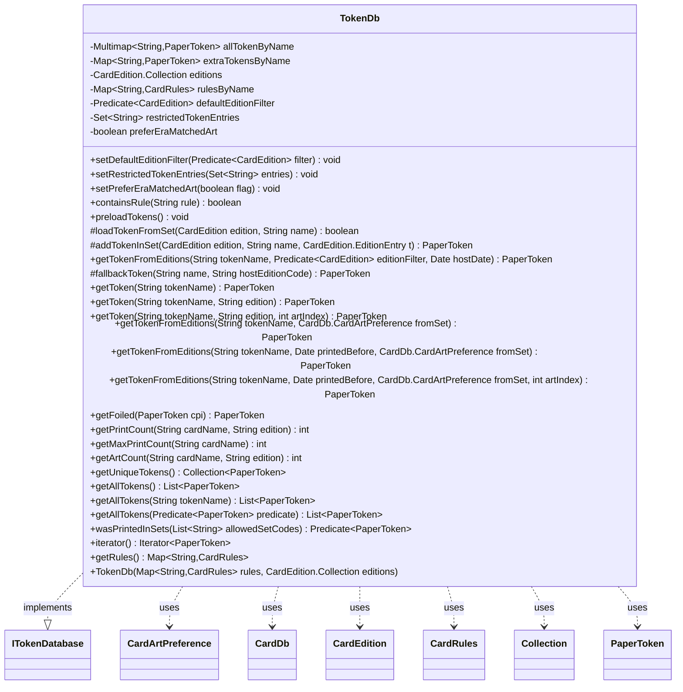

---
aliases:
  - TokenDb
tags:
  - java/class
  - module/forge-core
  - pkg/forge/token
fqn: forge.token.TokenDb
package: forge.token
module: forge-core
kind: Class
---

# TokenDb

**Package:** `forge.token` &nbsp; **Module:** `forge-core` &nbsp; **Kind:** Class



## Relationships
**Implements:**
- [[forge.token.ITokenDatabase|ITokenDatabase]]
**Uses:**
- [[forge.card.CardDb|CardDb]]
- [[forge.card.CardDb.CardArtPreference|CardArtPreference]]
- [[forge.card.CardEdition|CardEdition]]
- [[forge.card.CardEdition.Collection|Collection]]
- [[forge.card.CardRules|CardRules]]
- [[forge.item.PaperToken|PaperToken]]

## Design Description

TokenDb is the forge-core registry that maps token script names to their printable `PaperToken` instances, implementing the `ITokenDatabase` interface to serve tokens by name, edition, and art index. It owns a `HashMultimap` of tokens keyed by `name_setcode`, lazily loading entries from each `CardEdition` and resolving their game behavior through the injected `CardRules` map, while caching synthesized fallbacks in a case-insensitive `extraTokensByName` map. It collaborates with `CardEdition.Collection` to enumerate printings and borrows `CardDb.CardArtPreference` semantics in its interface contract.

The design centers on flexible art selection: a pluggable `defaultEditionFilter`, a `restrictedTokenEntries` blocklist, and an optional era-matching mode that picks the legal edition whose release date is closest to the host card's, otherwise choosing randomly among legal printings. Lookups degrade gracefully from exact edition match, to filtered fallback, to an on-the-fly constructed token. Many `ITokenDatabase` methods (print counts, foiling, unique listings) are stubbed to return null/zero, indicating a partially realized interface where only name/edition resolution is fully implemented.

## Source
`forge-core/src/main/java/forge/token/TokenDb.java`

```java
package forge.token;

import com.google.common.collect.HashMultimap;
import com.google.common.collect.Iterables;
import com.google.common.collect.Maps;
import com.google.common.collect.Multimap;

import forge.card.CardDb;
import forge.card.CardEdition;
import forge.card.CardRules;
import forge.item.IPaperCard;
import forge.item.PaperToken;
import forge.util.Aggregates;

import java.util.*;
import java.util.function.Predicate;

public class TokenDb implements ITokenDatabase {
    // Expected naming convention of scripts
    // token_name
    // minor_demon
    // marit_lage
    // gold

    // colors_power_toughness_cardtypes_sub_types_keywords
    // Some examples:
    // c_3_3_a_phyrexian_wurm_lifelink
    // w_2_2_knight_first_strike

    // The image names should be the same as the script name + _set
    // If that isn't found, consider falling back to the original token
    private final Multimap<String, PaperToken> allTokenByName = HashMultimap.create();
    private final Map<String, PaperToken> extraTokensByName = Maps.newTreeMap(String.CASE_INSENSITIVE_ORDER);

    private final CardEdition.Collection editions;
    private final Map<String, CardRules> rulesByName;

    // null preserves first-alphabetical match; adventure pushes a filter here.
    private Predicate<CardEdition> defaultEditionFilter = null;
    // Blocklist of "{EDITION_CODE}/{tokenScript}" pairs; skipped in fallback.
    private Set<String> restrictedTokenEntries = Collections.emptySet();
    // When true and a host-card date is known, pick the legal edition whose
    // release date is closest to the host's, so eras match (e.g. a 1999 card
    // gets a 1998 Unglued token rather than a 2002 Player Rewards print).
    private boolean preferEraMatchedArt = false;

    public TokenDb(Map<String, CardRules> rules, CardEdition.Collection editions) {
        this.rulesByName = rules;
        this.editions = editions;
    }

    public void setDefaultEditionFilter(Predicate<CardEdition> filter) {
        this.defaultEditionFilter = filter;
    }

    public void setRestrictedTokenEntries(Set<String> entries) {
        this.restrictedTokenEntries = entries != null ? entries : Collections.emptySet();
    }

    public void setPreferEraMatchedArt(boolean flag) {
        this.preferEraMatchedArt = flag;
    }

    public boolean containsRule(String rule) {
        return this.rulesByName.containsKey(rule);
    }

    public void preloadTokens() {
        for (CardEdition edition : this.editions) {
            for (Map.Entry<String, Collection<CardEdition.EditionEntry>> inSet : edition.getTokens().asMap().entrySet()) {
                String name = inSet.getKey();
                String fullName = String.format("%s_%s", name, edition.getCode().toLowerCase());
                for (CardEdition.EditionEntry t : inSet.getValue()) {
                    allTokenByName.put(fullName, addTokenInSet(edition, name, t));
                }
            }
        }
    }

    protected boolean loadTokenFromSet(CardEdition edition, String name) {
        String fullName = String.format("%s_%s", name, edition.getCode().toLowerCase());
        if (allTokenByName.containsKey(fullName)) {
            return true;
        }
        if (!edition.getTokens().containsKey(name)) {
            return false;
        }

        for (CardEdition.EditionEntry t : edition.getTokens().get(name)) {
            allTokenByName.put(fullName, addTokenInSet(edition, name, t));
        }
        return true;
    }

    protected PaperToken addTokenInSet(CardEdition edition, String name, CardEdition.EditionEntry t) {
        CardRules rules;
        if (rulesByName.containsKey(name)) {
            rules = rulesByName.get(name);
        } else if ("w_2_2_spirit".equals(name) || "w_3_3_spirit".equals(name)) { // Hotfix for Endure Token
            rules = rulesByName.get("w_x_x_spirit");
        } else {
            throw new RuntimeException("wrong token name:" + name);
        }
        return new PaperToken(rules, edition, name, t.collectorNumber(), t.artistName());
    }

    // Null filter: historical first-alphabetical match. Non-null: random among
    // editions that register the token and pass the filter, or null if none.
    // When preferEraMatchedArt is on and hostDate != null, instead picks the
    // legal edition whose release date is closest to hostDate.
    public PaperToken getTokenFromEditions(String tokenName, Predicate<CardEdition> editionFilter, Date hostDate) {
        if (editionFilter == null) {
            for (CardEdition edition : this.editions) {
                if (restrictedTokenEntries.contains(edition.getCode() + "/" + tokenName)) continue;
                String fullName = String.format("%s_%s", tokenName, edition.getCode().toLowerCase());
                if (loadTokenFromSet(edition, tokenName)) {
                    return Aggregates.random(allTokenByName.get(fullName));
                }
            }
            return null;
        }
        List<CardEdition> legal = new ArrayList<>();
        for (CardEdition edition : this.editions) {
            if (!loadTokenFromSet(edition, tokenName)) continue;
            if (restrictedTokenEntries.contains(edition.getCode() + "/" + tokenName)) continue;
            if (editionFilter.test(edition)) legal.add(edition);
        }
        if (legal.isEmpty()) return null;
        CardEdition pick;
        if (preferEraMatchedArt && hostDate != null) {
            pick = legal.get(0);
            long best = Math.abs(pick.getDate().getTime() - hostDate.getTime());
            for (int i = 1; i < legal.size(); i++) {
                long delta = Math.abs(legal.get(i).getDate().getTime() - hostDate.getTime());
                if (delta < best) {
                    best = delta;
                    pick = legal.get(i);
                }
            }
        } else {
            pick = Aggregates.random(legal);
        }
        String fullName = String.format("%s_%s", tokenName, pick.getCode().toLowerCase());
        return Aggregates.random(allTokenByName.get(fullName));
    }

    protected PaperToken fallbackToken(String name, String hostEditionCode) {
        Date hostDate = null;
        if (hostEditionCode != null) {
            CardEdition host = this.editions.get(hostEditionCode);
            if (host != null) hostDate = host.getDate();
        }
        return getTokenFromEditions(name, defaultEditionFilter, hostDate);
    }

    @Override
    public PaperToken getToken(String tokenName) {
        return getToken(tokenName, CardEdition.UNKNOWN.getCode());
    }

    @Override
    public PaperToken getToken(String tokenName, String edition) {
        return getToken(tokenName, edition, -1);
    }

    @Override
    public PaperToken getToken(String tokenName, String edition, int artIndex) {
        CardEdition realEdition = editions.getEditionByCodeOrThrow(edition);
        String fullName = String.format("%s_%s", tokenName, realEdition.getCode().toLowerCase());

        // Token exists in edition, return token at artIndex or a random one.
        if (loadTokenFromSet(realEdition, tokenName)) {
            Collection<PaperToken> collection = allTokenByName.get(fullName);

            if (artIndex < 1 || artIndex > collection.size()) {
                return Aggregates.random(collection);
            }

            return Iterables.get(collection, artIndex - 1);
        }
        PaperToken fallback = this.fallbackToken(tokenName, edition);
        if (fallback != null) {
            return fallback;
        }

        CardRules cr = rulesByName.get(tokenName);
        if (!extraTokensByName.containsKey(fullName) && cr != null) {
            try {
                PaperToken pt = new PaperToken(cr, realEdition, tokenName, "", IPaperCard.NO_ARTIST_NAME);
                extraTokensByName.put(fullName, pt);
                return pt;
            } catch(Exception e) {
                throw e;
            }
        }

        return extraTokensByName.get(fullName);
    }

    @Override
    public PaperToken getTokenFromEditions(String tokenName, CardDb.CardArtPreference fromSet) {
        return null;
    }

    @Override
    public PaperToken getTokenFromEditions(String tokenName, Date printedBefore, CardDb.CardArtPreference fromSet) {
        return null;
    }

    @Override
    public PaperToken getTokenFromEditions(String tokenName, Date printedBefore, CardDb.CardArtPreference fromSet, int artIndex) {
        return null;
    }

    @Override
    public PaperToken getFoiled(PaperToken cpi) {
        return null;
    }

    @Override
    public int getPrintCount(String cardName, String edition) {
        return 0;
    }

    @Override
    public int getMaxPrintCount(String cardName) {
        return 0;
    }

    @Override
    public int getArtCount(String cardName, String edition) {
        return 0;
    }

    @Override
    public Collection<PaperToken> getUniqueTokens() {
        return null;
    }

    @Override
    public List<PaperToken> getAllTokens() {
        return new ArrayList<>(allTokenByName.values());
    }

    @Override
    public List<PaperToken> getAllTokens(String tokenName) {
        return null;
    }

    @Override
    public List<PaperToken> getAllTokens(Predicate<PaperToken> predicate) {
        return null;
    }

    @Override
    public Predicate<? super PaperToken> wasPrintedInSets(List<String> allowedSetCodes) {
        return null;
    }

    @Override
    public Iterator<PaperToken> iterator() {
        return allTokenByName.values().iterator();
    }

    public Map<String, CardRules> getRules() { return this.rulesByName;}
}
```

## Python
`forge/token/TokenDb.py`

```python
from forge.token.ITokenDatabase import ITokenDatabase
from forge.card.CardDb import CardDb
from forge.card.CardEdition import CardEdition
from forge.card.CardRules import CardRules
from forge.item.IPaperCard import IPaperCard
from forge.item.PaperToken import PaperToken
from forge.util.Aggregates import Aggregates

from typing import Callable, Collection, Iterator, List
from datetime import datetime


class TokenDb(ITokenDatabase):
    # Expected naming convention of scripts
    # token_name
    # minor_demon
    # marit_lage
    # gold

    # colors_power_toughness_cardtypes_sub_types_keywords
    # Some examples:
    # c_3_3_a_phyrexian_wurm_lifelink
    # w_2_2_knight_first_strike

    # The image names should be the same as the script name + _set
    # If that isn't found, consider falling back to the original token

    def __init__(self, rules: dict[str, CardRules], editions: "CardEdition.Collection"):
        self.allTokenByName: dict[str, list[PaperToken]] = {}
        # case-insensitive ordered map of synthesized fallbacks
        self.extraTokensByName: dict[str, PaperToken] = {}

        self.rulesByName = rules
        self.editions = editions

        # null preserves first-alphabetical match; adventure pushes a filter here.
        self.defaultEditionFilter: Callable[[CardEdition], bool] = None
        # Blocklist of "{EDITION_CODE}/{tokenScript}" pairs; skipped in fallback.
        self.restrictedTokenEntries: set[str] = set()
        # When true and a host-card date is known, pick the legal edition whose
        # release date is closest to the host's, so eras match (e.g. a 1999 card
        # gets a 1998 Unglued token rather than a 2002 Player Rewards print).
        self.preferEraMatchedArt = False

    def setDefaultEditionFilter(self, filter: Callable[[CardEdition], bool]) -> None:
        self.defaultEditionFilter = filter

    def setRestrictedTokenEntries(self, entries: set[str]) -> None:
        self.restrictedTokenEntries = entries if entries is not None else set()

    def setPreferEraMatchedArt(self, flag: bool) -> None:
        self.preferEraMatchedArt = flag

    def containsRule(self, rule: str) -> bool:
        return rule in self.rulesByName

    def preloadTokens(self) -> None:
        for edition in self.editions:
            for name, values in edition.getTokens().asMap().items():
                fullName = "%s_%s" % (name, edition.getCode().lower())
                for t in values:
                    self.allTokenByName.setdefault(fullName, []).append(self.addTokenInSet(edition, name, t))

    def loadTokenFromSet(self, edition: CardEdition, name: str) -> bool:
        fullName = "%s_%s" % (name, edition.getCode().lower())
        if fullName in self.allTokenByName:
            return True
        if not edition.getTokens().containsKey(name):
            return False

        for t in edition.getTokens().get(name):
            self.allTokenByName.setdefault(fullName, []).append(self.addTokenInSet(edition, name, t))
        return True

    def addTokenInSet(self, edition: CardEdition, name: str, t: "CardEdition.EditionEntry") -> PaperToken:
        if name in self.rulesByName:
            rules = self.rulesByName[name]
        elif name == "w_2_2_spirit" or name == "w_3_3_spirit":  # Hotfix for Endure Token
            rules = self.rulesByName.get("w_x_x_spirit")
        else:
            raise RuntimeError("wrong token name:" + name)
        return PaperToken(rules, edition, name, t.collectorNumber(), t.artistName())

    # Null filter: historical first-alphabetical match. Non-null: random among
    # editions that register the token and pass the filter, or null if none.
    # When preferEraMatchedArt is on and hostDate != null, instead picks the
    # legal edition whose release date is closest to hostDate.
    def getTokenFromEditions(self, tokenName: str, editionFilter: Callable[[CardEdition], bool], hostDate: datetime) -> PaperToken:
        if editionFilter is None:
            for edition in self.editions:
                if (edition.getCode() + "/" + tokenName) in self.restrictedTokenEntries:
                    continue
                fullName = "%s_%s" % (tokenName, edition.getCode().lower())
                if self.loadTokenFromSet(edition, tokenName):
                    return Aggregates.random(self.allTokenByName.get(fullName))
            return None
        legal: list[CardEdition] = []
        for edition in self.editions:
            if not self.loadTokenFromSet(edition, tokenName):
                continue
            if (edition.getCode() + "/" + tokenName) in self.restrictedTokenEntries:
                continue
            if editionFilter(edition):
                legal.append(edition)
        if not legal:
            return None
        if self.preferEraMatchedArt and hostDate is not None:
            pick = legal[0]
            best = abs(pick.getDate().getTime() - hostDate.getTime())
            for i in range(1, len(legal)):
                delta = abs(legal[i].getDate().getTime() - hostDate.getTime())
                if delta < best:
                    best = delta
                    pick = legal[i]
        else:
            pick = Aggregates.random(legal)
        fullName = "%s_%s" % (tokenName, pick.getCode().lower())
        return Aggregates.random(self.allTokenByName.get(fullName))

    def fallbackToken(self, name: str, hostEditionCode: str) -> PaperToken:
        hostDate = None
        if hostEditionCode is not None:
            host = self.editions.get(hostEditionCode)
            if host is not None:
                hostDate = host.getDate()
        return self.getTokenFromEditions(name, self.defaultEditionFilter, hostDate)

    def getToken(self, tokenName: str, edition: str = None, artIndex: int = None) -> PaperToken:
        if edition is None:
            return self.getToken(tokenName, CardEdition.UNKNOWN.getCode())
        if artIndex is None:
            return self.getToken(tokenName, edition, -1)

        realEdition = self.editions.getEditionByCodeOrThrow(edition)
        fullName = "%s_%s" % (tokenName, realEdition.getCode().lower())

        # Token exists in edition, return token at artIndex or a random one.
        if self.loadTokenFromSet(realEdition, tokenName):
            collection = self.allTokenByName.get(fullName)

            if artIndex < 1 or artIndex > len(collection):
                return Aggregates.random(collection)

            return collection[artIndex - 1]
        fallback = self.fallbackToken(tokenName, edition)
        if fallback is not None:
            return fallback

        cr = self.rulesByName.get(tokenName)
        if fullName not in self.extraTokensByName and cr is not None:
            try:
                pt = PaperToken(cr, realEdition, tokenName, "", IPaperCard.NO_ARTIST_NAME)
                self.extraTokensByName[fullName] = pt
                return pt
            except Exception as e:
                raise e

        return self.extraTokensByName.get(fullName)

    def getTokenFromEditions(self, tokenName: str, fromSet: "CardDb.CardArtPreference") -> PaperToken:
        return None

    def getTokenFromEditions(self, tokenName: str, printedBefore: datetime, fromSet: "CardDb.CardArtPreference") -> PaperToken:
        return None

    def getTokenFromEditions(self, tokenName: str, printedBefore: datetime, fromSet: "CardDb.CardArtPreference", artIndex: int) -> PaperToken:
        return None

    def getFoiled(self, cpi: PaperToken) -> PaperToken:
        return None

    def getPrintCount(self, cardName: str, edition: str) -> int:
        return 0

    def getMaxPrintCount(self, cardName: str) -> int:
        return 0

    def getArtCount(self, cardName: str, edition: str) -> int:
        return 0

    def getUniqueTokens(self) -> Collection[PaperToken]:
        return None

    def getAllTokens(self, arg=None) -> List[PaperToken]:
        if arg is None:
            result: list[PaperToken] = []
            for values in self.allTokenByName.values():
                result.extend(values)
            return result
        # getAllTokens(String tokenName) and getAllTokens(Predicate<PaperToken>) both stubbed
        return None

    def wasPrintedInSets(self, allowedSetCodes: list[str]) -> Callable[[PaperToken], bool]:
        return None

    def iterator(self) -> Iterator[PaperToken]:
        result: list[PaperToken] = []
        for values in self.allTokenByName.values():
            result.extend(values)
        return iter(result)

    def getRules(self) -> dict[str, CardRules]:
        return self.rulesByName
```
