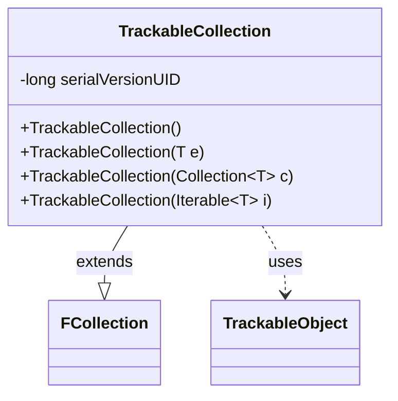

---
aliases:
  - TrackableCollection
tags:
  - java/class
  - module/forge-game
  - pkg/forge/trackable
fqn: forge.trackable.TrackableCollection
package: forge.trackable
module: forge-game
kind: Class
---

# TrackableCollection

**Package:** `forge.trackable` &nbsp; **Module:** `forge-game` &nbsp; **Kind:** Class



## Relationships
**Extends:**
- [[forge.util.collect.FCollection|FCollection]]
**Uses:**
- [[forge.trackable.TrackableObject|TrackableObject]]

## Source
`forge-game/src/main/java/forge/trackable/TrackableCollection.java`

```java
package forge.trackable;

import java.util.Collection;

import forge.util.collect.FCollection;

public class TrackableCollection<T extends TrackableObject> extends FCollection<T> {
    private static final long serialVersionUID = 1528674215758232314L;

    public TrackableCollection() {
    }
    public TrackableCollection(T e) {
        super(e);
    }
    public TrackableCollection(Collection<T> c) {
        super(c);
    }
    public TrackableCollection(Iterable<T> i) {
        super(i);
    }
}
```
