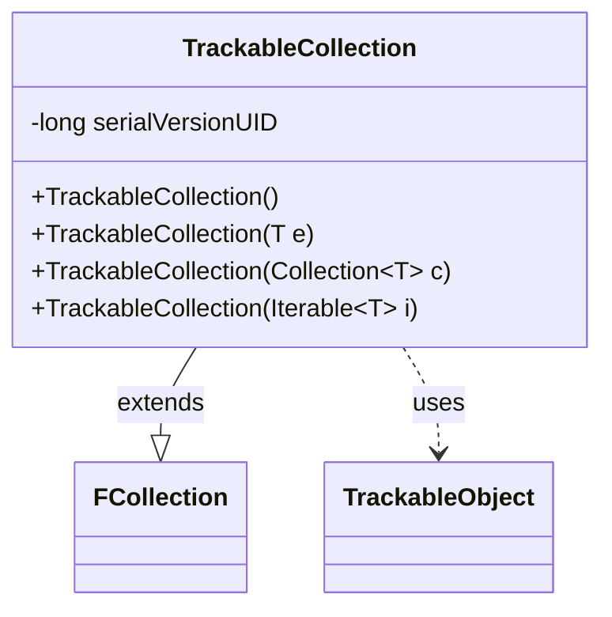

---
aliases:
  - TrackableCollection
tags:
  - java/class
  - module/forge-game
  - pkg/forge/trackable
fqn: forge.trackable.TrackableCollection
package: forge.trackable
module: forge-game
kind: Class
---

# TrackableCollection

**Package:** `forge.trackable` &nbsp; **Module:** `forge-game` &nbsp; **Kind:** Class



## Relationships
**Extends:**
- [[forge.util.collect.FCollection|FCollection]]
**Uses:**
- [[forge.trackable.TrackableObject|TrackableObject]]

## Design Description

TrackableCollection is a thin, type-parameterized list specialization that holds elements bound to the engine's change-tracking infrastructure, constraining its members to subtypes of TrackableObject. By extending FCollection, it inherits Forge's ordered, set-backed collection semantics (combining list ordering with set-like uniqueness) and contributes no behavior of its own beyond the type bound and a set of pass-through constructors.

Its design intent is deliberately minimal: the constructors simply delegate to the FCollection superclass for the empty, single-element, Collection, and Iterable cases, while the generic bound `<T extends TrackableObject>` is the class's real contribution. This guarantees at compile time that any collection so typed contains only trackable game objects, letting the tracking layer manage and serialize groups of such objects uniformly without redefining collection mechanics.

## Source
`forge-game/src/main/java/forge/trackable/TrackableCollection.java`

```java
package forge.trackable;

import java.util.Collection;

import forge.util.collect.FCollection;

public class TrackableCollection<T extends TrackableObject> extends FCollection<T> {
    private static final long serialVersionUID = 1528674215758232314L;

    public TrackableCollection() {
    }
    public TrackableCollection(T e) {
        super(e);
    }
    public TrackableCollection(Collection<T> c) {
        super(c);
    }
    public TrackableCollection(Iterable<T> i) {
        super(i);
    }
}
```

## Python
`forge/trackable/TrackableCollection.py`

```python
from typing import Collection, Iterable, Optional, TypeVar

from forge.util.collect.FCollection import FCollection
from forge.trackable.TrackableObject import TrackableObject

T = TypeVar("T", bound=TrackableObject)


class TrackableCollection(FCollection[T]):
    serialVersionUID = 1528674215758232314

    def __init__(self, arg=None):
        if arg is None:
            super().__init__()
        elif isinstance(arg, TrackableObject):
            super().__init__(arg)
        elif isinstance(arg, Collection):
            super().__init__(arg)
        elif isinstance(arg, Iterable):
            super().__init__(arg)
        else:
            super().__init__(arg)
```
