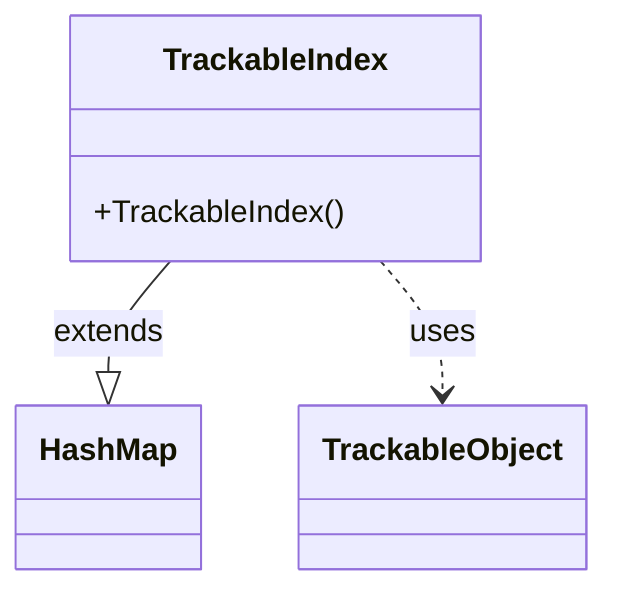

---
aliases:
  - TrackableIndex
tags:
  - java/class
  - module/forge-game
  - pkg/forge/trackable
fqn: forge.trackable.TrackableIndex
package: forge.trackable
module: forge-game
kind: Class
---

# TrackableIndex

**Package:** `forge.trackable` &nbsp; **Module:** `forge-game` &nbsp; **Kind:** Class



## Relationships
**Uses:**
- [[forge.trackable.TrackableObject|TrackableObject]]

## Source
`forge-game/src/main/java/forge/trackable/TrackableIndex.java`

```java
package forge.trackable;

import java.util.HashMap;

@SuppressWarnings("serial")
public class TrackableIndex<T extends TrackableObject> extends HashMap<Integer, T> {
    public TrackableIndex() {
    }
}
```
