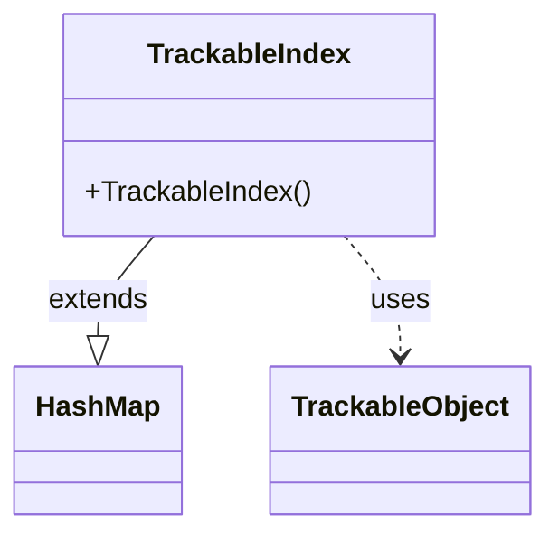

---
aliases:
  - TrackableIndex
tags:
  - java/class
  - module/forge-game
  - pkg/forge/trackable
fqn: forge.trackable.TrackableIndex
package: forge.trackable
module: forge-game
kind: Class
---

# TrackableIndex

**Package:** `forge.trackable`   **Module:** `forge-game`   **Kind:** Class



## Relationships
**Uses:**
- [[forge.trackable.TrackableObject|TrackableObject]]

## Design Description

TrackableIndex is a thin, type-safe specialization of `HashMap<Integer, T>` that maps integer identifiers to tracked game objects within Forge's `forge.trackable` framework. Its generic parameter is bound to `TrackableObject` subtypes, so it serves as a lookup index keyed by each object's integer id, letting the trackable system resolve and retrieve game entities by reference id.

Rather than adding behavior, the class exists to give that id-to-object mapping a distinct, named type—improving readability and enabling type-specific collection handling while inheriting all map operations from `HashMap`. The empty constructor and `@SuppressWarnings("serial")` annotation signal a deliberately minimal, serialization-tolerant container whose only design intent is to constrain values to `TrackableObject` instances collaborating with the broader trackable infrastructure.

## Source
`forge-game/src/main/java/forge/trackable/TrackableIndex.java`

```java
package forge.trackable;

import java.util.HashMap;

@SuppressWarnings("serial")
public class TrackableIndex<T extends TrackableObject> extends HashMap<Integer, T> {
    public TrackableIndex() {
    }
}
```

## Python
`forge/trackable/TrackableIndex.py`

```python
from forge.trackable.TrackableObject import TrackableObject


class TrackableIndex(dict):
    def __init__(self):
        super().__init__()
```
