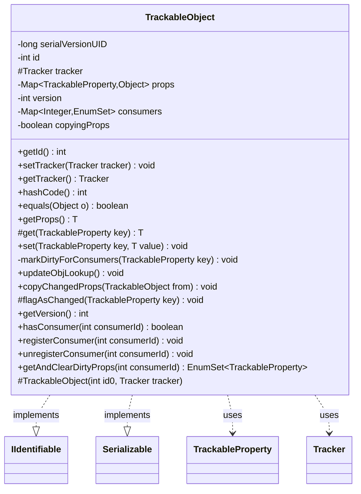

---
aliases:
  - TrackableObject
tags:
  - java/class
  - module/forge-game
  - pkg/forge/trackable
fqn: forge.trackable.TrackableObject
package: forge.trackable
module: forge-game
kind: Class
---

# TrackableObject

**Package:** `forge.trackable`   **Module:** `forge-game`   **Kind:** Class



## Relationships
**Implements:**
- [[forge.game.IIdentifiable|IIdentifiable]]
**Uses:**
- [[forge.trackable.TrackableProperty|TrackableProperty]]
- [[forge.trackable.Tracker|Tracker]]

## Design Description

TrackableObject is the abstract base for engine entities whose mutable state is mirrored into a serialized view consumed by one or more GUIs. Implementing IIdentifiable and Serializable, it stores each subclass's state as a map of TrackableProperty keys, exposing protected get and public set accessors so the engine writes properties while consumers read them. It collaborates closely with Tracker, which it consults to honor a freeze window by queuing delayed property changes, and with TrackableProperty, which supplies defaults, freeze modes, and object-lookup updates.

Its notable design intent is efficient delta synchronization: rather than diffing whole objects, it maintains lazily initialized per-consumer dirty-bit sets so each registered GUI client can drain only the properties changed since its last read, while offline games incur no tracking overhead. Identity rests solely on the immutable id, defaults are elided from storage to keep state minimal, and copyChangedProps guards against circular-reference recursion during full-state network syncs.

## Source
`forge-game/src/main/java/forge/trackable/TrackableObject.java`

```java
package forge.trackable;

import java.io.Serializable;
import java.util.EnumMap;
import java.util.EnumSet;
import java.util.HashMap;
import java.util.Map;
import java.util.Map.Entry;

import forge.game.IIdentifiable;

/**
 * Base for objects that mirror engine state into a serialized view consumed by GUI(s).
 * Each subclass exposes its mutable state as {@link TrackableProperty} entries; the engine
 * writes via {@link #set} and consumers (GUIs) read via {@link #get}.
 *
 * <p><b>Consumer dirty bits.</b> Each GUI client that uses delta-sync registers as a
 * consumer; the object keeps a per-consumer set of properties dirty since the consumer's
 * last drain. {@link forge.gamemodes.net.server.DeltaSyncManager#collectDeltas} reads and
 * clears them. Offline games never register consumers, so {@code set} does no tracking work.
 *
 * <p><b>Freeze interaction.</b> When the owning {@link Tracker} is frozen, {@code set}
 * queues the change rather than applying it; the queued change replays at unfreeze. Do not
 * read a property during a frozen window expecting a freshly-set value — {@code get}
 * returns the pre-freeze value, not the queued one.
 */
public abstract class TrackableObject implements IIdentifiable, Serializable {
    private static final long serialVersionUID = 7386836745378571056L;

    private final int id;
    protected transient Tracker tracker;
    private final Map<TrackableProperty, Object> props;
    private int version;
    // Per-consumer dirty tracking. Lazy-init: null until first registerConsumer.
    private transient Map<Integer, EnumSet<TrackableProperty>> consumers;
    private boolean copyingProps;

    protected TrackableObject(final int id0, final Tracker tracker) {
        id = id0;
        this.tracker = tracker;
        props = new EnumMap<>(TrackableProperty.class);
    }

    public final int getId() {
        return id;
    }

    // needed for multiplayer support
    public void setTracker(Tracker tracker) {
        this.tracker = tracker;
    }

    public final Tracker getTracker() {
        return tracker;
    }

    @Override
    public int hashCode() {
        return id;
    }

    @Override
    public final boolean equals(final Object o) {
        if (o == null) { return false; }
        return o.hashCode() == hashCode() && o.getClass().equals(getClass());
    }

    // don't know if this is really needed, but don't know a better way
    public <T> T getProps() {
        return (T)props;
    }

    @SuppressWarnings("unchecked")
    protected final <T> T get(final TrackableProperty key) {
        T value = (T)props.get(key);
        if (value == null) {
            value = key.getDefaultValue();
        }
        return value;
    }

    public final <T> void set(final TrackableProperty key, final T value) {
        if (tracker != null && tracker.isFrozen()) { //if trackable objects currently frozen, queue up delayed prop change
            boolean respectsFreeze = false;
            if (key.getFreezeMode() == TrackableProperty.FreezeMode.RespectsFreeze) {
                respectsFreeze = true;
            } else if (key.getFreezeMode() == TrackableProperty.FreezeMode.IgnoresFreezeIfUnset) {
                respectsFreeze = (props.get(key) != null);
            }
            if (respectsFreeze) {
                tracker.addDelayedPropChange(this, key, value);
                return;
            }
        }
        if (value == null || value.equals(key.getDefaultValue())) {
            if (props.remove(key) != null) {
                // TODO: A property changing A->B->A between consumer reads would still be marked dirty.
                // A checksum or version-per-property approach could skip this, but A->B->A is uncommon
                // in typical Magic game flow. Revisit if profiling shows excessive no-op deltas.
                markDirtyForConsumers(key);
                key.updateObjLookup(tracker, value);
            }
        }
        else if (!value.equals(props.put(key, value))) {
            markDirtyForConsumers(key);
            key.updateObjLookup(tracker, value);
        }
    }

    /**
     * Mark a property as dirty for all registered consumers and increment version.
     */
    private void markDirtyForConsumers(final TrackableProperty key) {
        if (consumers == null) {
            return;
        }
        version++;
        for (EnumSet<TrackableProperty> dirtySet : consumers.values()) {
            dirtySet.add(key);
        }
    }

    public final void updateObjLookup() {
        for (final Entry<TrackableProperty, Object> prop : props.entrySet()) {
            prop.getKey().updateObjLookup(tracker, prop.getValue());
        }
    }

    /**
     * Copy all properties of another TrackableObject to this object.
     * Used in network full-state scenarios where all properties should be synced.
     */
    public final void copyChangedProps(final TrackableObject from) {
        if (copyingProps) { return; } //prevent infinite loop from circular reference
        copyingProps = true;
        for (final TrackableProperty prop : from.props.keySet()) {
            prop.copyChangedProps(from, this);
        }
        // Remove properties that reverted to default on the source.
        // set() removes props that equal their default value, so they won't
        // appear in from.props — but they may still be in our props with a
        // stale non-default value.
        props.keySet().retainAll(from.props.keySet());
        copyingProps = false;
    }

    // use when updating collection type properties without using set (or assigning the same object)
    protected final void flagAsChanged(final TrackableProperty key) {
        markDirtyForConsumers(key);
        key.updateObjLookup(tracker, props.get(key));
    }

    /**
     * Get the monotonic version counter. Incremented on every actual property change.
     */
    public int getVersion() {
        return version;
    }

    /**
     * Check whether a consumer is currently registered on this object.
     * <p>
     * Used by network serialization to gate IdRef substitution: the server
     * registers a consumer on every TrackableObject it has included in a
     * delta packet for a given client. An object without that consumer is
     * one the client hasn't been told about (typically an ephemeral such as
     * a {@code Card.fromPaperCard} choice copy that never enters a tracked
     * zone), and protocol-method args holding it must serialize inline.
     */
    public boolean hasConsumer(int consumerId) {
        return consumers != null && consumers.containsKey(consumerId);
    }

    /**
     * Register a consumer for per-consumer dirty tracking.
     */
    public void registerConsumer(int consumerId) {
        if (consumers == null) {
            consumers = new HashMap<>();
        }
        consumers.putIfAbsent(consumerId, EnumSet.noneOf(TrackableProperty.class));
    }

    /**
     * Unregister a consumer. Removes its dirty set.
     * Nulls the map if empty to avoid overhead in offline games.
     */
    public void unregisterConsumer(int consumerId) {
        if (consumers != null) {
            consumers.remove(consumerId);
            if (consumers.isEmpty()) {
                consumers = null;
            }
        }
    }

    /**
     * Get and clear dirty properties for a specific consumer.
     * Returns a snapshot copy; the consumer's dirty set is cleared.
     */
    public EnumSet<TrackableProperty> getAndClearDirtyProps(int consumerId) {
        if (consumers == null) {
            return EnumSet.noneOf(TrackableProperty.class);
        }
        EnumSet<TrackableProperty> dirtySet = consumers.get(consumerId);
        if (dirtySet == null || dirtySet.isEmpty()) {
            return EnumSet.noneOf(TrackableProperty.class);
        }
        EnumSet<TrackableProperty> copy = EnumSet.copyOf(dirtySet);
        dirtySet.clear();
        return copy;
    }

}
```

## Python
`forge/trackable/TrackableObject.py`

```python
from forge.game.IIdentifiable import IIdentifiable
from forge.trackable.TrackableProperty import TrackableProperty
from forge.trackable.Tracker import Tracker


class TrackableObject(IIdentifiable):
    """
    Base for objects that mirror engine state into a serialized view consumed by GUI(s).
    Each subclass exposes its mutable state as TrackableProperty entries; the engine
    writes via set and consumers (GUIs) read via get.

    Consumer dirty bits. Each GUI client that uses delta-sync registers as a
    consumer; the object keeps a per-consumer set of properties dirty since the consumer's
    last drain. DeltaSyncManager.collectDeltas reads and clears them. Offline games never
    register consumers, so set does no tracking work.

    Freeze interaction. When the owning Tracker is frozen, set queues the change rather
    than applying it; the queued change replays at unfreeze. Do not read a property during
    a frozen window expecting a freshly-set value -- get returns the pre-freeze value, not
    the queued one.
    """
    serialVersionUID = 7386836745378571056

    def __init__(self, id0: int, tracker: Tracker):
        self.id = id0
        self.tracker = tracker
        self.props: dict = {}
        self.version = 0
        # Per-consumer dirty tracking. Lazy-init: None until first registerConsumer.
        self.consumers = None
        self.copyingProps = False

    def getId(self) -> int:
        return self.id

    # needed for multiplayer support
    def setTracker(self, tracker: Tracker) -> None:
        self.tracker = tracker

    def getTracker(self) -> Tracker:
        return self.tracker

    def hashCode(self) -> int:
        return self.id

    def __hash__(self) -> int:
        return self.id

    def equals(self, o) -> bool:
        if o is None:
            return False
        return o.hashCode() == self.hashCode() and o.__class__ == self.__class__

    def __eq__(self, o) -> bool:
        return self.equals(o)

    # don't know if this is really needed, but don't know a better way
    def getProps(self):
        return self.props

    def get(self, key: TrackableProperty):
        value = self.props.get(key)
        if value is None:
            value = key.getDefaultValue()
        return value

    def set(self, key: TrackableProperty, value) -> None:
        if self.tracker is not None and self.tracker.isFrozen():  # if trackable objects currently frozen, queue up delayed prop change
            respectsFreeze = False
            if key.getFreezeMode() == TrackableProperty.FreezeMode.RespectsFreeze:
                respectsFreeze = True
            elif key.getFreezeMode() == TrackableProperty.FreezeMode.IgnoresFreezeIfUnset:
                respectsFreeze = (self.props.get(key) is not None)
            if respectsFreeze:
                self.tracker.addDelayedPropChange(self, key, value)
                return
        if value is None or value == key.getDefaultValue():
            if self.props.pop(key, None) is not None:
                # TODO: A property changing A->B->A between consumer reads would still be marked dirty.
                # A checksum or version-per-property approach could skip this, but A->B->A is uncommon
                # in typical Magic game flow. Revisit if profiling shows excessive no-op deltas.
                self.markDirtyForConsumers(key)
                key.updateObjLookup(self.tracker, value)
        else:
            oldValue = self.props.get(key)
            self.props[key] = value
            if value != oldValue:
                self.markDirtyForConsumers(key)
                key.updateObjLookup(self.tracker, value)

    def markDirtyForConsumers(self, key: TrackableProperty) -> None:
        """Mark a property as dirty for all registered consumers and increment version."""
        if self.consumers is None:
            return
        self.version += 1
        for dirtySet in self.consumers.values():
            dirtySet.add(key)

    def updateObjLookup(self) -> None:
        for key, value in self.props.items():
            key.updateObjLookup(self.tracker, value)

    def copyChangedProps(self, frm: "TrackableObject") -> None:
        """
        Copy all properties of another TrackableObject to this object.
        Used in network full-state scenarios where all properties should be synced.
        """
        if self.copyingProps:
            return  # prevent infinite loop from circular reference
        self.copyingProps = True
        for prop in list(frm.props.keys()):
            prop.copyChangedProps(frm, self)
        # Remove properties that reverted to default on the source.
        # set() removes props that equal their default value, so they won't
        # appear in from.props -- but they may still be in our props with a
        # stale non-default value.
        for key in list(self.props.keys()):
            if key not in frm.props:
                del self.props[key]
        self.copyingProps = False

    # use when updating collection type properties without using set (or assigning the same object)
    def flagAsChanged(self, key: TrackableProperty) -> None:
        self.markDirtyForConsumers(key)
        key.updateObjLookup(self.tracker, self.props.get(key))

    def getVersion(self) -> int:
        """Get the monotonic version counter. Incremented on every actual property change."""
        return self.version

    def hasConsumer(self, consumerId: int) -> bool:
        """
        Check whether a consumer is currently registered on this object.

        Used by network serialization to gate IdRef substitution: the server
        registers a consumer on every TrackableObject it has included in a
        delta packet for a given client. An object without that consumer is
        one the client hasn't been told about (typically an ephemeral such as
        a Card.fromPaperCard choice copy that never enters a tracked
        zone), and protocol-method args holding it must serialize inline.
        """
        return self.consumers is not None and consumerId in self.consumers

    def registerConsumer(self, consumerId: int) -> None:
        """Register a consumer for per-consumer dirty tracking."""
        if self.consumers is None:
            self.consumers = {}
        if consumerId not in self.consumers:
            self.consumers[consumerId] = set()

    def unregisterConsumer(self, consumerId: int) -> None:
        """
        Unregister a consumer. Removes its dirty set.
        Nulls the map if empty to avoid overhead in offline games.
        """
        if self.consumers is not None:
            self.consumers.pop(consumerId, None)
            if not self.consumers:
                self.consumers = None

    def getAndClearDirtyProps(self, consumerId: int) -> set:
        """
        Get and clear dirty properties for a specific consumer.
        Returns a snapshot copy; the consumer's dirty set is cleared.
        """
        if self.consumers is None:
            return set()
        dirtySet = self.consumers.get(consumerId)
        if dirtySet is None or len(dirtySet) == 0:
            return set()
        copy = set(dirtySet)
        dirtySet.clear()
        return copy
```
