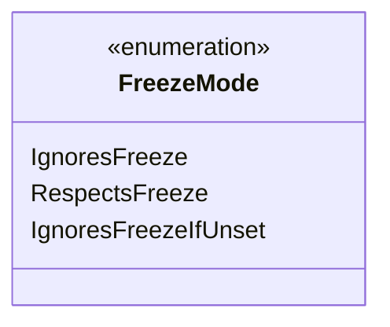

---
aliases:
  - FreezeMode
tags:
  - java/enum
  - module/forge-game
  - pkg/forge/trackable
fqn: forge.trackable.TrackableProperty.FreezeMode
package: forge.trackable
module: forge-game
kind: Enum
---

# FreezeMode

**Package:** `forge.trackable`   **Module:** `forge-game`   **Kind:** Enum



## Design Description

Forge's TrackableProperty manages serializable game-state properties whose updates can be batched or "frozen" to control when changes propagate to clients. The nested FreezeMode enum encodes, per property, how an update should behave with respect to that freeze: IgnoresFreeze applies changes immediately regardless of freeze state, RespectsFreeze defers changes while frozen, and IgnoresFreezeIfUnset bypasses the freeze only when the property has no existing value. As a simple, dependency-free enumeration, it externalizes a policy decision that the surrounding tracking machinery consults, letting each property declare its own freeze semantics rather than hard-coding the behavior in the update logic.

## Source
`forge-game/src/main/java/forge/trackable/TrackableProperty.java` — declaration excerpt

```java
    public enum FreezeMode {
        IgnoresFreeze,
        RespectsFreeze,
        IgnoresFreezeIfUnset
    }
```

## Python
`forge/trackable/TrackableProperty/FreezeMode.py`

```python
from enum import Enum, auto


class FreezeMode(Enum):
    IgnoresFreeze = auto()
    RespectsFreeze = auto()
    IgnoresFreezeIfUnset = auto()
```
