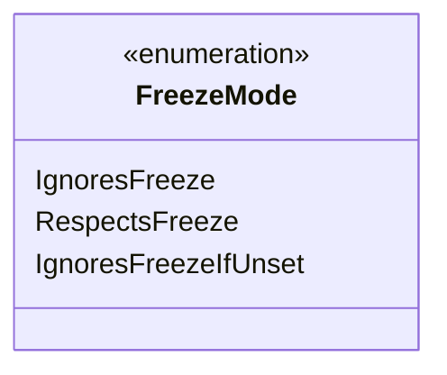

---
aliases:
  - FreezeMode
tags:
  - java/enum
  - module/forge-game
  - pkg/forge/trackable
fqn: forge.trackable.TrackableProperty.FreezeMode
package: forge.trackable
module: forge-game
kind: Enum
---

# FreezeMode

**Package:** `forge.trackable` &nbsp; **Module:** `forge-game` &nbsp; **Kind:** Enum



## Source
`forge-game/src/main/java/forge/trackable/TrackableProperty.java` — declaration excerpt

```java
    public enum FreezeMode {
        IgnoresFreeze,
        RespectsFreeze,
        IgnoresFreezeIfUnset
    }
```
