---
aliases:
  - TrackableProperty
tags:
  - java/enum
  - module/forge-game
  - pkg/forge/trackable
fqn: forge.trackable.TrackableProperty
package: forge.trackable
module: forge-game
kind: Enum
---

# TrackableProperty

**Package:** `forge.trackable` &nbsp; **Module:** `forge-game` &nbsp; **Kind:** Enum

```mermaid
classDiagram
    class TrackableProperty {
        <<enumeration>>
        Text
        PreventNextDamage
        AttachedCards
        Counters
        CurrentPlane
        PlanarPlayer
        Owner
        Controller
        Zone
        GamePieceType
        IsEmblem
        IsBoon
        CanSpecialize
        Flipped
        Facedown
        Foretold
        Modal
        Secondary
        DoubleFaced
        FacedownImageKey
        PaperFoil
        Cloner
        Cloned
        FlipCard
        SplitCard
        MergedCards
        MergedCardsCollection
        RevealedCardsCollection
        PaperCardBackup
        Attacking
        Blocking
        PhasedOut
        Sickness
        Tapped
        Token
        TokenCard
        IsCommander
        IsRingBearer
        CommanderAltType
        Damage
        AssignedDamage
        LethalDamage
        ShieldCount
        ChosenType
        ChosenType2
        NotedTypes
        ChosenColors
        ChosenCards
        ChosenNumber
        StoredRolls
        ChosenPlayer
        PromisedGift
        ProtectingPlayer
        ChosenDirection
        ChosenEvenOdd
        ChosenMode
        Sector
        Sprocket
        DraftAction
        ClassLevel
        RingLevel
        CurrentRoom
        Intensity
        OverlayText
        MarkerText
        Remembered
        NamedCard
        PlayerMayLook
        MayPlayPlayers
        EntityAttachedTo
        EncodedCards
        UntilLeavesBattlefield
        GainControlTargets
        CloneOrigin
        ExiledWith
        WasDestroyed
        CrackOverlay
        NeedsTransformAnimation
        NeedsUntapAnimation
        NeedsTapAnimation
        MarkedColors
        ImprintedCards
        ExiledCards
        HauntedBy
        Haunting
        MustBlockCards
        PairedWith
        CurrentState
        AlternateState
        LeftSplitState
        RightSplitState
        Room
        HiddenId
        ExertedThisTurn
        Detained
        Name
        Colors
        OriginalColors
        ImageKey
        Type
        ManaCost
        OriginalManaCost
        SetCode
        Rarity
        FunctionalVariant
        OracleText
        RulesText
        OracleName
        Power
        Toughness
        Loyalty
        Defense
        AttractionLights
        ChangedColorWords
        HasChangedColors
        HasPrintedPT
        ChangedTypes
        OrigProduceMana
        OrigProduceAnyMana
        Keywords
        HasAnnihilator
        HasWard
        BlockAdditional
        BlockAny
        AbilityText
        NonAbilityText
        HasDivideDamage
        FoilIndex
        CantHaveKeyword
        IsAI
        LobbyPlayerName
        AvatarIndex
        AvatarCardImageKey
        SleeveIndex
        Opponents
        Life
        MaxHandSize
        HasUnlimitedHandSize
        MaxLandPlay
        HasUnlimitedLandPlay
        NumLandThisTurn
        NumManaShards
        DraftNotes
        NumDrawnThisTurn
        AdditionalVote
        OptionalAdditionalVote
        ControlVotes
        AdditionalVillainousChoices
        Commander
        CommanderCast
        CommanderDamage
        MindSlaveMaster
        Ante
        Battlefield
        Command
        Exile
        Flashback
        Graveyard
        Hand
        Library
        Sideboard
        PlanarDeck
        SchemeDeck
        AttractionDeck
        ContraptionDeck
        Junkyard
        Mana
        IsExtraTurn
        ExtraTurnCount
        HasPriority
        AvatarLifeDifference
        HasLost
        HasAvailableActions
        HostCard
        Description
        CanPlay
        PromptIfOnlyPossibleAbility
        SA_IsSpell
        RE_HostCard
        RE_Description
        ST_HostCard
        ST_Description
        BackSideName
        HasBackSide
        Key
        SourceTrigger
        SourceCard
        ActivatingPlayer
        TargetCards
        TargetPlayers
        SubInstance
        Ability
        OptionalTrigger
        OptionalCosts
        AttackersWithDefenders
        AttackersWithBlockers
        BandsWithDefenders
        BandsWithBlockers
        AttackersWithPlannedBlockers
        BandsWithPlannedBlockers
        CombatView
        Players
        GameType
        Title
        Turn
        WinningPlayerName
        WinningTeam
        MatchOver
        Mulligan
        NumGamesInMatch
        NumPlayedGamesInMatch
        Stack
        StormCount
        GameOver
        PoisonCountersToLose
        PlayerTurn
        Phase
        Dependencies
        -TrackableType~Object~ type
        -FreezeMode freezeMode
        +getFreezeMode() FreezeMode
        +getType() TrackableType~Object~
        +updateObjLookup(Tracker tracker, T newObj) void
        +copyChangedProps(TrackableObject from, TrackableObject to) void
        +getDefaultValue() T
        ~TrackableProperty(TrackableType~Object~ type0)
        ~TrackableProperty(TrackableType~Object~ type0, FreezeMode freezeMode0)
    }
    TrackableProperty ..> CardRarity : uses
    TrackableProperty ..> Direction : uses
    TrackableProperty ..> EvenOdd : uses
    TrackableProperty ..> FreezeMode : uses
    TrackableProperty ..> GamePieceType : uses
    TrackableProperty ..> GameType : uses
    TrackableProperty ..> PhaseType : uses
    TrackableProperty ..> TrackableObject : uses
    TrackableProperty ..> TrackableType : uses
    TrackableProperty ..> Tracker : uses
    TrackableProperty ..> ZoneType : uses
```



## Relationships
**Uses:**
- [[forge.card.CardRarity|CardRarity]]
- [[forge.card.GamePieceType|GamePieceType]]
- [[forge.game.Direction|Direction]]
- [[forge.game.EvenOdd|EvenOdd]]
- [[forge.game.GameType|GameType]]
- [[forge.game.phase.PhaseType|PhaseType]]
- [[forge.game.zone.ZoneType|ZoneType]]
- [[forge.trackable.TrackableObject|TrackableObject]]
- [[forge.trackable.TrackableProperty.FreezeMode|FreezeMode]]
- [[forge.trackable.TrackableTypes.TrackableType|TrackableType]]
- [[forge.trackable.Tracker|Tracker]]

## Source
`forge-game/src/main/java/forge/trackable/TrackableProperty.java`

```java
package forge.trackable;


import forge.card.CardRarity;
import forge.card.GamePieceType;
import forge.game.Direction;
import forge.game.EvenOdd;
import forge.game.GameType;
import forge.game.phase.PhaseType;
import forge.game.zone.ZoneType;
import forge.trackable.TrackableTypes.TrackableType;

public enum TrackableProperty {
    //Shared
    Text(TrackableTypes.StringType),
    PreventNextDamage(TrackableTypes.IntegerType),
    AttachedCards(TrackableTypes.CardViewCollectionType),
    Counters(TrackableTypes.CounterMapType),
    CurrentPlane(TrackableTypes.StringType),
    PlanarPlayer(TrackableTypes.PlayerViewType),

    //Card
    Owner(TrackableTypes.PlayerViewType),
    Controller(TrackableTypes.PlayerViewType),
    Zone(TrackableTypes.EnumType(ZoneType.class)),

    GamePieceType(TrackableTypes.EnumType(GamePieceType.class)),

    IsEmblem(TrackableTypes.BooleanType),
    IsBoon(TrackableTypes.BooleanType),
    CanSpecialize(TrackableTypes.BooleanType),

    Flipped(TrackableTypes.BooleanType),
    Facedown(TrackableTypes.BooleanType),
    Foretold(TrackableTypes.BooleanType),
    Modal(TrackableTypes.BooleanType),
    Secondary(TrackableTypes.BooleanType),
    DoubleFaced(TrackableTypes.BooleanType),
    FacedownImageKey(TrackableTypes.StringType),
    PaperFoil(TrackableTypes.BooleanType),

    //TODO?
    Cloner(TrackableTypes.StringType),
    Cloned(TrackableTypes.BooleanType),
    FlipCard(TrackableTypes.BooleanType),
    SplitCard(TrackableTypes.BooleanType),
    MergedCards(TrackableTypes.StringType),
    MergedCardsCollection(TrackableTypes.CardViewCollectionType, FreezeMode.IgnoresFreeze),
    RevealedCardsCollection(TrackableTypes.CardViewCollectionType, FreezeMode.IgnoresFreeze),
    PaperCardBackup(TrackableTypes.IPaperCardType),

    Attacking(TrackableTypes.BooleanType),
    Blocking(TrackableTypes.BooleanType),
    PhasedOut(TrackableTypes.BooleanType),
    Sickness(TrackableTypes.BooleanType),
    Tapped(TrackableTypes.BooleanType),
    Token(TrackableTypes.BooleanType),
    TokenCard(TrackableTypes.BooleanType),
    IsCommander(TrackableTypes.BooleanType),
    IsRingBearer(TrackableTypes.BooleanType),
    CommanderAltType(TrackableTypes.StringType),
    Damage(TrackableTypes.IntegerType),
    AssignedDamage(TrackableTypes.IntegerType),
    LethalDamage(TrackableTypes.IntegerType),
    ShieldCount(TrackableTypes.IntegerType),
    ChosenType(TrackableTypes.StringType),
    ChosenType2(TrackableTypes.StringType),
    NotedTypes(TrackableTypes.StringListType),
    ChosenColors(TrackableTypes.StringListType),
    ChosenCards(TrackableTypes.CardViewCollectionType),
    ChosenNumber(TrackableTypes.StringType),
    StoredRolls(TrackableTypes.StringListType),
    ChosenPlayer(TrackableTypes.PlayerViewType),
    PromisedGift(TrackableTypes.PlayerViewType),
    ProtectingPlayer(TrackableTypes.PlayerViewType),
    ChosenDirection(TrackableTypes.EnumType(Direction.class)),
    ChosenEvenOdd(TrackableTypes.EnumType(EvenOdd.class)),
    ChosenMode(TrackableTypes.StringType),
    Sector(TrackableTypes.StringType),
    Sprocket(TrackableTypes.IntegerType),
    DraftAction(TrackableTypes.StringListType),
    ClassLevel(TrackableTypes.IntegerType),
    RingLevel(TrackableTypes.IntegerType),
    CurrentRoom(TrackableTypes.StringType),
    Intensity(TrackableTypes.IntegerType),
    OverlayText(TrackableTypes.StringType),
    MarkerText(TrackableTypes.StringListType),
    Remembered(TrackableTypes.StringType),
    NamedCard(TrackableTypes.StringListType),
    PlayerMayLook(TrackableTypes.PlayerViewCollectionType, FreezeMode.IgnoresFreeze),
    MayPlayPlayers(TrackableTypes.PlayerViewCollectionType, FreezeMode.IgnoresFreeze),
    EntityAttachedTo(TrackableTypes.GameEntityViewType),
    EncodedCards(TrackableTypes.CardViewCollectionType),
    UntilLeavesBattlefield(TrackableTypes.CardViewCollectionType),
    GainControlTargets(TrackableTypes.CardViewCollectionType),
    CloneOrigin(TrackableTypes.CardViewType),
    ExiledWith(TrackableTypes.CardViewType),
    WasDestroyed(TrackableTypes.BooleanType),
    CrackOverlay(TrackableTypes.IntegerType),
    NeedsTransformAnimation(TrackableTypes.BooleanType, FreezeMode.IgnoresFreeze),
    NeedsUntapAnimation(TrackableTypes.BooleanType, FreezeMode.IgnoresFreeze),
    NeedsTapAnimation(TrackableTypes.BooleanType, FreezeMode.IgnoresFreeze),
    MarkedColors(TrackableTypes.ColorSetType),

    ImprintedCards(TrackableTypes.CardViewCollectionType),
    ExiledCards(TrackableTypes.CardViewCollectionType),
    HauntedBy(TrackableTypes.CardViewCollectionType),
    Haunting(TrackableTypes.CardViewType),
    MustBlockCards(TrackableTypes.CardViewCollectionType),
    PairedWith(TrackableTypes.CardViewType),
    CurrentState(TrackableTypes.CardStateViewType, FreezeMode.IgnoresFreeze),
    AlternateState(TrackableTypes.CardStateViewType, FreezeMode.IgnoresFreeze),
    LeftSplitState(TrackableTypes.CardStateViewType, FreezeMode.IgnoresFreeze),
    RightSplitState(TrackableTypes.CardStateViewType, FreezeMode.IgnoresFreeze),
    Room(TrackableTypes.BooleanType, FreezeMode.IgnoresFreeze),
    HiddenId(TrackableTypes.IntegerType),
    ExertedThisTurn(TrackableTypes.BooleanType),
    Detained(TrackableTypes.BooleanType),

    //Card State
    Name(TrackableTypes.StringType),
    Colors(TrackableTypes.ColorSetType),
    OriginalColors(TrackableTypes.ColorSetType),
    ImageKey(TrackableTypes.StringType),
    Type(TrackableTypes.CardTypeViewType),
    ManaCost(TrackableTypes.ManaCostType),
    OriginalManaCost(TrackableTypes.ManaCostType),
    SetCode(TrackableTypes.StringType),
    Rarity(TrackableTypes.EnumType(CardRarity.class)),
    FunctionalVariant(TrackableTypes.StringType),
    OracleText(TrackableTypes.StringType),
    RulesText(TrackableTypes.StringType),
    OracleName(TrackableTypes.StringType),
    Power(TrackableTypes.IntegerType),
    Toughness(TrackableTypes.IntegerType),
    Loyalty(TrackableTypes.StringType),
    Defense(TrackableTypes.StringType),
    AttractionLights(TrackableTypes.IntegerSetType),
    ChangedColorWords(TrackableTypes.StringMapType),
    HasChangedColors(TrackableTypes.BooleanType),
    HasPrintedPT(TrackableTypes.BooleanType),
    ChangedTypes(TrackableTypes.StringMapType),

    //check produce mana for BG
    OrigProduceMana(TrackableTypes.ColorSetType),
    OrigProduceAnyMana(TrackableTypes.BooleanType),

    Keywords(TrackableTypes.KeywordCollectionViewType),
    HasAnnihilator(TrackableTypes.BooleanType),
    HasWard(TrackableTypes.BooleanType),

    BlockAdditional(TrackableTypes.IntegerType),
    BlockAny(TrackableTypes.BooleanType),
    AbilityText(TrackableTypes.StringType),
    NonAbilityText(TrackableTypes.StringType),
    HasDivideDamage(TrackableTypes.BooleanType),
    FoilIndex(TrackableTypes.IntegerType),

    CantHaveKeyword(TrackableTypes.StringSetType),

    //Player
    IsAI(TrackableTypes.BooleanType),
    LobbyPlayerName(TrackableTypes.StringType),
    AvatarIndex(TrackableTypes.IntegerType),
    AvatarCardImageKey(TrackableTypes.StringType),
    SleeveIndex(TrackableTypes.IntegerType),
    Opponents(TrackableTypes.PlayerViewCollectionType),
    Life(TrackableTypes.IntegerType),
    MaxHandSize(TrackableTypes.IntegerType),
    HasUnlimitedHandSize(TrackableTypes.BooleanType),
    MaxLandPlay(TrackableTypes.IntegerType),
    HasUnlimitedLandPlay(TrackableTypes.BooleanType),
    NumLandThisTurn(TrackableTypes.IntegerType),
    NumManaShards(TrackableTypes.IntegerType),
    DraftNotes(TrackableTypes.StringMapType),
    NumDrawnThisTurn(TrackableTypes.IntegerType),
    AdditionalVote(TrackableTypes.IntegerType),
    OptionalAdditionalVote(TrackableTypes.IntegerType),
    ControlVotes(TrackableTypes.BooleanType),
    AdditionalVillainousChoices(TrackableTypes.IntegerType),
    Commander(TrackableTypes.CardViewCollectionType, FreezeMode.IgnoresFreeze),
    CommanderCast(TrackableTypes.IntegerMapType),
    CommanderDamage(TrackableTypes.IntegerMapType),
    MindSlaveMaster(TrackableTypes.PlayerViewType),

    Ante(TrackableTypes.CardViewCollectionType, FreezeMode.IgnoresFreeze),
    Battlefield(TrackableTypes.CardViewCollectionType, FreezeMode.IgnoresFreeze), //zones can't respect freeze, otherwise cards that die from state based effects won't have that reflected in the UI
    Command(TrackableTypes.CardViewCollectionType, FreezeMode.IgnoresFreeze),
    Exile(TrackableTypes.CardViewCollectionType, FreezeMode.IgnoresFreeze),
    Flashback(TrackableTypes.CardViewCollectionType, FreezeMode.IgnoresFreeze),
    Graveyard(TrackableTypes.CardViewCollectionType, FreezeMode.IgnoresFreeze),
    Hand(TrackableTypes.CardViewCollectionType, FreezeMode.IgnoresFreeze),
    Library(TrackableTypes.CardViewCollectionType, FreezeMode.IgnoresFreeze),
    Sideboard(TrackableTypes.CardViewCollectionType, FreezeMode.IgnoresFreeze),
    PlanarDeck(TrackableTypes.CardViewCollectionType, FreezeMode.IgnoresFreeze),
    SchemeDeck(TrackableTypes.CardViewCollectionType, FreezeMode.IgnoresFreeze),
    AttractionDeck(TrackableTypes.CardViewCollectionType, FreezeMode.IgnoresFreeze),
    ContraptionDeck(TrackableTypes.CardViewCollectionType, FreezeMode.IgnoresFreeze),
    Junkyard(TrackableTypes.CardViewCollectionType, FreezeMode.IgnoresFreeze),

    Mana(TrackableTypes.ManaMapType, FreezeMode.IgnoresFreeze),

    IsExtraTurn(TrackableTypes.BooleanType),
    ExtraTurnCount(TrackableTypes.IntegerType),
    HasPriority(TrackableTypes.BooleanType, FreezeMode.IgnoresFreeze),
    AvatarLifeDifference(TrackableTypes.IntegerType, FreezeMode.IgnoresFreeze),
    HasLost(TrackableTypes.BooleanType),
    HasAvailableActions(TrackableTypes.BooleanType),

    //SpellAbility
    HostCard(TrackableTypes.CardViewType),
    Description(TrackableTypes.StringType),
    CanPlay(TrackableTypes.BooleanType),
    PromptIfOnlyPossibleAbility(TrackableTypes.BooleanType),
    SA_IsSpell(TrackableTypes.BooleanType),

    //ReplacementEffectView
    RE_HostCard(TrackableTypes.CardViewType),
    RE_Description(TrackableTypes.StringType),

    //StaticAbilityView
    ST_HostCard(TrackableTypes.CardViewType),
    ST_Description(TrackableTypes.StringType),

    //HasBackSide
    BackSideName(TrackableTypes.StringType),
    HasBackSide(TrackableTypes.BooleanType),

    //StackItem
    Key(TrackableTypes.StringType),
    SourceTrigger(TrackableTypes.IntegerType),
    SourceCard(TrackableTypes.CardViewType),
    ActivatingPlayer(TrackableTypes.PlayerViewType),
    TargetCards(TrackableTypes.CardViewCollectionType),
    TargetPlayers(TrackableTypes.PlayerViewCollectionType),
    SubInstance(TrackableTypes.StackItemViewType),
    Ability(TrackableTypes.BooleanType),
    OptionalTrigger(TrackableTypes.BooleanType),
    OptionalCosts(TrackableTypes.StringType),

    //Combat
    AttackersWithDefenders(TrackableTypes.GenericMapType, FreezeMode.IgnoresFreeze),
    AttackersWithBlockers(TrackableTypes.GenericMapType, FreezeMode.IgnoresFreeze),
    BandsWithDefenders(TrackableTypes.GenericMapType, FreezeMode.IgnoresFreeze),
    BandsWithBlockers(TrackableTypes.GenericMapType, FreezeMode.IgnoresFreeze),
    AttackersWithPlannedBlockers(TrackableTypes.GenericMapType, FreezeMode.IgnoresFreeze),
    BandsWithPlannedBlockers(TrackableTypes.GenericMapType, FreezeMode.IgnoresFreeze),
    CombatView(TrackableTypes.CombatViewType, FreezeMode.IgnoresFreeze),

    //Game
    Players(TrackableTypes.PlayerViewCollectionType),
    GameType(TrackableTypes.EnumType(GameType.class)),
    Title(TrackableTypes.StringType),
    Turn(TrackableTypes.IntegerType),
    WinningPlayerName(TrackableTypes.StringType),
    WinningTeam(TrackableTypes.IntegerType),
    MatchOver(TrackableTypes.BooleanType),
    Mulligan(TrackableTypes.BooleanType),
    NumGamesInMatch(TrackableTypes.IntegerType),
    NumPlayedGamesInMatch(TrackableTypes.IntegerType),
    Stack(TrackableTypes.StackItemViewListType),
    StormCount(TrackableTypes.IntegerType),
    GameOver(TrackableTypes.BooleanType),
    PoisonCountersToLose(TrackableTypes.IntegerType),
    PlayerTurn(TrackableTypes.PlayerViewType, FreezeMode.IgnoresFreeze),
    Phase(TrackableTypes.EnumType(PhaseType.class), FreezeMode.IgnoresFreeze),
    Dependencies(TrackableTypes.StringType);

    public enum FreezeMode {
        IgnoresFreeze,
        RespectsFreeze,
        IgnoresFreezeIfUnset
    }

    private final TrackableType<?> type;
    private final FreezeMode freezeMode;

    TrackableProperty(TrackableType<?> type0) {
        this(type0, FreezeMode.RespectsFreeze);
    }

    TrackableProperty(TrackableType<?> type0, FreezeMode freezeMode0) {
        type = type0;
        freezeMode = freezeMode0;
    }

    public FreezeMode getFreezeMode() {
        return freezeMode;
    }

    public TrackableType<?> getType() {
        return type;
    }

    @SuppressWarnings("unchecked")
    public <T> void updateObjLookup(Tracker tracker, T newObj) {
        ((TrackableType<T>) type).updateObjLookup(tracker, newObj);
    }

    public void copyChangedProps(TrackableObject from, TrackableObject to) {
        type.copyChangedProps(from, to, this);
    }

    @SuppressWarnings("unchecked")
    public <T> T getDefaultValue() {
        return ((TrackableType<T>) type).getDefaultValue();
    }

}
```
