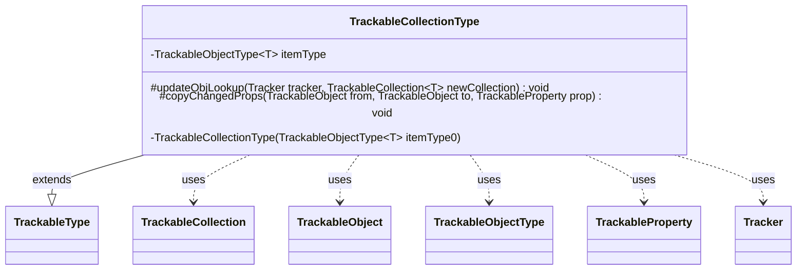

---
aliases:
  - TrackableCollectionType
tags:
  - java/class
  - module/forge-game
  - pkg/forge/trackable
fqn: forge.trackable.TrackableTypes.TrackableCollectionType
package: forge.trackable
module: forge-game
kind: Class
---

# TrackableCollectionType

**Package:** `forge.trackable` &nbsp; **Module:** `forge-game` &nbsp; **Kind:** Class



## Relationships
**Extends:**
- [[forge.trackable.TrackableTypes.TrackableType|TrackableType]]
**Uses:**
- [[forge.trackable.TrackableCollection|TrackableCollection]]
- [[forge.trackable.TrackableObject|TrackableObject]]
- [[forge.trackable.TrackableProperty|TrackableProperty]]
- [[forge.trackable.TrackableTypes.TrackableObjectType|TrackableObjectType]]
- [[forge.trackable.Tracker|Tracker]]

## Source
`forge-game/src/main/java/forge/trackable/TrackableTypes.java` — declaration excerpt

```java
    private static abstract class TrackableCollectionType<T extends TrackableObject> extends TrackableType<TrackableCollection<T>> {
        private final TrackableObjectType<T> itemType;

        private TrackableCollectionType(TrackableObjectType<T> itemType0) {
            itemType = itemType0;
        }

        @Override
        protected void updateObjLookup(Tracker tracker, TrackableCollection<T> newCollection) {
            if (newCollection != null) {
                for (T newObj : newCollection) {
                    if (newObj != null) {
                        itemType.updateObjLookup(tracker, newObj);
                    }
                }
            }
        }

        @Override
        protected void copyChangedProps(TrackableObject from, TrackableObject to, TrackableProperty prop) {
            TrackableCollection<T> newCollection = from.get(prop);
            if (newCollection != null) {
                // Snapshot via toArray: the loop below clears and rebuilds the collection,
                // so direct iteration would throw ConcurrentModificationException
                @SuppressWarnings("unchecked")
                T[] items = (T[]) newCollection.toArray(new TrackableObject[0]);
                newCollection.clear();
                for (T newObj : items) {
                    if (newObj != null) {
                        T existingObj = from.getTracker().getObj(itemType, newObj.getId());
                        if (existingObj != null) {
                            // Skip CardView collections — cross-zone refs like Commander hold stale copies
                            if (prop.getType() != TrackableTypes.CardViewCollectionType &&
                                    prop.getType() != TrackableTypes.StackItemViewListType) {
                                existingObj.copyChangedProps(newObj);
                            }
                            newCollection.add(existingObj);
                        } else {
                            from.getTracker().putObj(itemType, newObj.getId(), newObj);
                            newCollection.add(newObj);
                        }
                    }
                }
            }
            to.set(prop, newCollection);
        }
    }
```
