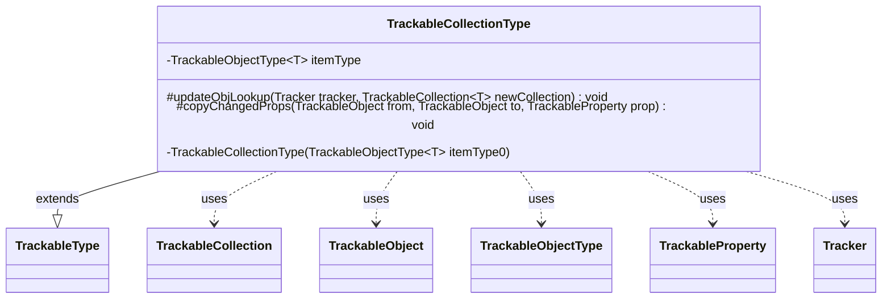

---
aliases:
  - TrackableCollectionType
tags:
  - java/class
  - module/forge-game
  - pkg/forge/trackable
fqn: forge.trackable.TrackableTypes.TrackableCollectionType
package: forge.trackable
module: forge-game
kind: Class
---

# TrackableCollectionType

**Package:** `forge.trackable`   **Module:** `forge-game`   **Kind:** Class



## Relationships
**Extends:**
- [[forge.trackable.TrackableTypes.TrackableType|TrackableType]]
**Uses:**
- [[forge.trackable.TrackableCollection|TrackableCollection]]
- [[forge.trackable.TrackableObject|TrackableObject]]
- [[forge.trackable.TrackableProperty|TrackableProperty]]
- [[forge.trackable.TrackableTypes.TrackableObjectType|TrackableObjectType]]
- [[forge.trackable.Tracker|Tracker]]

## Design Description

TrackableCollectionType is an abstract base for the collection-valued entries in TrackableTypes, parameterizing the generic TrackableType over a TrackableCollection of TrackableObjects. It delegates per-element identity tracking to a wrapped TrackableObjectType, applying that item type's lookup and registration logic across every member of a collection. Its core responsibility is reconciling incoming collections against the Tracker's object registry: updateObjLookup registers each element, while copyChangedProps rebuilds the collection in place, reusing existing tracked instances by id (merging changed properties into them) or registering new ones. Notable design intent includes snapshotting via toArray to avoid ConcurrentModificationException during the clear-and-rebuild, and deliberately skipping property merges for CardView and StackItemView collections, whose cross-zone references (e.g. Commander) can hold stale copies.

## Source
`forge-game/src/main/java/forge/trackable/TrackableTypes.java` — declaration excerpt

```java
    private static abstract class TrackableCollectionType<T extends TrackableObject> extends TrackableType<TrackableCollection<T>> {
        private final TrackableObjectType<T> itemType;

        private TrackableCollectionType(TrackableObjectType<T> itemType0) {
            itemType = itemType0;
        }

        @Override
        protected void updateObjLookup(Tracker tracker, TrackableCollection<T> newCollection) {
            if (newCollection != null) {
                for (T newObj : newCollection) {
                    if (newObj != null) {
                        itemType.updateObjLookup(tracker, newObj);
                    }
                }
            }
        }

        @Override
        protected void copyChangedProps(TrackableObject from, TrackableObject to, TrackableProperty prop) {
            TrackableCollection<T> newCollection = from.get(prop);
            if (newCollection != null) {
                // Snapshot via toArray: the loop below clears and rebuilds the collection,
                // so direct iteration would throw ConcurrentModificationException
                @SuppressWarnings("unchecked")
                T[] items = (T[]) newCollection.toArray(new TrackableObject[0]);
                newCollection.clear();
                for (T newObj : items) {
                    if (newObj != null) {
                        T existingObj = from.getTracker().getObj(itemType, newObj.getId());
                        if (existingObj != null) {
                            // Skip CardView collections — cross-zone refs like Commander hold stale copies
                            if (prop.getType() != TrackableTypes.CardViewCollectionType &&
                                    prop.getType() != TrackableTypes.StackItemViewListType) {
                                existingObj.copyChangedProps(newObj);
                            }
                            newCollection.add(existingObj);
                        } else {
                            from.getTracker().putObj(itemType, newObj.getId(), newObj);
                            newCollection.add(newObj);
                        }
                    }
                }
            }
            to.set(prop, newCollection);
        }
    }
```

## Python
`forge/trackable/TrackableTypes/TrackableCollectionType.py`

```python
from forge.trackable.TrackableTypes.TrackableType import TrackableType
from forge.trackable.TrackableCollection import TrackableCollection
from forge.trackable.TrackableObject import TrackableObject
from forge.trackable.TrackableProperty import TrackableProperty
from forge.trackable.TrackableTypes.TrackableObjectType import TrackableObjectType
from forge.trackable.Tracker import Tracker


class TrackableCollectionType(TrackableType):
    def __init__(self, itemType0: TrackableObjectType):
        super().__init__()
        self.itemType = itemType0

    def updateObjLookup(self, tracker: Tracker, newCollection: TrackableCollection) -> None:
        if newCollection is not None:
            for newObj in newCollection:
                if newObj is not None:
                    self.itemType.updateObjLookup(tracker, newObj)

    def copyChangedProps(self, from_: TrackableObject, to: TrackableObject, prop: TrackableProperty) -> None:
        newCollection = from_.get(prop)
        if newCollection is not None:
            # Snapshot via toArray: the loop below clears and rebuilds the collection,
            # so direct iteration would throw ConcurrentModificationException
            items = list(newCollection.toArray([]))
            newCollection.clear()
            for newObj in items:
                if newObj is not None:
                    existingObj = from_.getTracker().getObj(self.itemType, newObj.getId())
                    if existingObj is not None:
                        # Skip CardView collections - cross-zone refs like Commander hold stale copies
                        if prop.getType() != TrackableTypes.CardViewCollectionType and \
                                prop.getType() != TrackableTypes.StackItemViewListType:
                            existingObj.copyChangedProps(newObj)
                        newCollection.add(existingObj)
                    else:
                        from_.getTracker().putObj(self.itemType, newObj.getId(), newObj)
                        newCollection.add(newObj)
        to.set(prop, newCollection)
```
