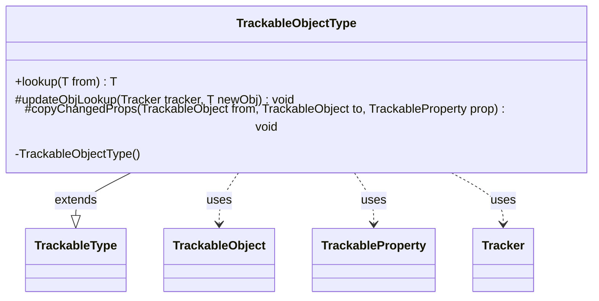

---
aliases:
  - TrackableObjectType
tags:
  - java/class
  - module/forge-game
  - pkg/forge/trackable
fqn: forge.trackable.TrackableTypes.TrackableObjectType
package: forge.trackable
module: forge-game
kind: Class
---

# TrackableObjectType

**Package:** `forge.trackable` &nbsp; **Module:** `forge-game` &nbsp; **Kind:** Class



## Relationships
**Extends:**
- [[forge.trackable.TrackableTypes.TrackableType|TrackableType]]
**Uses:**
- [[forge.trackable.TrackableObject|TrackableObject]]
- [[forge.trackable.TrackableProperty|TrackableProperty]]
- [[forge.trackable.Tracker|Tracker]]

## Source
`forge-game/src/main/java/forge/trackable/TrackableTypes.java` — declaration excerpt

```java
    public static abstract class TrackableObjectType<T extends TrackableObject> extends TrackableType<T> {
        private TrackableObjectType() {
        }

        public T lookup(T from) {
            if (from == null) { return null; }
            T to = from.getTracker().getObj(this, from.getId());
            if (to == null) {
                from.getTracker().putObj(this, from.getId(), from);
                return from;
            }
            return to;
        }

        @Override
        protected void updateObjLookup(Tracker tracker, T newObj) {
            if (tracker == null) { return; }
            if (newObj != null && !tracker.hasObj(this, newObj.getId())) {
                tracker.putObj(this, newObj.getId(), newObj);
                newObj.updateObjLookup();
            }
        }

        @Override
        protected void copyChangedProps(TrackableObject from, TrackableObject to, TrackableProperty prop) {
            T newObj = from.get(prop);
            if (newObj != null) {
                T existingObj = newObj.getTracker().getObj(this, newObj.getId());
                if (existingObj != null) { //if object exists already, update its changed properties
                    existingObj.copyChangedProps(newObj);
                    newObj = existingObj;
                }
                else { //if object is new, cache in object lookup
                    newObj.getTracker().putObj(this, newObj.getId(), newObj);
                }
            }
            to.set(prop, newObj);
        }
    }
```
