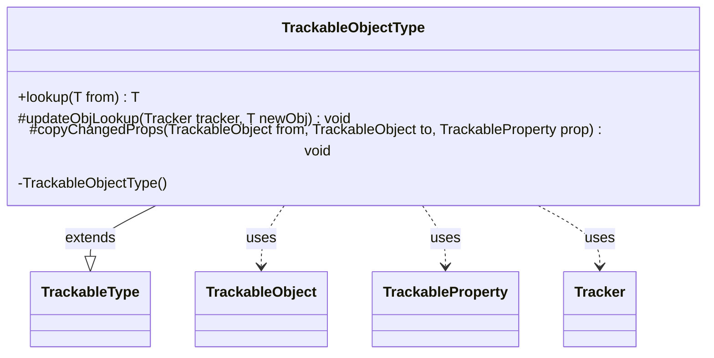

---
aliases:
  - TrackableObjectType
tags:
  - java/class
  - module/forge-game
  - pkg/forge/trackable
fqn: forge.trackable.TrackableTypes.TrackableObjectType
package: forge.trackable
module: forge-game
kind: Class
---

# TrackableObjectType

**Package:** `forge.trackable`   **Module:** `forge-game`   **Kind:** Class



## Relationships
**Extends:**
- [[forge.trackable.TrackableTypes.TrackableType|TrackableType]]
**Uses:**
- [[forge.trackable.TrackableObject|TrackableObject]]
- [[forge.trackable.TrackableProperty|TrackableProperty]]
- [[forge.trackable.Tracker|Tracker]]

## Design Description

TrackableObjectType is an abstract specialization of TrackableType for value types that are themselves TrackableObjects, parameterized over `T extends TrackableObject`. Its responsibility is identity-preserving object caching: it resolves objects through a per-game Tracker keyed by type and object id, ensuring that a given logical object resolves to a single canonical instance rather than duplicated copies.

As a subtype of TrackableType, it implements the lookup and copy hooks the framework invokes during state synchronization. `lookup` and `updateObjLookup` register or retrieve instances from the Tracker, while `copyChangedProps` reconciles a TrackableProperty by merging changed fields into an existing cached object when one is present and otherwise caching the incoming object. The private constructor confines instantiation to the enclosing TrackableTypes factory, reflecting an intent to expose only curated, well-known type singletons.

## Source
`forge-game/src/main/java/forge/trackable/TrackableTypes.java` — declaration excerpt

```java
    public static abstract class TrackableObjectType<T extends TrackableObject> extends TrackableType<T> {
        private TrackableObjectType() {
        }

        public T lookup(T from) {
            if (from == null) { return null; }
            T to = from.getTracker().getObj(this, from.getId());
            if (to == null) {
                from.getTracker().putObj(this, from.getId(), from);
                return from;
            }
            return to;
        }

        @Override
        protected void updateObjLookup(Tracker tracker, T newObj) {
            if (tracker == null) { return; }
            if (newObj != null && !tracker.hasObj(this, newObj.getId())) {
                tracker.putObj(this, newObj.getId(), newObj);
                newObj.updateObjLookup();
            }
        }

        @Override
        protected void copyChangedProps(TrackableObject from, TrackableObject to, TrackableProperty prop) {
            T newObj = from.get(prop);
            if (newObj != null) {
                T existingObj = newObj.getTracker().getObj(this, newObj.getId());
                if (existingObj != null) { //if object exists already, update its changed properties
                    existingObj.copyChangedProps(newObj);
                    newObj = existingObj;
                }
                else { //if object is new, cache in object lookup
                    newObj.getTracker().putObj(this, newObj.getId(), newObj);
                }
            }
            to.set(prop, newObj);
        }
    }
```

## Python
`forge/trackable/TrackableTypes/TrackableObjectType.py`

```python
from forge.trackable.TrackableTypes.TrackableType import TrackableType
from forge.trackable.TrackableObject import TrackableObject
from forge.trackable.TrackableProperty import TrackableProperty
from forge.trackable.Tracker import Tracker


class TrackableObjectType(TrackableType):
    def __init__(self):
        pass

    def lookup(self, from_):
        if from_ is None:
            return None
        to = from_.getTracker().getObj(self, from_.getId())
        if to is None:
            from_.getTracker().putObj(self, from_.getId(), from_)
            return from_
        return to

    def updateObjLookup(self, tracker, newObj):
        if tracker is None:
            return
        if newObj is not None and not tracker.hasObj(self, newObj.getId()):
            tracker.putObj(self, newObj.getId(), newObj)
            newObj.updateObjLookup()

    def copyChangedProps(self, from_, to, prop):
        newObj = from_.get(prop)
        if newObj is not None:
            existingObj = newObj.getTracker().getObj(self, newObj.getId())
            if existingObj is not None:  # if object exists already, update its changed properties
                existingObj.copyChangedProps(newObj)
                newObj = existingObj
            else:  # if object is new, cache in object lookup
                newObj.getTracker().putObj(self, newObj.getId(), newObj)
        to.set(prop, newObj)
```
