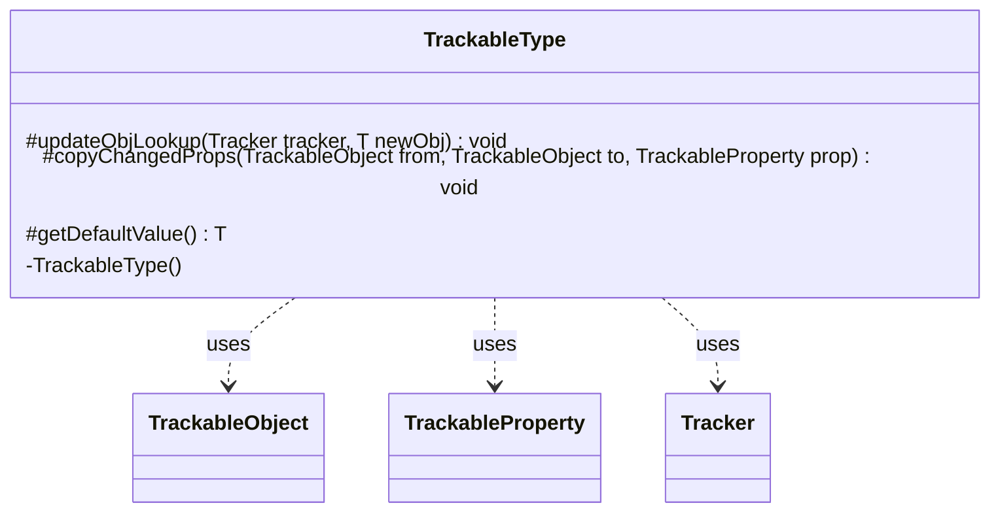

---
aliases:
  - TrackableType
tags:
  - java/class
  - module/forge-game
  - pkg/forge/trackable
fqn: forge.trackable.TrackableTypes.TrackableType
package: forge.trackable
module: forge-game
kind: Class
---

# TrackableType

**Package:** `forge.trackable`   **Module:** `forge-game`   **Kind:** Class



## Relationships
**Uses:**
- [[forge.trackable.TrackableObject|TrackableObject]]
- [[forge.trackable.TrackableProperty|TrackableProperty]]
- [[forge.trackable.Tracker|Tracker]]

## Design Description

TrackableType is an abstract, generically-typed base class that defines the contract for the kinds of values a TrackableObject can store and synchronize. Each concrete subtype encapsulates how a particular value type is looked up, copied, and defaulted, providing the type-specific behavior the tracking framework needs.

It collaborates with TrackableObject and TrackableProperty—its default copyChangedProps transfers a property value from one object to another—and with Tracker to refresh object lookups when values change. The private constructor restricts instantiation to nested subtypes declared within the enclosing TrackableTypes class, enforcing a closed, controlled set of supported types. getDefaultValue is left abstract so each subtype supplies its own appropriate default, while the other methods offer overridable defaults.

## Source
`forge-game/src/main/java/forge/trackable/TrackableTypes.java` — declaration excerpt

```java
    public static abstract class TrackableType<T> {
        private TrackableType() {
        }

        protected void updateObjLookup(Tracker tracker, T newObj) {
        }
        protected void copyChangedProps(TrackableObject from, TrackableObject to, TrackableProperty prop) {
            to.set(prop, from.get(prop));
        }
        protected abstract T getDefaultValue();
    }
```

## Python
`forge/trackable/TrackableTypes/TrackableType.py`

```python
from abc import ABC, abstractmethod
from typing import Generic, TypeVar

from forge.trackable.TrackableObject import TrackableObject
from forge.trackable.TrackableProperty import TrackableProperty
from forge.trackable.Tracker import Tracker

T = TypeVar("T")


class TrackableType(ABC, Generic[T]):
    def __init__(self):
        pass

    def updateObjLookup(self, tracker: Tracker, newObj: T) -> None:
        pass

    def copyChangedProps(self, from_: TrackableObject, to: TrackableObject, prop: TrackableProperty) -> None:
        to.set(prop, from_.get(prop))

    @abstractmethod
    def getDefaultValue(self) -> T:
        ...
```
