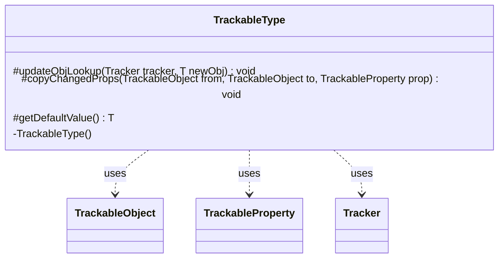

---
aliases:
  - TrackableType
tags:
  - java/class
  - module/forge-game
  - pkg/forge/trackable
fqn: forge.trackable.TrackableTypes.TrackableType
package: forge.trackable
module: forge-game
kind: Class
---

# TrackableType

**Package:** `forge.trackable` &nbsp; **Module:** `forge-game` &nbsp; **Kind:** Class



## Relationships
**Uses:**
- [[forge.trackable.TrackableObject|TrackableObject]]
- [[forge.trackable.TrackableProperty|TrackableProperty]]
- [[forge.trackable.Tracker|Tracker]]

## Source
`forge-game/src/main/java/forge/trackable/TrackableTypes.java` — declaration excerpt

```java
    public static abstract class TrackableType<T> {
        private TrackableType() {
        }

        protected void updateObjLookup(Tracker tracker, T newObj) {
        }
        protected void copyChangedProps(TrackableObject from, TrackableObject to, TrackableProperty prop) {
            to.set(prop, from.get(prop));
        }
        protected abstract T getDefaultValue();
    }
```
