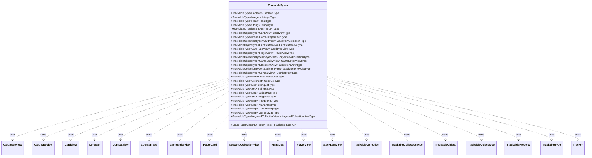

---
aliases:
  - TrackableTypes
tags:
  - java/class
  - module/forge-game
  - pkg/forge/trackable
fqn: forge.trackable.TrackableTypes
package: forge.trackable
module: forge-game
kind: Class
---

# TrackableTypes

**Package:** `forge.trackable`   **Module:** `forge-game`   **Kind:** Class



## Relationships
**Uses:**
- [[forge.card.CardTypeView|CardTypeView]]
- [[forge.card.ColorSet|ColorSet]]
- [[forge.card.mana.ManaCost|ManaCost]]
- [[forge.game.GameEntityView|GameEntityView]]
- [[forge.game.card.CardView|CardView]]
- [[forge.game.card.CardView.CardStateView|CardStateView]]
- [[forge.game.card.CounterType|CounterType]]
- [[forge.game.combat.CombatView|CombatView]]
- [[forge.game.keyword.KeywordCollectionView|KeywordCollectionView]]
- [[forge.game.player.PlayerView|PlayerView]]
- [[forge.game.spellability.StackItemView|StackItemView]]
- [[forge.item.IPaperCard|IPaperCard]]
- [[forge.trackable.TrackableCollection|TrackableCollection]]
- [[forge.trackable.TrackableObject|TrackableObject]]
- [[forge.trackable.TrackableProperty|TrackableProperty]]
- [[forge.trackable.TrackableTypes.TrackableCollectionType|TrackableCollectionType]]
- [[forge.trackable.TrackableTypes.TrackableObjectType|TrackableObjectType]]
- [[forge.trackable.TrackableTypes.TrackableType|TrackableType]]
- [[forge.trackable.Tracker|Tracker]]

## Design Description

TrackableTypes is a namespace utility that defines the complete catalog of value-type descriptors used by Forge's client-server state-synchronization (tracking) layer. It exposes singleton `TrackableType<T>` constants—primitives, enums, collections, and view objects (CardView, PlayerView, StackItemView, CombatView, etc.)—each parameterized to a property's value type, supplying that type's default value and the logic for copying changed properties between `TrackableObject` snapshots.

Through its nested abstract hierarchy—`TrackableType`, the identity-resolving `TrackableObjectType`, and `TrackableCollectionType`—it collaborates with `Tracker`, `TrackableProperty`, and `TrackableCollection` to deduplicate and reconcile tracked objects by ID during synchronization. Notable design intent includes the lazily-cached `EnumType` factory that avoids declaring a class per enum, and specialized `copyChangedProps` overrides that handle edge cases: shared-ID CardStateViews, ConcurrentModification-safe collection rebuilds, and stale cross-zone CardView references.

## Source
`forge-game/src/main/java/forge/trackable/TrackableTypes.java`

```java
package forge.trackable;

import java.util.List;
import java.util.Map;
import java.util.Set;

import com.google.common.collect.Maps;

import forge.card.CardType;
import forge.card.CardTypeView;
import forge.card.ColorSet;
import forge.card.mana.ManaCost;
import forge.game.GameEntityView;
import forge.game.card.CardView;
import forge.game.card.CardView.CardStateView;
import forge.game.card.CounterType;
import forge.game.combat.CombatView;
import forge.game.keyword.KeywordCollectionView;
import forge.game.player.PlayerView;
import forge.game.spellability.StackItemView;
import forge.item.IPaperCard;

public class TrackableTypes {
    public static abstract class TrackableType<T> {
        private TrackableType() {
        }

        protected void updateObjLookup(Tracker tracker, T newObj) {
        }
        protected void copyChangedProps(TrackableObject from, TrackableObject to, TrackableProperty prop) {
            to.set(prop, from.get(prop));
        }
        protected abstract T getDefaultValue();
    }

    public static abstract class TrackableObjectType<T extends TrackableObject> extends TrackableType<T> {
        private TrackableObjectType() {
        }

        public T lookup(T from) {
            if (from == null) { return null; }
            T to = from.getTracker().getObj(this, from.getId());
            if (to == null) {
                from.getTracker().putObj(this, from.getId(), from);
                return from;
            }
            return to;
        }

        @Override
        protected void updateObjLookup(Tracker tracker, T newObj) {
            if (tracker == null) { return; }
            if (newObj != null && !tracker.hasObj(this, newObj.getId())) {
                tracker.putObj(this, newObj.getId(), newObj);
                newObj.updateObjLookup();
            }
        }

        @Override
        protected void copyChangedProps(TrackableObject from, TrackableObject to, TrackableProperty prop) {
            T newObj = from.get(prop);
            if (newObj != null) {
                T existingObj = newObj.getTracker().getObj(this, newObj.getId());
                if (existingObj != null) { //if object exists already, update its changed properties
                    existingObj.copyChangedProps(newObj);
                    newObj = existingObj;
                }
                else { //if object is new, cache in object lookup
                    newObj.getTracker().putObj(this, newObj.getId(), newObj);
                }
            }
            to.set(prop, newObj);
        }
    }

    private static abstract class TrackableCollectionType<T extends TrackableObject> extends TrackableType<TrackableCollection<T>> {
        private final TrackableObjectType<T> itemType;

        private TrackableCollectionType(TrackableObjectType<T> itemType0) {
            itemType = itemType0;
        }

        @Override
        protected void updateObjLookup(Tracker tracker, TrackableCollection<T> newCollection) {
            if (newCollection != null) {
                for (T newObj : newCollection) {
                    if (newObj != null) {
                        itemType.updateObjLookup(tracker, newObj);
                    }
                }
            }
        }

        @Override
        protected void copyChangedProps(TrackableObject from, TrackableObject to, TrackableProperty prop) {
            TrackableCollection<T> newCollection = from.get(prop);
            if (newCollection != null) {
                // Snapshot via toArray: the loop below clears and rebuilds the collection,
                // so direct iteration would throw ConcurrentModificationException
                @SuppressWarnings("unchecked")
                T[] items = (T[]) newCollection.toArray(new TrackableObject[0]);
                newCollection.clear();
                for (T newObj : items) {
                    if (newObj != null) {
                        T existingObj = from.getTracker().getObj(itemType, newObj.getId());
                        if (existingObj != null) {
                            // Skip CardView collections — cross-zone refs like Commander hold stale copies
                            if (prop.getType() != TrackableTypes.CardViewCollectionType &&
                                    prop.getType() != TrackableTypes.StackItemViewListType) {
                                existingObj.copyChangedProps(newObj);
                            }
                            newCollection.add(existingObj);
                        } else {
                            from.getTracker().putObj(itemType, newObj.getId(), newObj);
                            newCollection.add(newObj);
                        }
                    }
                }
            }
            to.set(prop, newCollection);
        }
    }

    public static final TrackableType<Boolean> BooleanType = new TrackableType<Boolean>() {
        @Override
        public Boolean getDefaultValue() {
            return false;
        }
    };
    public static final TrackableType<Integer> IntegerType = new TrackableType<Integer>() {
        @Override
        public Integer getDefaultValue() {
            return 0;
        }
    };
    public static final TrackableType<Float> FloatType = new TrackableType<Float>() {
        @Override
        public Float getDefaultValue() {
            return 0f;
        }
    };
    public static final TrackableType<String> StringType = new TrackableType<String>() {
        @Override
        public String getDefaultValue() {
            return "";
        }
    };

    //make this quicker than having to define a new class for every single enum
    private static Map<Class<? extends Enum<?>>, TrackableType<?>> enumTypes = Maps.newHashMap();

    @SuppressWarnings("unchecked")
    public static <E extends Enum<E>> TrackableType<E> EnumType(final Class<E> enumType) {
        TrackableType<E> type = (TrackableType<E>)enumTypes.get(enumType);
        if (type == null) {
            type = new TrackableType<E>() {
                @Override
                public E getDefaultValue() {
                    return null;
                }
            };
            enumTypes.put(enumType, type);
        }
        return type;
    }

    public static final TrackableObjectType<CardView> CardViewType = new TrackableObjectType<CardView>() {
        @Override
        protected CardView getDefaultValue() {
            return null;
        }
    };

    public static final TrackableType<IPaperCard> IPaperCardType = new TrackableType<IPaperCard>() {
        @Override
        protected IPaperCard getDefaultValue() {
            return null;
        }
    };

    public static final TrackableCollectionType<CardView> CardViewCollectionType = new TrackableCollectionType<CardView>(CardViewType) {
        @Override
        protected TrackableCollection<CardView> getDefaultValue() {
            return null;
        }
    };
    public static final TrackableObjectType<CardStateView> CardStateViewType = new TrackableObjectType<CardStateView>() {
        @Override
        protected CardStateView getDefaultValue() {
            return null;
        }
        @Override
        protected void copyChangedProps(TrackableObject from, TrackableObject to, TrackableProperty prop) {
            // CardStateViews share their parent CardView's ID, so multiple states
            // (CurrentState, AlternateState) have the same (type, id) key. The base
            // implementation uses tracker.getObj(type, id) which returns the wrong
            // state. Instead, look up the existing state directly via the property.
            CardStateView newCsv = from.get(prop);
            CardStateView existingCsv = to.get(prop);
            if (newCsv != null && existingCsv != null) {
                existingCsv.copyChangedProps(newCsv);
                to.set(prop, existingCsv);
            } else {
                to.set(prop, newCsv);
            }
        }
    };
    public static final TrackableType<CardTypeView> CardTypeViewType = new TrackableType<CardTypeView>() {
        @Override
        protected CardTypeView getDefaultValue() {
            return CardType.EMPTY;
        }
    };
    public static final TrackableObjectType<PlayerView> PlayerViewType = new TrackableObjectType<PlayerView>() {
        @Override
        protected PlayerView getDefaultValue() {
            return null;
        }
    };
    public static final TrackableCollectionType<PlayerView> PlayerViewCollectionType = new TrackableCollectionType<PlayerView>(PlayerViewType) {
        @Override
        protected TrackableCollection<PlayerView> getDefaultValue() {
            return null;
        }
    };
    public static final TrackableObjectType<GameEntityView> GameEntityViewType = new TrackableObjectType<GameEntityView>() {
        @Override
        protected GameEntityView getDefaultValue() {
            return null;
        }
    };
    public static final TrackableObjectType<StackItemView> StackItemViewType = new TrackableObjectType<StackItemView>() {
        @Override
        protected StackItemView getDefaultValue() {
            return null;
        }
    };
    public static final TrackableCollectionType<StackItemView> StackItemViewListType = new TrackableCollectionType<StackItemView>(StackItemViewType) {
        @Override
        protected TrackableCollection<StackItemView> getDefaultValue() {
            return new TrackableCollection<>();
        }
    };
    public static final TrackableObjectType<CombatView> CombatViewType = new TrackableObjectType<CombatView>() {
        @Override
        protected CombatView getDefaultValue() {
            return null;
        }
    };
    public static final TrackableType<ManaCost> ManaCostType = new TrackableType<ManaCost>() {
        @Override
        public ManaCost getDefaultValue() {
            return ManaCost.NO_COST;
        }
    };
    public static final TrackableType<ColorSet> ColorSetType = new TrackableType<ColorSet>() {
        @Override
        public ColorSet getDefaultValue() {
            return ColorSet.C;
        }
    };
    public static final TrackableType<List<String>> StringListType = new TrackableType<List<String>>() {
        @Override
        public List<String> getDefaultValue() {
            return null;
        }
    };
    public static final TrackableType<Set<String>> StringSetType = new TrackableType<Set<String>>() {
        @Override
        public Set<String> getDefaultValue() {
            return null;
        }
    };
    public static final TrackableType<Map<String, String>> StringMapType = new TrackableType<Map<String, String>>() {
        @Override
        public Map<String, String> getDefaultValue() {
            return null;
        }
    };

    public static final TrackableType<Set<Integer>> IntegerSetType = new TrackableType<Set<Integer>>() {
        @Override
        public Set<Integer> getDefaultValue() {
            return null;
        }
    };
    public static final TrackableType<Map<Integer, Integer>> IntegerMapType = new TrackableType<Map<Integer, Integer>>() {
        @Override
        public Map<Integer, Integer> getDefaultValue() {
            return null;
        }
    };
    public static final TrackableType<Map<Byte, Integer>> ManaMapType = new TrackableType<Map<Byte, Integer>>() {
        @Override
        public Map<Byte, Integer> getDefaultValue() {
            return null;
        }
    };
    public static final TrackableType<Map<CounterType, Integer>> CounterMapType = new TrackableType<Map<CounterType, Integer>>() {
        @Override
        public Map<CounterType, Integer> getDefaultValue() {
            return null;
        }
    };
    public static final TrackableType<Map<Object, Object>> GenericMapType = new TrackableType<Map<Object, Object>>() {
        @Override
        public Map<Object, Object> getDefaultValue() {
            return null;
        }
    };
    public static final TrackableType<KeywordCollectionView> KeywordCollectionViewType = new TrackableType<KeywordCollectionView>() {
        @Override
        public KeywordCollectionView getDefaultValue() {
            return KeywordCollectionView.EMPTY;
        }
    };
}
```

## Python
`forge/trackable/TrackableTypes.py`

```python
from forge.card.CardType import CardType
from forge.card.CardTypeView import CardTypeView
from forge.card.ColorSet import ColorSet
from forge.card.mana.ManaCost import ManaCost
from forge.game.GameEntityView import GameEntityView
from forge.game.card.CardView import CardView
from forge.game.card.CardView.CardStateView import CardStateView
from forge.game.card.CounterType import CounterType
from forge.game.combat.CombatView import CombatView
from forge.game.keyword.KeywordCollectionView import KeywordCollectionView
from forge.game.player.PlayerView import PlayerView
from forge.game.spellability.StackItemView import StackItemView
from forge.item.IPaperCard import IPaperCard
from forge.trackable.TrackableCollection import TrackableCollection
from forge.trackable.TrackableObject import TrackableObject
from forge.trackable.TrackableProperty import TrackableProperty
from forge.trackable.Tracker import Tracker


class TrackableTypes:
    class TrackableType:
        def __init__(self):
            pass

        def updateObjLookup(self, tracker, newObj):
            pass

        def copyChangedProps(self, from_, to, prop):
            to.set(prop, from_.get(prop))

        def getDefaultValue(self):
            raise NotImplementedError

    class TrackableObjectType(TrackableType):
        def __init__(self):
            pass

        def lookup(self, from_):
            if from_ is None:
                return None
            to = from_.getTracker().getObj(self, from_.getId())
            if to is None:
                from_.getTracker().putObj(self, from_.getId(), from_)
                return from_
            return to

        def updateObjLookup(self, tracker, newObj):
            if tracker is None:
                return
            if newObj is not None and not tracker.hasObj(self, newObj.getId()):
                tracker.putObj(self, newObj.getId(), newObj)
                newObj.updateObjLookup()

        def copyChangedProps(self, from_, to, prop):
            newObj = from_.get(prop)
            if newObj is not None:
                existingObj = newObj.getTracker().getObj(self, newObj.getId())
                if existingObj is not None:  # if object exists already, update its changed properties
                    existingObj.copyChangedProps(newObj)
                    newObj = existingObj
                else:  # if object is new, cache in object lookup
                    newObj.getTracker().putObj(self, newObj.getId(), newObj)
            to.set(prop, newObj)

    class TrackableCollectionType(TrackableType):
        def __init__(self, itemType0):
            self.itemType = itemType0

        def updateObjLookup(self, tracker, newCollection):
            if newCollection is not None:
                for newObj in newCollection:
                    if newObj is not None:
                        self.itemType.updateObjLookup(tracker, newObj)

        def copyChangedProps(self, from_, to, prop):
            newCollection = from_.get(prop)
            if newCollection is not None:
                # Snapshot via toArray: the loop below clears and rebuilds the collection,
                # so direct iteration would throw ConcurrentModificationException
                items = list(newCollection)
                newCollection.clear()
                for newObj in items:
                    if newObj is not None:
                        existingObj = from_.getTracker().getObj(self.itemType, newObj.getId())
                        if existingObj is not None:
                            # Skip CardView collections ΓÇö cross-zone refs like Commander hold stale copies
                            if prop.getType() is not TrackableTypes.CardViewCollectionType and \
                                    prop.getType() is not TrackableTypes.StackItemViewListType:
                                existingObj.copyChangedProps(newObj)
                            newCollection.add(existingObj)
                        else:
                            from_.getTracker().putObj(self.itemType, newObj.getId(), newObj)
                            newCollection.add(newObj)
            to.set(prop, newCollection)

    class _BooleanType(TrackableType):
        def getDefaultValue(self):
            return False
    BooleanType = _BooleanType()

    class _IntegerType(TrackableType):
        def getDefaultValue(self):
            return 0
    IntegerType = _IntegerType()

    class _FloatType(TrackableType):
        def getDefaultValue(self):
            return 0.0
    FloatType = _FloatType()

    class _StringType(TrackableType):
        def getDefaultValue(self):
            return ""
    StringType = _StringType()

    # make this quicker than having to define a new class for every single enum
    enumTypes = {}

    class _EnumType(TrackableType):
        def getDefaultValue(self):
            return None

    @staticmethod
    def EnumType(enumType):
        type = TrackableTypes.enumTypes.get(enumType)
        if type is None:
            type = TrackableTypes._EnumType()
            TrackableTypes.enumTypes[enumType] = type
        return type

    class _CardViewType(TrackableObjectType):
        def getDefaultValue(self):
            return None
    CardViewType = _CardViewType()

    class _IPaperCardType(TrackableType):
        def getDefaultValue(self):
            return None
    IPaperCardType = _IPaperCardType()

    class _CardViewCollectionType(TrackableCollectionType):
        def getDefaultValue(self):
            return None
    CardViewCollectionType = _CardViewCollectionType(CardViewType)

    class _CardStateViewType(TrackableObjectType):
        def getDefaultValue(self):
            return None

        def copyChangedProps(self, from_, to, prop):
            # CardStateViews share their parent CardView's ID, so multiple states
            # (CurrentState, AlternateState) have the same (type, id) key. The base
            # implementation uses tracker.getObj(type, id) which returns the wrong
            # state. Instead, look up the existing state directly via the property.
            newCsv = from_.get(prop)
            existingCsv = to.get(prop)
            if newCsv is not None and existingCsv is not None:
                existingCsv.copyChangedProps(newCsv)
                to.set(prop, existingCsv)
            else:
                to.set(prop, newCsv)
    CardStateViewType = _CardStateViewType()

    class _CardTypeViewType(TrackableType):
        def getDefaultValue(self):
            return CardType.EMPTY
    CardTypeViewType = _CardTypeViewType()

    class _PlayerViewType(TrackableObjectType):
        def getDefaultValue(self):
            return None
    PlayerViewType = _PlayerViewType()

    class _PlayerViewCollectionType(TrackableCollectionType):
        def getDefaultValue(self):
            return None
    PlayerViewCollectionType = _PlayerViewCollectionType(PlayerViewType)

    class _GameEntityViewType(TrackableObjectType):
        def getDefaultValue(self):
            return None
    GameEntityViewType = _GameEntityViewType()

    class _StackItemViewType(TrackableObjectType):
        def getDefaultValue(self):
            return None
    StackItemViewType = _StackItemViewType()

    class _StackItemViewListType(TrackableCollectionType):
        def getDefaultValue(self):
            return TrackableCollection()
    StackItemViewListType = _StackItemViewListType(StackItemViewType)

    class _CombatViewType(TrackableObjectType):
        def getDefaultValue(self):
            return None
    CombatViewType = _CombatViewType()

    class _ManaCostType(TrackableType):
        def getDefaultValue(self):
            return ManaCost.NO_COST
    ManaCostType = _ManaCostType()

    class _ColorSetType(TrackableType):
        def getDefaultValue(self):
            return ColorSet.C
    ColorSetType = _ColorSetType()

    class _StringListType(TrackableType):
        def getDefaultValue(self):
            return None
    StringListType = _StringListType()

    class _StringSetType(TrackableType):
        def getDefaultValue(self):
            return None
    StringSetType = _StringSetType()

    class _StringMapType(TrackableType):
        def getDefaultValue(self):
            return None
    StringMapType = _StringMapType()

    class _IntegerSetType(TrackableType):
        def getDefaultValue(self):
            return None
    IntegerSetType = _IntegerSetType()

    class _IntegerMapType(TrackableType):
        def getDefaultValue(self):
            return None
    IntegerMapType = _IntegerMapType()

    class _ManaMapType(TrackableType):
        def getDefaultValue(self):
            return None
    ManaMapType = _ManaMapType()

    class _CounterMapType(TrackableType):
        def getDefaultValue(self):
            return None
    CounterMapType = _CounterMapType()

    class _GenericMapType(TrackableType):
        def getDefaultValue(self):
            return None
    GenericMapType = _GenericMapType()

    class _KeywordCollectionViewType(TrackableType):
        def getDefaultValue(self):
            return KeywordCollectionView.EMPTY
    KeywordCollectionViewType = _KeywordCollectionViewType()
```
