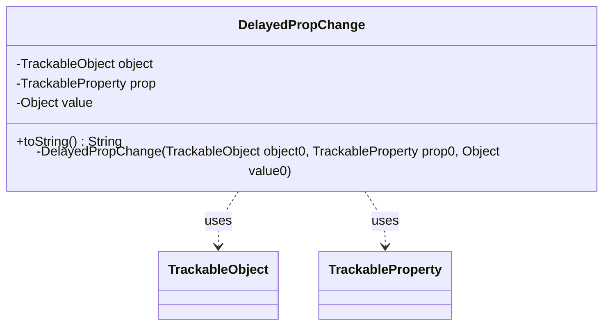

---
aliases:
  - DelayedPropChange
tags:
  - java/class
  - module/forge-game
  - pkg/forge/trackable
fqn: forge.trackable.Tracker.DelayedPropChange
package: forge.trackable
module: forge-game
kind: Class
---

# DelayedPropChange

**Package:** `forge.trackable`   **Module:** `forge-game`   **Kind:** Class



## Relationships
**Uses:**
- [[forge.trackable.TrackableObject|TrackableObject]]
- [[forge.trackable.TrackableProperty|TrackableProperty]]

## Design Description

Set forge.trackable.TrackableProperty of forge.trackable.TrackableObject to value — that one-line `toString()` captures the entire intent of this small private inner class.

DelayedPropChange is a private inner class of `Tracker` that records a single deferred property mutation so it can be queued and replayed later rather than applied immediately. It bundles the three pieces of state needed to describe one change — the target `TrackableObject`, the `TrackableProperty` being altered, and the new `Object` value — as immutable `final` fields set once at construction. As a passive value object it holds no behavior beyond a human-readable `toString()` for debugging, collaborating with `TrackableObject` and `TrackableProperty` purely by reference. Its private constructor and enclosing-class scoping signal that it is an internal implementation detail of `Tracker`'s change-tracking mechanism, intended only to be created and drained by the tracker itself.

## Source
`forge-game/src/main/java/forge/trackable/Tracker.java` — declaration excerpt

```java
    private class DelayedPropChange {
        private final TrackableObject object;
        private final TrackableProperty prop;
        private final Object value;
        private DelayedPropChange(final TrackableObject object0, final TrackableProperty prop0, final Object value0) {
            object = object0;
            prop = prop0;
            value = value0;
        }
        @Override public String toString() {
            return "Set " + prop + " of " + object + " to " + value;
        }
    }
```

## Python
`forge/trackable/Tracker/DelayedPropChange.py`

```python
from forge.trackable.TrackableObject import TrackableObject
from forge.trackable.TrackableProperty import TrackableProperty


class DelayedPropChange:
    def __init__(self, object0: TrackableObject, prop0: TrackableProperty, value0: object):
        self.object = object0
        self.prop = prop0
        self.value = value0

    def __str__(self) -> str:
        return "Set " + str(self.prop) + " of " + str(self.object) + " to " + str(self.value)
```
