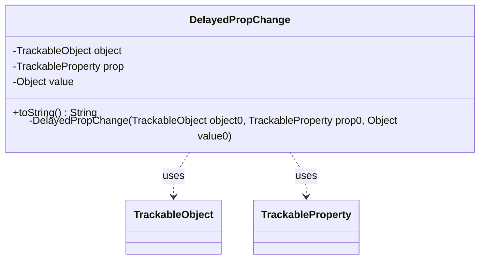

---
aliases:
  - DelayedPropChange
tags:
  - java/class
  - module/forge-game
  - pkg/forge/trackable
fqn: forge.trackable.Tracker.DelayedPropChange
package: forge.trackable
module: forge-game
kind: Class
---

# DelayedPropChange

**Package:** `forge.trackable` &nbsp; **Module:** `forge-game` &nbsp; **Kind:** Class



## Relationships
**Uses:**
- [[forge.trackable.TrackableObject|TrackableObject]]
- [[forge.trackable.TrackableProperty|TrackableProperty]]

## Source
`forge-game/src/main/java/forge/trackable/Tracker.java` — declaration excerpt

```java
    private class DelayedPropChange {
        private final TrackableObject object;
        private final TrackableProperty prop;
        private final Object value;
        private DelayedPropChange(final TrackableObject object0, final TrackableProperty prop0, final Object value0) {
            object = object0;
            prop = prop0;
            value = value0;
        }
        @Override public String toString() {
            return "Set " + prop + " of " + object + " to " + value;
        }
    }
```
