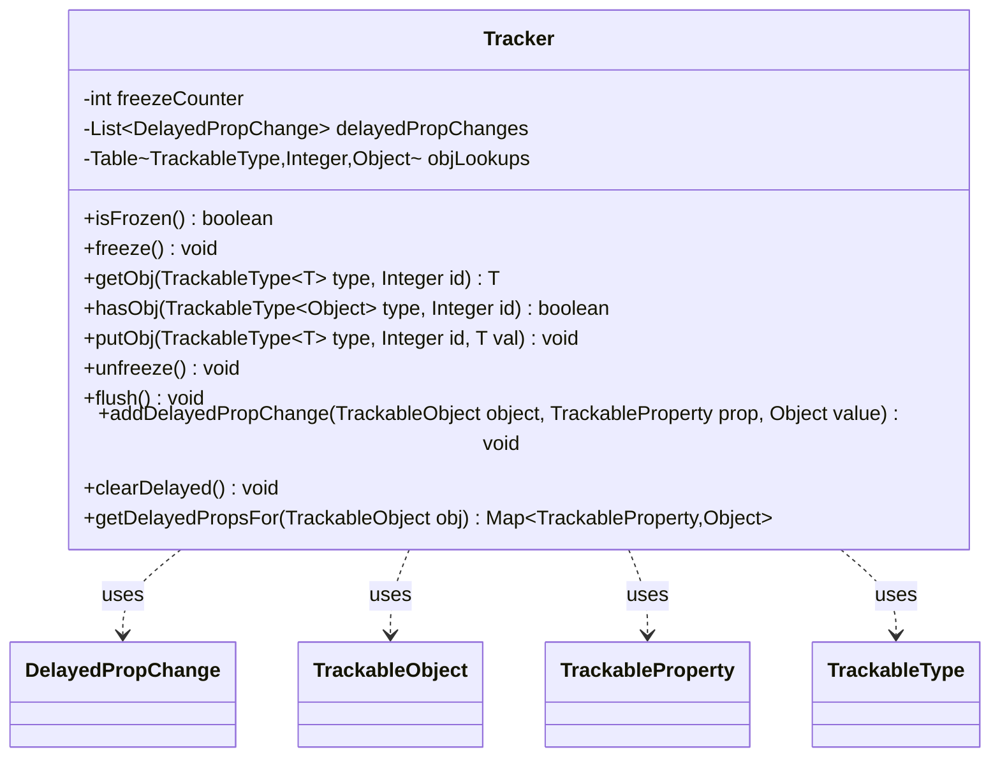

---
aliases:
  - Tracker
tags:
  - java/class
  - module/forge-game
  - pkg/forge/trackable
fqn: forge.trackable.Tracker
package: forge.trackable
module: forge-game
kind: Class
---

# Tracker

**Package:** `forge.trackable`   **Module:** `forge-game`   **Kind:** Class



## Relationships
**Uses:**
- [[forge.trackable.TrackableObject|TrackableObject]]
- [[forge.trackable.TrackableProperty|TrackableProperty]]
- [[forge.trackable.TrackableTypes.TrackableType|TrackableType]]
- [[forge.trackable.Tracker.DelayedPropChange|DelayedPropChange]]

## Design Description

The Tracker is a per-game ledger that serves two roles for the trackable view layer: an object registry and a change-coalescing buffer. As a registry it maps `(TrackableType, id)` pairs to canonical instances, letting deserialization resolve `IdRef` stand-ins back to real objects; lookups live here rather than on the globally-shared `TrackableType` precisely because a Tracker is scoped to a single game. As a buffer it implements a reentrant freeze model via a counter: while frozen, `TrackableObject.set` enqueues `DelayedPropChange` records instead of applying them, and `unfreeze` replays the queue only when the count returns to zero, bundling a multi-step engine effect into one coherent post-effect snapshot. It collaborates with `TrackableObject`, `TrackableProperty`, and `TrackableType`, using a private inner `DelayedPropChange` to hold deferred writes. The design is deliberately single-threaded—replay drives consumer dirty-bit notifications, so off-thread use would corrupt that state.

## Source
`forge-game/src/main/java/forge/trackable/Tracker.java`

```java
package forge.trackable;

import java.util.Collections;
import java.util.EnumMap;
import java.util.List;
import java.util.Map;

import com.google.common.collect.HashBasedTable;
import com.google.common.collect.Lists;
import com.google.common.collect.Table;

import forge.trackable.TrackableTypes.TrackableType;

/**
 * Per-game lookup + change-coalescing ledger for {@link TrackableObject}s. Owned by the
 * game thread; every TrackableObject in an active game's view holds a reference to one
 * instance.
 *
 * <p><b>Object lookup.</b> Stores ({@link TrackableTypes.TrackableType}, id) → instance.
 * Used by deserialization to resolve {@code IdRef} stand-ins back to canonical objects.
 *
 * <p><b>Freeze model.</b> {@link #freeze()}/{@link #unfreeze()} bracket a region during
 * which {@link TrackableObject#set} queues changes rather than applying them. When the
 * freeze counter reaches zero, queued changes replay through {@code set} and may cascade
 * into consumer dirty-bit updates. Used to bundle the state changes of a multi-step
 * engine effect into a single coherent post-effect snapshot. {@link #flush()} drains the
 * queue without leaving the frozen state.
 *
 * <p><b>Thread safety.</b> Not thread-safe — game thread only. The {@code unfreeze}
 * replay walks TrackableObjects and triggers consumer notifications; running it from
 * another thread corrupts consumer dirty-bit state.
 */
public class Tracker {
    private int freezeCounter = 0;
    private final List<DelayedPropChange> delayedPropChanges = Lists.newArrayList();

    private final Table<TrackableType<?>, Integer, Object> objLookups = HashBasedTable.create();

    public final boolean isFrozen() {
        return freezeCounter > 0;
    }

    public void freeze() {
        freezeCounter++;
    }

    // Note: objLookups exist on the tracker and not on the TrackableType because
    // TrackableType is global and Tracker is per game.
    @SuppressWarnings("unchecked")
    public <T> T getObj(TrackableType<T> type, Integer id) {
        return (T)objLookups.get(type, id);
    }

    public boolean hasObj(TrackableType<?> type, Integer id) {
        return objLookups.contains(type, id);
    }

    public <T> void putObj(TrackableType<T> type, Integer id, T val) {
        objLookups.put(type, id, val);
    }

    public void unfreeze() {
        if (!isFrozen() || --freezeCounter > 0 || delayedPropChanges.isEmpty()) {
            return;
        }
        //after being unfrozen, ensure all changes delayed during freeze are now applied
        for (final DelayedPropChange change : delayedPropChanges) {
            change.object.set(change.prop, change.value);
        }
        delayedPropChanges.clear();
    }

    public void flush() {
        // unfreeze and refreeze the tracker in order to flush current pending properties
        if (!isFrozen()) {
            return;
        }
        unfreeze();
        freeze();
    }

    public void addDelayedPropChange(final TrackableObject object, final TrackableProperty prop, final Object value) {
        delayedPropChanges.add(new DelayedPropChange(object, prop, value));
    }

    public void clearDelayed() {
        delayedPropChanges.clear();
    }

    /**
     * Read-only peek at delayed property changes queued for a specific object.
     */
    public Map<TrackableProperty, Object> getDelayedPropsFor(TrackableObject obj) {
        if (delayedPropChanges.isEmpty()) {
            return Collections.emptyMap();
        }
        Map<TrackableProperty, Object> result = new EnumMap<>(TrackableProperty.class);
        for (DelayedPropChange change : delayedPropChanges) {
            if (change.object == obj) {
                result.put(change.prop, change.value);
            }
        }
        return result;
    }

    private class DelayedPropChange {
        private final TrackableObject object;
        private final TrackableProperty prop;
        private final Object value;
        private DelayedPropChange(final TrackableObject object0, final TrackableProperty prop0, final Object value0) {
            object = object0;
            prop = prop0;
            value = value0;
        }
        @Override public String toString() {
            return "Set " + prop + " of " + object + " to " + value;
        }
    }
}
```

## Python
`forge/trackable/Tracker.py`

```python
from typing import TypeVar

from forge.trackable.TrackableObject import TrackableObject
from forge.trackable.TrackableProperty import TrackableProperty
from forge.trackable.TrackableTypes.TrackableType import TrackableType

T = TypeVar("T")


class Tracker:
    def __init__(self):
        self.freezeCounter = 0
        self.delayedPropChanges: list["Tracker.DelayedPropChange"] = []
        self.objLookups: dict[tuple[TrackableType, int], object] = {}

    def isFrozen(self) -> bool:
        return self.freezeCounter > 0

    def freeze(self) -> None:
        self.freezeCounter += 1

    # Note: objLookups exist on the tracker and not on the TrackableType because
    # TrackableType is global and Tracker is per game.
    def getObj(self, type: TrackableType, id: int) -> T:
        return self.objLookups.get((type, id))

    def hasObj(self, type: TrackableType, id: int) -> bool:
        return (type, id) in self.objLookups

    def putObj(self, type: TrackableType, id: int, val: T) -> None:
        self.objLookups[(type, id)] = val

    def unfreeze(self) -> None:
        if not self.isFrozen():
            return
        self.freezeCounter -= 1
        if self.freezeCounter > 0 or not self.delayedPropChanges:
            return
        # after being unfrozen, ensure all changes delayed during freeze are now applied
        for change in self.delayedPropChanges:
            change.object.set(change.prop, change.value)
        self.delayedPropChanges.clear()

    def flush(self) -> None:
        # unfreeze and refreeze the tracker in order to flush current pending properties
        if not self.isFrozen():
            return
        self.unfreeze()
        self.freeze()

    def addDelayedPropChange(self, object: TrackableObject, prop: TrackableProperty, value: object) -> None:
        self.delayedPropChanges.append(Tracker.DelayedPropChange(object, prop, value))

    def clearDelayed(self) -> None:
        self.delayedPropChanges.clear()

    def getDelayedPropsFor(self, obj: TrackableObject) -> dict[TrackableProperty, object]:
        """Read-only peek at delayed property changes queued for a specific object."""
        if not self.delayedPropChanges:
            return {}
        result: dict[TrackableProperty, object] = {}
        for change in self.delayedPropChanges:
            if change.object is obj:
                result[change.prop] = change.value
        return result

    class DelayedPropChange:
        def __init__(self, object0: TrackableObject, prop0: TrackableProperty, value0: object):
            self.object = object0
            self.prop = prop0
            self.value = value0

        def __str__(self) -> str:
            return "Set " + str(self.prop) + " of " + str(self.object) + " to " + str(self.value)
```
