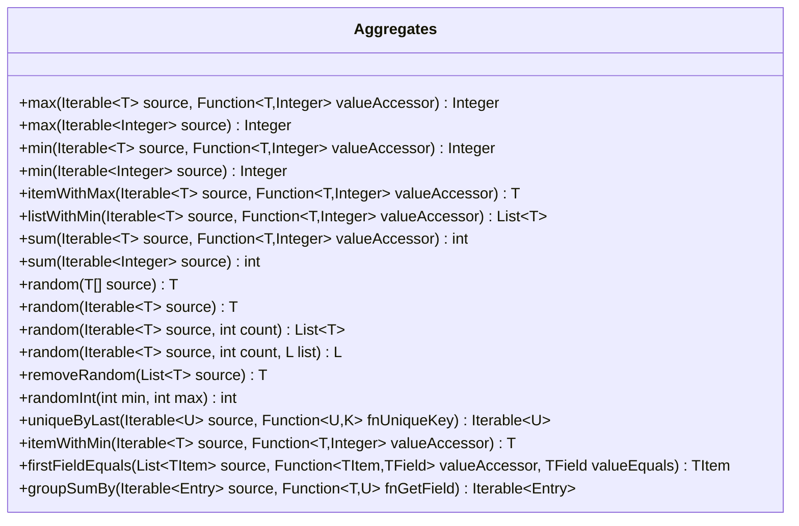

---
aliases:
  - Aggregates
tags:
  - java/class
  - module/forge-core
  - pkg/forge/util
fqn: forge.util.Aggregates
package: forge.util
module: forge-core
kind: Class
---

# Aggregates

**Package:** `forge.util`   **Module:** `forge-core`   **Kind:** Class



## Design Description

`Aggregates` is a stateless utility class in `forge.util` that provides a library of generic static helper methods for computing summary values over collections. Its responsibilities cluster around three concerns: extremes and reductions (`max`, `min`, `sum`, `itemWithMax`/`itemWithMin`, `listWithMin`), randomized selection (`random`, `removeRandom`, `randomInt`, and reservoir sampling for fixed-count draws), and grouping or deduplication (`uniqueByLast`, `groupSumBy`, `firstFieldEquals`). Most methods accept a `Function` value-accessor, decoupling the aggregation logic from any particular domain type so callers across the engine can reuse them on arbitrary `Iterable` sources.

As a final utility holder it declares no supertype or interfaces, instead collaborating with Guava's `Lists`, the engine's `MyRandom` for deterministic-seedable randomness, `StreamUtil`, and Java streams. The design favors null-tolerant, defensive iteration (guarding null sources and empty collections) and single-pass algorithms—notably reservoir sampling to draw random subsets without materializing the whole source—reflecting an intent toward broadly reusable, allocation-conscious collection operations.

## Source
`forge-core/src/main/java/forge/util/Aggregates.java`

```java
package forge.util;

import com.google.common.collect.Lists;

import java.util.*;
import java.util.Map.Entry;
import java.util.function.Function;
import java.util.stream.Collectors;

/** 
 * TODO: Write javadoc for this type.
 *
 */
public class Aggregates {

    // Returns the value matching predicate conditions with the maximum value of whatever valueAccessor returns.
    public static final <T> Integer max(final Iterable<T> source, final Function<T, Integer> valueAccessor) {
        if (source == null) { return null; }
        int max = Integer.MIN_VALUE;
        for (final T c : source) {
            int value = valueAccessor.apply(c);
            if (value > max) {
                max = value;
            }
        }
        return max;
    }

    public static Integer max(final Iterable<Integer> source) {
        if (source == null) return null;
        int max = Integer.MIN_VALUE;
        for (int value : source) {
            if (value > max)
                max = value;
        }
        return max;
    }

    public static final <T> Integer min(final Iterable<T> source, final Function<T, Integer> valueAccessor) {
        if (source == null) { return null; }
        int max = Integer.MAX_VALUE;
        for (final T c : source) {
            int value = valueAccessor.apply(c);
            if (value < max) {
                max = value;
            }
        }
        return max;
    }

    public static Integer min(final Iterable<Integer> source) {
        if (source == null) return null;
        int min = Integer.MAX_VALUE;
        for (int value : source) {
            if (value < min)
                min = value;
        }
        return min;
    }

    public static final <T> T itemWithMax(final Iterable<T> source, final Function<T, Integer> valueAccessor) {
        if (source == null) { return null; }
        int max = Integer.MIN_VALUE;
        T result = null;
        for (final T c : source) {
            int value = valueAccessor.apply(c);
            if (value > max) {
                max = value;
                result = c;
            }
        }
        return result;
    }

    public static final <T> List<T> listWithMin(final Iterable<T> source, final Function<T, Integer> valueAccessor) {
        if (source == null) { return null; }
        int min = Integer.MAX_VALUE;
        List<T> result = Lists.newArrayList();
        for (final T c : source) {
            int value = valueAccessor.apply(c);
            if (value == min) {
                result.add(c);
            }
            if (value < min) {
                min = value;
                result.clear();
                result.add(c);
            }
        }
        return result;
    }

    public static final <T> int sum(final Iterable<T> source, final Function<T, Integer> valueAccessor) {
        int result = 0;
        if (source != null) {
            for (final T c : source) {
                result += valueAccessor.apply(c);
            }
        }
        return result;
    }

    public static int sum(final Iterable<Integer> source) {
        int result = 0;
        if(source != null) {
            for(final Integer value : source) {
                result += value;
            }
        }
        return result;
    }

    public static final <T> T random(final T[] source) {
        if (source == null) { return null; }

        switch (source.length) {
            case 0: return null;
            case 1: return source[0];
            default: return source[MyRandom.getRandom().nextInt(source.length)];
        }
    }

    // Random - algorithm adapted from Braid's GeneratorFunctions
    /**
     * Random.
     * 
     * @param source
     *            the source
     * @return the t
     */
    public static final <T> T random(final Iterable<T> source) {
        if (source == null) { return null; }

        if (source instanceof List<?>) {
            List<T> src = (List<T>)source;
            int len = src.size();
            switch(len) {
                case 0: return null;
                case 1: return src.get(0);
                default: return src.get(MyRandom.getRandom().nextInt(len));
            }
        }

        T candidate = null;
        int lowest = Integer.MAX_VALUE;
        for (final T item : source) {
            int next = MyRandom.getRandom().nextInt();
            if(next < lowest) {
                lowest = next;
                candidate = item;
            }
        }
        return candidate;
    }

    public static final <T> List<T> random(final Iterable<T> source, final int count) {
        return random(source, count, new ArrayList<>());
    }
    public static final <T, L extends List<T>> L random(final Iterable<T> source, final int count, final L list) {
        // Using Reservoir Sampling to grab X random values from source
        int i = 0;
        for (T item : source) {
            i++;
            if (i <= count) {
                // Add the first count items into the result list
                list.add(item);
            } else {
                // Progressively reduce odds of item > count to get added into the reservoir
                int j = MyRandom.getRandom().nextInt(i);
                if (j < count) {
                    list.set(j, item);
                }
            }
        }
        return list;
    }

    public static final <T> T removeRandom(final List<T> source) {
        if (source == null || source.isEmpty()) { return null; }

        int index;
        if (source.size() > 1) {
            index = MyRandom.getRandom().nextInt(source.size());
        }
        else {
            index = 0;
        }
        return source.remove(index);
    }

    public static int randomInt(int min, int max) {
        return MyRandom.getRandom().nextInt(max - min + 1) + min;
    }

    public static final <K, U> Iterable<U> uniqueByLast(final Iterable<U> source, final Function<U, K> fnUniqueKey) { // this might be exotic
        final Map<K, U> uniques = new Hashtable<>();
        for (final U c : source) {
             uniques.put(fnUniqueKey.apply(c), c);
        }
        return uniques.values();
    }

    public static <T> T itemWithMin(final Iterable<T> source, final Function<T, Integer> valueAccessor) {
        if (source == null) { return null; }
        int max = Integer.MAX_VALUE;
        T result = null;
        for (final T c : source) {
            int value = valueAccessor.apply(c);
            if (value < max) {
                max = value;
                result = c;
            }
        }
        return result;
    }

    public static <TItem, TField> TItem firstFieldEquals(List<TItem> source, Function<TItem, TField> valueAccessor, TField valueEquals) {
        if (source == null) { return null; }

        if (valueEquals == null) {
            for (final TItem c : source) {
                if (null == valueAccessor.apply(c)) {
                    return c;
                }
            }
        }
        else {
            for (final TItem c : source) {
                if (valueEquals.equals(valueAccessor.apply(c))) {
                    return c;
                }
            }
        }
        return null;
    }

    public static <T, U> Iterable<Entry<U, Integer>> groupSumBy(Iterable<Entry<T, Integer>> source, Function<T, U> fnGetField) {
        return StreamUtil.stream(source).collect(Collectors.groupingBy(kv -> fnGetField.apply(kv.getKey()), Collectors.summingInt(e -> e.getValue()))).entrySet();
    }
}
```

## Python
`forge/util/Aggregates.py`

```python
from forge.util.MyRandom import MyRandom
from forge.util.StreamUtil import StreamUtil

from typing import Callable, Iterable, List, TypeVar

T = TypeVar("T")
K = TypeVar("K")
U = TypeVar("U")
L = TypeVar("L")
TItem = TypeVar("TItem")
TField = TypeVar("TField")

INT_MIN = -2147483648
INT_MAX = 2147483647


# TODO: Write javadoc for this type.
class Aggregates:

    # Returns the value matching predicate conditions with the maximum value of whatever valueAccessor returns.
    @staticmethod
    def max(source, valueAccessor=None):
        if source is None:
            return None
        max = INT_MIN
        if valueAccessor is not None:
            for c in source:
                value = valueAccessor(c)
                if value > max:
                    max = value
        else:
            for value in source:
                if value > max:
                    max = value
        return max

    @staticmethod
    def min(source, valueAccessor=None):
        if source is None:
            return None
        if valueAccessor is not None:
            max = INT_MAX
            for c in source:
                value = valueAccessor(c)
                if value < max:
                    max = value
            return max
        else:
            min = INT_MAX
            for value in source:
                if value < min:
                    min = value
            return min

    @staticmethod
    def itemWithMax(source, valueAccessor):
        if source is None:
            return None
        max = INT_MIN
        result = None
        for c in source:
            value = valueAccessor(c)
            if value > max:
                max = value
                result = c
        return result

    @staticmethod
    def listWithMin(source, valueAccessor):
        if source is None:
            return None
        min = INT_MAX
        result = []
        for c in source:
            value = valueAccessor(c)
            if value == min:
                result.append(c)
            if value < min:
                min = value
                result.clear()
                result.append(c)
        return result

    @staticmethod
    def sum(source, valueAccessor=None):
        result = 0
        if source is not None:
            if valueAccessor is not None:
                for c in source:
                    result += valueAccessor(c)
            else:
                for value in source:
                    result += value
        return result

    @staticmethod
    def random(source, count=None, list=None):
        if count is None:
            # random(T[] source) / random(Iterable<T> source)
            if source is None:
                return None

            if isinstance(source, __import__("builtins").list):
                src = source
                length = len(src)
                if length == 0:
                    return None
                elif length == 1:
                    return src[0]
                else:
                    return src[MyRandom.getRandom().nextInt(length)]

            candidate = None
            lowest = INT_MAX
            for item in source:
                next = MyRandom.getRandom().nextInt()
                if next < lowest:
                    lowest = next
                    candidate = item
            return candidate

        # random(Iterable<T> source, int count[, L list])
        if list is None:
            list = []
        # Using Reservoir Sampling to grab X random values from source
        i = 0
        for item in source:
            i += 1
            if i <= count:
                # Add the first count items into the result list
                list.append(item)
            else:
                # Progressively reduce odds of item > count to get added into the reservoir
                j = MyRandom.getRandom().nextInt(i)
                if j < count:
                    list[j] = item
        return list

    @staticmethod
    def removeRandom(source):
        if source is None or len(source) == 0:
            return None

        if len(source) > 1:
            index = MyRandom.getRandom().nextInt(len(source))
        else:
            index = 0
        return source.pop(index)

    @staticmethod
    def randomInt(min, max):
        return MyRandom.getRandom().nextInt(max - min + 1) + min

    @staticmethod
    def uniqueByLast(source, fnUniqueKey):  # this might be exotic
        uniques = {}
        for c in source:
            uniques[fnUniqueKey(c)] = c
        return list(uniques.values())

    @staticmethod
    def itemWithMin(source, valueAccessor):
        if source is None:
            return None
        max = INT_MAX
        result = None
        for c in source:
            value = valueAccessor(c)
            if value < max:
                max = value
                result = c
        return result

    @staticmethod
    def firstFieldEquals(source, valueAccessor, valueEquals):
        if source is None:
            return None

        if valueEquals is None:
            for c in source:
                if valueAccessor(c) is None:
                    return c
        else:
            for c in source:
                if valueEquals == valueAccessor(c):
                    return c
        return None

    @staticmethod
    def groupSumBy(source, fnGetField):
        result = {}
        for kv in StreamUtil.stream(source):
            key = fnGetField(kv.getKey())
            result[key] = result.get(key, 0) + kv.getValue()
        return result.items()
```
