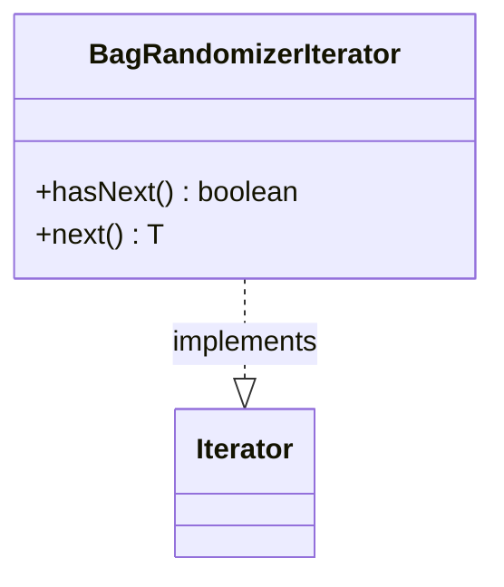

---
aliases:
  - BagRandomizerIterator
tags:
  - java/class
  - module/forge-core
  - pkg/forge/util
fqn: forge.util.BagRandomizer.BagRandomizerIterator
package: forge.util
module: forge-core
kind: Class
---

# BagRandomizerIterator

**Package:** `forge.util` &nbsp; **Module:** `forge-core` &nbsp; **Kind:** Class



## Source
`forge-core/src/main/java/forge/util/BagRandomizer.java` — declaration excerpt

```java
    private class BagRandomizerIterator<T> implements Iterator<T> {

        @Override
        public boolean hasNext() {
            return bag.length > 0;
        }

        @Override
        public T next() {
            return (T) BagRandomizer.this.getNextItem();
        }
    }
```
