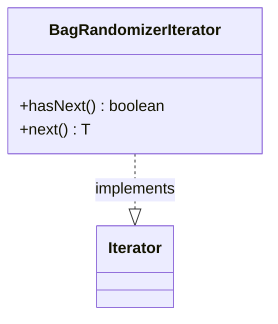

---
aliases:
  - BagRandomizerIterator
tags:
  - java/class
  - module/forge-core
  - pkg/forge/util
fqn: forge.util.BagRandomizer.BagRandomizerIterator
package: forge.util
module: forge-core
kind: Class
---

# BagRandomizerIterator

**Package:** `forge.util`   **Module:** `forge-core`   **Kind:** Class



## Design Description

A private inner iterator that exposes `BagRandomizer`'s draw sequence through the standard `Iterator<T>` contract, allowing callers to consume randomized items via normal iteration idioms. Its sole responsibility is to delegate: `hasNext()` reports whether the enclosing bag still holds elements, and `next()` returns the parent's `getNextItem()`, so all randomization and depletion logic remains in `BagRandomizer` rather than the iterator itself. Being a non-static inner class, it binds directly to its enclosing instance's mutable `bag` state, keeping the iterator a thin, stateless view over the outer object. The design intentionally treats randomized drawing as an open-ended stream, with availability gated purely by remaining bag contents.

## Source
`forge-core/src/main/java/forge/util/BagRandomizer.java` — declaration excerpt

```java
    private class BagRandomizerIterator<T> implements Iterator<T> {

        @Override
        public boolean hasNext() {
            return bag.length > 0;
        }

        @Override
        public T next() {
            return (T) BagRandomizer.this.getNextItem();
        }
    }
```

## Python
`forge/util/BagRandomizer/BagRandomizerIterator.py`

```python
from typing import Iterator, TypeVar
from forge.util.BagRandomizer import BagRandomizer

T = TypeVar("T")


class BagRandomizerIterator(Iterator[T]):

    def __init__(self, outer: "BagRandomizer"):
        self._outer = outer

    def hasNext(self) -> bool:
        return len(self._outer.bag) > 0

    def next(self) -> T:
        return self._outer.getNextItem()

    def __next__(self) -> T:
        if not self.hasNext():
            raise StopIteration
        return self.next()

    def __iter__(self) -> "BagRandomizerIterator[T]":
        return self
```
