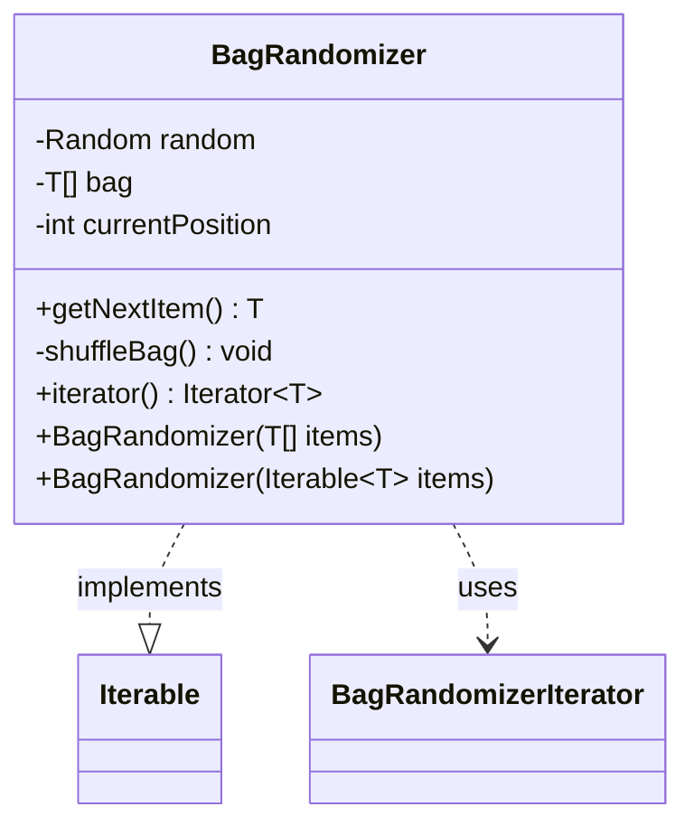

---
aliases:
  - BagRandomizer
tags:
  - java/class
  - module/forge-core
  - pkg/forge/util
fqn: forge.util.BagRandomizer
package: forge.util
module: forge-core
kind: Class
---

# BagRandomizer

**Package:** `forge.util`   **Module:** `forge-core`   **Kind:** Class



## Relationships
**Uses:**
- [[forge.util.BagRandomizer.BagRandomizerIterator|BagRandomizerIterator]]

## Design Description

BagRandomizer is a generic utility that implements the "shuffle bag" distribution pattern: it returns every item from a fixed set exactly once, in random order, before reshuffling and repeating. This guarantees fair, non-repeating draws that feel random without the clustering of independent sampling, making it suited to gameplay randomness where even coverage matters. It accepts items either as an array or any `Iterable`, validating that the bag is non-empty, and exposes draws through `getNextItem()`, which transparently reshuffles once the current cycle is exhausted.

As an `Iterable<T>`, it integrates with for-each iteration via an inner `BagRandomizerIterator` that delegates each `next()` back to `getNextItem()`, yielding an effectively endless cyclic stream. A shared static `SecureRandom` supplies high-quality entropy, and the private Fisher–Yates `shuffleBag()` keeps the permutation logic encapsulated and unbiased.

## Source
`forge-core/src/main/java/forge/util/BagRandomizer.java`

```java
package forge.util;

import java.security.SecureRandom;
import java.util.ArrayList;
import java.util.Iterator;
import java.util.Random;

/**
 * Data structure that allows random draws from a set number of items,
 * where all items are returned once before the first will be retrieved.
 * The bag will be shuffled after each time all items have been returned.
 * @param <T> an object
 */
public class BagRandomizer<T > implements Iterable<T>{
    private static Random random = new SecureRandom();

    private T[] bag;
    private int currentPosition = 0;

    public BagRandomizer(T[] items) throws IllegalArgumentException {
        if (items.length == 0) {
            throw new IllegalArgumentException("Must include at least one item!");
        }
        bag = items;
        shuffleBag();
    }

    public BagRandomizer(Iterable<T> items) throws IllegalArgumentException {
        ArrayList<T> list = new ArrayList<>();
        for (T item : items) {
            list.add(item);
        }
        if (list.size() == 0) {
            throw new IllegalArgumentException("Must include at least one item!");
        }
        bag = (T[]) list.toArray();
        shuffleBag();
    }

    public T getNextItem() {
        // reset bag if last position is reached
        if (currentPosition >= bag.length) {
            shuffleBag();
            currentPosition = 0;
        }
        return bag[currentPosition++];
    }

    private void shuffleBag() {
        int n = bag.length;
        for (int i = 0; i < n; i++) {
            int r = (int) (random.nextDouble() * (i + 1));
            T swap = bag[r];
            bag[r] = bag[i];
            bag[i] = swap;
        }
    }

    @Override
    public Iterator<T> iterator() {
        return new BagRandomizerIterator<T>();
    }

    private class BagRandomizerIterator<T> implements Iterator<T> {

        @Override
        public boolean hasNext() {
            return bag.length > 0;
        }

        @Override
        public T next() {
            return (T) BagRandomizer.this.getNextItem();
        }
    }
}
```

## Python
`forge/util/BagRandomizer.py`

```python
from typing import Iterable, Iterator
from random import SystemRandom


class BagRandomizer(Iterable):
    """
    Data structure that allows random draws from a set number of items,
    where all items are returned once before the first will be retrieved.
    The bag will be shuffled after each time all items have been returned.
    :param <T>: an object
    """
    random = SystemRandom()

    def __init__(self, items):
        self.bag = None
        self.currentPosition = 0
        if isinstance(items, (list, tuple)):
            if len(items) == 0:
                raise ValueError("Must include at least one item!")
            self.bag = list(items)
            self.shuffleBag()
        else:
            list_ = []
            for item in items:
                list_.append(item)
            if len(list_) == 0:
                raise ValueError("Must include at least one item!")
            self.bag = list_
            self.shuffleBag()

    def getNextItem(self):
        # reset bag if last position is reached
        if self.currentPosition >= len(self.bag):
            self.shuffleBag()
            self.currentPosition = 0
        item = self.bag[self.currentPosition]
        self.currentPosition += 1
        return item

    def shuffleBag(self):
        n = len(self.bag)
        for i in range(n):
            r = int(BagRandomizer.random.random() * (i + 1))
            swap = self.bag[r]
            self.bag[r] = self.bag[i]
            self.bag[i] = swap

    def iterator(self) -> Iterator:
        return BagRandomizer.BagRandomizerIterator(self)

    def __iter__(self) -> Iterator:
        return self.iterator()

    class BagRandomizerIterator(Iterator):

        def __init__(self, outer):
            self.outer = outer

        def hasNext(self) -> bool:
            return len(self.outer.bag) > 0

        def next(self):
            return self.outer.getNextItem()

        def __next__(self):
            return self.next()
```
