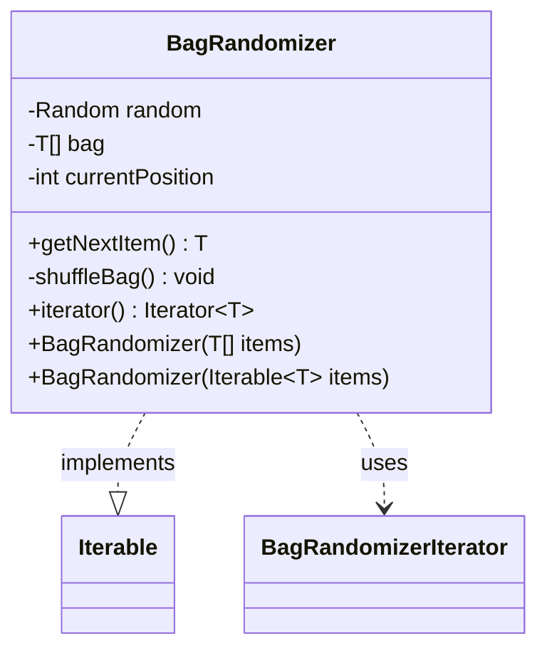

---
aliases:
  - BagRandomizer
tags:
  - java/class
  - module/forge-core
  - pkg/forge/util
fqn: forge.util.BagRandomizer
package: forge.util
module: forge-core
kind: Class
---

# BagRandomizer

**Package:** `forge.util` &nbsp; **Module:** `forge-core` &nbsp; **Kind:** Class



## Relationships
**Uses:**
- [[forge.util.BagRandomizer.BagRandomizerIterator|BagRandomizerIterator]]

## Source
`forge-core/src/main/java/forge/util/BagRandomizer.java`

```java
package forge.util;

import java.security.SecureRandom;
import java.util.ArrayList;
import java.util.Iterator;
import java.util.Random;

/**
 * Data structure that allows random draws from a set number of items,
 * where all items are returned once before the first will be retrieved.
 * The bag will be shuffled after each time all items have been returned.
 * @param <T> an object
 */
public class BagRandomizer<T > implements Iterable<T>{
    private static Random random = new SecureRandom();

    private T[] bag;
    private int currentPosition = 0;

    public BagRandomizer(T[] items) throws IllegalArgumentException {
        if (items.length == 0) {
            throw new IllegalArgumentException("Must include at least one item!");
        }
        bag = items;
        shuffleBag();
    }

    public BagRandomizer(Iterable<T> items) throws IllegalArgumentException {
        ArrayList<T> list = new ArrayList<>();
        for (T item : items) {
            list.add(item);
        }
        if (list.size() == 0) {
            throw new IllegalArgumentException("Must include at least one item!");
        }
        bag = (T[]) list.toArray();
        shuffleBag();
    }

    public T getNextItem() {
        // reset bag if last position is reached
        if (currentPosition >= bag.length) {
            shuffleBag();
            currentPosition = 0;
        }
        return bag[currentPosition++];
    }

    private void shuffleBag() {
        int n = bag.length;
        for (int i = 0; i < n; i++) {
            int r = (int) (random.nextDouble() * (i + 1));
            T swap = bag[r];
            bag[r] = bag[i];
            bag[i] = swap;
        }
    }

    @Override
    public Iterator<T> iterator() {
        return new BagRandomizerIterator<T>();
    }

    private class BagRandomizerIterator<T> implements Iterator<T> {

        @Override
        public boolean hasNext() {
            return bag.length > 0;
        }

        @Override
        public T next() {
            return (T) BagRandomizer.this.getNextItem();
        }
    }
}
```
