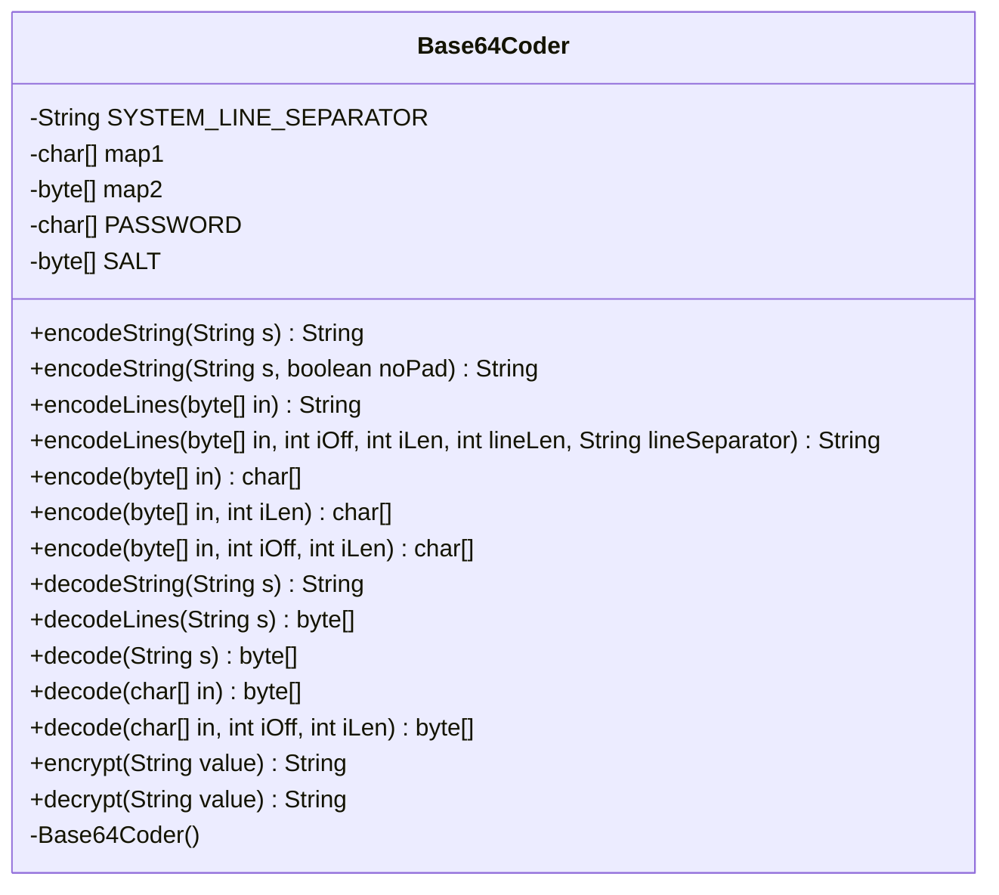

---
aliases:
  - Base64Coder
tags:
  - java/class
  - module/forge-core
  - pkg/forge/util
fqn: forge.util.Base64Coder
package: forge.util
module: forge-core
kind: Class
---

# Base64Coder

**Package:** `forge.util`   **Module:** `forge-core`   **Kind:** Class



## Design Description

Base64Coder is a final utility class in the `forge.util` package that provides static methods for encoding and decoding data in Base64 format per RFC 1521, supplemented by simple symmetric encryption helpers. As a stateless helper, it exposes no instances—its private no-arg constructor enforces purely static use—and relies on two precomputed lookup tables (`map1`, `map2`), built in static initializers, to translate between 6-bit nibbles and Base64 characters for fast bitwise conversion. It offers layered overloads for strings, byte arrays, and line-wrapped output (76-char default), with an optional unpadded variant that delegates to `TextUtil.fastReplace`. The `encrypt`/`decrypt` methods extend its role beyond pure encoding, wrapping the JCE `Cipher` API (PBEWithMD5AndDES) with a hardcoded password and salt and Base64-encoding the cipher output. Validation throws `IllegalArgumentException` on malformed input, reflecting a defensively coded, dependency-light design.

## Source
`forge-core/src/main/java/forge/util/Base64Coder.java`

```java
/*
 * Forge: Play Magic: the Gathering.
 * Copyright (C) 2011  Forge Team
 *
 * This program is free software: you can redistribute it and/or modify
 * it under the terms of the GNU General Public License as published by
 * the Free Software Foundation, either version 3 of the License, or
 * (at your option) any later version.
 * 
 * This program is distributed in the hope that it will be useful,
 * but WITHOUT ANY WARRANTY; without even the implied warranty of
 * MERCHANTABILITY or FITNESS FOR A PARTICULAR PURPOSE.  See the
 * GNU General Public License for more details.
 * 
 * You should have received a copy of the GNU General Public License
 * along with this program.  If not, see <http://www.gnu.org/licenses/>.
 */
// www.source-code.biz, www.inventec.ch/chdh
//
// This module is multi-licensed and may be used under the terms
// of any of the following licenses:
//
//  EPL, Eclipse Public License, V1.0 or later, http://www.eclipse.org/legal
//  LGPL, GNU Lesser General Public License, V2.1 or later, http://www.gnu.org/licenses/lgpl.html
//  GPL, GNU General Public License, V2 or later, http://www.gnu.org/licenses/gpl.html
//  AL, Apache License, V2.0 or later, http://www.apache.org/licenses
//  BSD, BSD License, http://www.opensource.org/licenses/bsd-license.php
//
// Please contact the author if you need another license.
// This module is provided "as is", without warranties of any kind.

package forge.util;

import javax.crypto.Cipher;
import javax.crypto.SecretKey;
import javax.crypto.SecretKeyFactory;
import javax.crypto.spec.PBEKeySpec;
import javax.crypto.spec.PBEParameterSpec;
import java.nio.charset.StandardCharsets;
import java.util.Arrays;

/**
 * A Base64 encoder/decoder.
 * <p/>
 * <p/>
 * This class is used to encode and decode data in Base64 format as described in
 * RFC 1521.
 * <p/>
 * <p/>
 * Project home page: <a
 * href="http://www.source-code.biz/base64coder/java/">www.
 * source-code.biz/base64coder/java</a><br>
 * Author: Christian d'Heureuse, Inventec Informatik AG, Zurich, Switzerland<br>
 * Multi-licensed: EPL / LGPL / GPL / AL / BSD.
 * 
 * @author Forge
 * @version $Id: Base64Coder.java 13541 2012-01-26 21:20:51Z Max mtg $
 */
public final class Base64Coder {

    // The line separator string of the operating system.
    /**
     * Constant.
     * <code>systemLineSeparator="System.getProperty(line.separator)"</code>
     */
    private static final String SYSTEM_LINE_SEPARATOR = System.lineSeparator();

    // Mapping table from 6-bit nibbles to Base64 characters.
    /** Constant <code>map1=new char[64]</code>. */
    private static char[] map1 = new char[64];

    static {
        int i = 0;
        for (char c = 'A'; c <= 'Z'; c++) {
            Base64Coder.map1[i++] = c;
        }
        for (char c = 'a'; c <= 'z'; c++) {
            Base64Coder.map1[i++] = c;
        }
        for (char c = '0'; c <= '9'; c++) {
            Base64Coder.map1[i++] = c;
        }
        Base64Coder.map1[i++] = '+';
        Base64Coder.map1[i++] = '/';
    }

    // Mapping table from Base64 characters to 6-bit nibbles.
    /** Constant <code>map2=new byte[128]</code>. */
    private static byte[] map2 = new byte[128];

    static {
        Arrays.fill(Base64Coder.map2, (byte) -1);
        for (int i = 0; i < 64; i++) {
            Base64Coder.map2[Base64Coder.map1[i]] = (byte) i;
        }
    }

    /**
     * Encodes a string into Base64 format. No blanks or line breaks are
     * inserted.
     * 
     * @param s
     *            A String to be encoded.
     * @return A String containing the Base64 encoded data.
     */
    public static String encodeString(final String s) {
        return new String(Base64Coder.encode(s.getBytes()));
    }

    /**
     * <p>
     * encodeString.
     * </p>
     * 
     * @param s
     *            a {@link java.lang.String} object.
     * @param noPad
     *            a boolean.
     * @return a {@link java.lang.String} object.
     */
    public static String encodeString(final String s, final boolean noPad) {
        String t = new String(Base64Coder.encode(s.getBytes()));

        if (noPad) {
            t = TextUtil.fastReplace(t, "=", "");
        }

        return t;
    }

    /**
     * Encodes a byte array into Base 64 format and breaks the output into lines
     * of 76 characters. This method is compatible with
     * <code>sun.misc.BASE64Encoder.encodeBuffer(byte[])</code>.
     * 
     * @param in
     *            An array containing the data bytes to be encoded.
     * @return A String containing the Base64 encoded data, broken into lines.
     */
    public static String encodeLines(final byte[] in) {
        return Base64Coder.encodeLines(in, 0, in.length, 76, Base64Coder.SYSTEM_LINE_SEPARATOR);
    }

    /**
     * Encodes a byte array into Base 64 format and breaks the output into
     * lines.
     * 
     * @param in
     *            An array containing the data bytes to be encoded.
     * @param iOff
     *            Offset of the first byte in <code>in</code> to be processed.
     * @param iLen
     *            Number of bytes to be processed in <code>in</code>, starting
     *            at <code>iOff</code>.
     * @param lineLen
     *            Line length for the output data. Should be a multiple of 4.
     * @param lineSeparator
     *            The line separator to be used to separate the output lines.
     * @return A String containing the Base64 encoded data, broken into lines.
     */
    public static String encodeLines(final byte[] in, final int iOff, final int iLen, final int lineLen,
            final String lineSeparator) {
        final int blockLen = (lineLen * 3) / 4;
        if (blockLen <= 0) {
            throw new IllegalArgumentException();
        }
        final int lines = ((iLen + blockLen) - 1) / blockLen;
        final int bufLen = (((iLen + 2) / 3) * 4) + (lines * lineSeparator.length());
        final StringBuilder buf = new StringBuilder(bufLen);
        int ip = 0;
        while (ip < iLen) {
            final int l = Math.min(iLen - ip, blockLen);
            buf.append(Base64Coder.encode(in, iOff + ip, l));
            buf.append(lineSeparator);
            ip += l;
        }
        return buf.toString();
    }

    /**
     * Encodes a byte array into Base64 format. No blanks or line breaks are
     * inserted in the output.
     * 
     * @param in
     *            An array containing the data bytes to be encoded.
     * @return A character array containing the Base64 encoded data.
     */
    public static char[] encode(final byte[] in) {
        return Base64Coder.encode(in, 0, in.length);
    }

    /**
     * Encodes a byte array into Base64 format. No blanks or line breaks are
     * inserted in the output.
     * 
     * @param in
     *            An array containing the data bytes to be encoded.
     * @param iLen
     *            Number of bytes to process in <code>in</code>.
     * @return A character array containing the Base64 encoded data.
     */
    public static char[] encode(final byte[] in, final int iLen) {
        return Base64Coder.encode(in, 0, iLen);
    }

    /**
     * Encodes a byte array into Base64 format. No blanks or line breaks are
     * inserted in the output.
     * 
     * @param in
     *            An array containing the data bytes to be encoded.
     * @param iOff
     *            Offset of the first byte in <code>in</code> to be processed.
     * @param iLen
     *            Number of bytes to process in <code>in</code>, starting at
     *            <code>iOff</code>.
     * @return A character array containing the Base64 encoded data.
     */
    public static char[] encode(final byte[] in, final int iOff, final int iLen) {
        final int oDataLen = ((iLen * 4) + 2) / 3; // output length without
                                                   // padding
        final int oLen = ((iLen + 2) / 3) * 4; // output length including
                                               // padding
        final char[] out = new char[oLen];
        int ip = iOff;
        final int iEnd = iOff + iLen;
        int op = 0;
        while (ip < iEnd) {
            final int i0 = in[ip++] & 0xff;
            final int i1 = ip < iEnd ? in[ip++] & 0xff : 0;
            final int i2 = ip < iEnd ? in[ip++] & 0xff : 0;
            final int o0 = i0 >>> 2;
            final int o1 = ((i0 & 3) << 4) | (i1 >>> 4);
            final int o2 = ((i1 & 0xf) << 2) | (i2 >>> 6);
            final int o3 = i2 & 0x3F;
            out[op++] = Base64Coder.map1[o0];
            out[op++] = Base64Coder.map1[o1];
            out[op] = op < oDataLen ? Base64Coder.map1[o2] : '=';
            op++;
            out[op] = op < oDataLen ? Base64Coder.map1[o3] : '=';
            op++;
        }
        return out;
    }

    /**
     * Decodes a string from Base64 format. No blanks or line breaks are allowed
     * within the Base64 encoded input data.
     * 
     * @param s
     *            A Base64 String to be decoded.
     * @return A String containing the decoded data.
     * 
     *         If the input is not valid Base64 encoded data.
     */
    public static String decodeString(final String s) {
        return new String(Base64Coder.decode(s));
    }

    /**
     * Decodes a byte array from Base64 format and ignores line separators, tabs
     * and blanks. CR, LF, Tab and Space characters are ignored in the input
     * data. This method is compatible with
     * <code>sun.misc.BASE64Decoder.decodeBuffer(String)</code>.
     * 
     * @param s
     *            A Base64 String to be decoded.
     * @return An array containing the decoded data bytes.
     * 
     *         If the input is not valid Base64 encoded data.
     */
    public static byte[] decodeLines(final String s) {
        final char[] buf = new char[s.length()];
        int p = 0;
        for (int ip = 0; ip < s.length(); ip++) {
            final char c = s.charAt(ip);
            if ((c != ' ') && (c != '\r') && (c != '\n') && (c != '\t')) {
                buf[p++] = c;
            }
        }
        return Base64Coder.decode(buf, 0, p);
    }

    /**
     * Decodes a byte array from Base64 format. No blanks or line breaks are
     * allowed within the Base64 encoded input data.
     * 
     * @param s
     *            A Base64 String to be decoded.
     * @return An array containing the decoded data bytes.
     * 
     *         If the input is not valid Base64 encoded data.
     */
    public static byte[] decode(final String s) {
        return Base64Coder.decode(s.toCharArray());
    }

    /**
     * Decodes a byte array from Base64 format. No blanks or line breaks are
     * allowed within the Base64 encoded input data.
     * 
     * @param in
     *            A character array containing the Base64 encoded data.
     * @return An array containing the decoded data bytes.
     * 
     *         If the input is not valid Base64 encoded data.
     */
    public static byte[] decode(final char[] in) {
        return Base64Coder.decode(in, 0, in.length);
    }

    /**
     * Decodes a byte array from Base64 format. No blanks or line breaks are
     * allowed within the Base64 encoded input data.
     * 
     * @param in
     *            A character array containing the Base64 encoded data.
     * @param iOff
     *            Offset of the first character in <code>in</code> to be
     *            processed.
     * @param iLen
     *            Number of characters to process in <code>in</code>, starting
     *            at <code>iOff</code>.
     * @return An array containing the decoded data bytes.
     * 
     *         If the input is not valid Base64 encoded data.
     */
    public static byte[] decode(final char[] in, final int iOff, int iLen) {
        if ((iLen % 4) != 0) {
            throw new IllegalArgumentException("Length of Base64 encoded input string is not a multiple of 4.");
        }
        while ((iLen > 0) && (in[(iOff + iLen) - 1] == '=')) {
            iLen--;
        }
        final int oLen = (iLen * 3) / 4;
        final byte[] out = new byte[oLen];
        int ip = iOff;
        final int iEnd = iOff + iLen;
        int op = 0;
        while (ip < iEnd) {
            final int i0 = in[ip++];
            final int i1 = in[ip++];
            final int i2 = ip < iEnd ? in[ip++] : 'A';
            final int i3 = ip < iEnd ? in[ip++] : 'A';
            if ((i0 > 127) || (i1 > 127) || (i2 > 127) || (i3 > 127)) {
                throw new IllegalArgumentException("Illegal character in Base64 encoded data.");
            }
            final int b0 = Base64Coder.map2[i0];
            final int b1 = Base64Coder.map2[i1];
            final int b2 = Base64Coder.map2[i2];
            final int b3 = Base64Coder.map2[i3];
            if ((b0 < 0) || (b1 < 0) || (b2 < 0) || (b3 < 0)) {
                throw new IllegalArgumentException("Illegal character in Base64 encoded data.");
            }
            final int o0 = (b0 << 2) | (b1 >>> 4);
            final int o1 = ((b1 & 0xf) << 4) | (b2 >>> 2);
            final int o2 = ((b2 & 3) << 6) | b3;
            out[op++] = (byte) o0;
            if (op < oLen) {
                out[op++] = (byte) o1;
            }
            if (op < oLen) {
                out[op++] = (byte) o2;
            }
        }
        return out;
    }

    private static final char[] PASSWORD = "enfldsgbnlsngdlksdsgm".toCharArray();
    private static final byte[] SALT = {
        (byte) 0xde, (byte) 0x33, (byte) 0x10, (byte) 0x12,
        (byte) 0xde, (byte) 0x33, (byte) 0x10, (byte) 0x12,
    };

    public static String encrypt(String value) throws Exception {
        SecretKeyFactory keyFactory = SecretKeyFactory.getInstance("PBEWithMD5AndDES");
        SecretKey key = keyFactory.generateSecret(new PBEKeySpec(PASSWORD));
        Cipher pbeCipher = Cipher.getInstance("PBEWithMD5AndDES");
        pbeCipher.init(Cipher.ENCRYPT_MODE, key, new PBEParameterSpec(SALT, 20));
        return String.valueOf(encode(pbeCipher.doFinal(value.getBytes(StandardCharsets.UTF_8))));
    }

    public static String decrypt(String value) throws Exception {
        SecretKeyFactory keyFactory = SecretKeyFactory.getInstance("PBEWithMD5AndDES");
        SecretKey key = keyFactory.generateSecret(new PBEKeySpec(PASSWORD));
        Cipher pbeCipher = Cipher.getInstance("PBEWithMD5AndDES");
        pbeCipher.init(Cipher.DECRYPT_MODE, key, new PBEParameterSpec(SALT, 20));
        return new String(pbeCipher.doFinal(decode(value)), StandardCharsets.UTF_8);
    }

    // Dummy constructor.
    /**
     * <p>
     * Constructor for Base64Coder.
     * </p>
     */
    private Base64Coder() {
    }
} // end class Base64Coder
```

## Python
`forge/util/Base64Coder.py`

```python
from forge.util.TextUtil import TextUtil

import os
import hashlib
from Crypto.Cipher import DES
from Crypto.Util.Padding import pad, unpad


class Base64Coder:

    # The line separator string of the operating system.
    SYSTEM_LINE_SEPARATOR = os.linesep

    # Mapping table from 6-bit nibbles to Base64 characters.
    map1 = [None] * 64
    _i = 0
    for _c in range(ord('A'), ord('Z') + 1):
        map1[_i] = chr(_c)
        _i += 1
    for _c in range(ord('a'), ord('z') + 1):
        map1[_i] = chr(_c)
        _i += 1
    for _c in range(ord('0'), ord('9') + 1):
        map1[_i] = chr(_c)
        _i += 1
    map1[_i] = '+'
    _i += 1
    map1[_i] = '/'
    _i += 1
    del _i
    del _c

    # Mapping table from Base64 characters to 6-bit nibbles.
    map2 = [-1] * 128
    for _i in range(64):
        map2[ord(map1[_i])] = _i
    del _i

    @staticmethod
    def encodeString(s, noPad=None):
        if noPad is None:
            return ''.join(Base64Coder.encode(s.encode()))
        t = ''.join(Base64Coder.encode(s.encode()))
        if noPad:
            t = TextUtil.fastReplace(t, "=", "")
        return t

    @staticmethod
    def encodeLines(in_, iOff=None, iLen=None, lineLen=None, lineSeparator=None):
        if iOff is None:
            return Base64Coder.encodeLines(in_, 0, len(in_), 76, Base64Coder.SYSTEM_LINE_SEPARATOR)
        blockLen = (lineLen * 3) // 4
        if blockLen <= 0:
            raise ValueError()
        lines = ((iLen + blockLen) - 1) // blockLen
        bufLen = (((iLen + 2) // 3) * 4) + (lines * len(lineSeparator))
        buf = []
        ip = 0
        while ip < iLen:
            l = min(iLen - ip, blockLen)
            buf.append(''.join(Base64Coder.encode(in_, iOff + ip, l)))
            buf.append(lineSeparator)
            ip += l
        return ''.join(buf)

    @staticmethod
    def encode(in_, a=None, b=None):
        if a is None:
            return Base64Coder.encode(in_, 0, len(in_))
        if b is None:
            return Base64Coder.encode(in_, 0, a)
        iOff, iLen = a, b
        oDataLen = ((iLen * 4) + 2) // 3  # output length without padding
        oLen = ((iLen + 2) // 3) * 4  # output length including padding
        out = [''] * oLen
        ip = iOff
        iEnd = iOff + iLen
        op = 0
        while ip < iEnd:
            i0 = in_[ip] & 0xff
            ip += 1
            if ip < iEnd:
                i1 = in_[ip] & 0xff
                ip += 1
            else:
                i1 = 0
            if ip < iEnd:
                i2 = in_[ip] & 0xff
                ip += 1
            else:
                i2 = 0
            o0 = i0 >> 2
            o1 = ((i0 & 3) << 4) | (i1 >> 4)
            o2 = ((i1 & 0xf) << 2) | (i2 >> 6)
            o3 = i2 & 0x3F
            out[op] = Base64Coder.map1[o0]
            op += 1
            out[op] = Base64Coder.map1[o1]
            op += 1
            out[op] = Base64Coder.map1[o2] if op < oDataLen else '='
            op += 1
            out[op] = Base64Coder.map1[o3] if op < oDataLen else '='
            op += 1
        return out

    @staticmethod
    def decodeString(s):
        return bytes(Base64Coder.decode(s)).decode()

    @staticmethod
    def decodeLines(s):
        buf = [''] * len(s)
        p = 0
        for ip in range(len(s)):
            c = s[ip]
            if (c != ' ') and (c != '\r') and (c != '\n') and (c != '\t'):
                buf[p] = c
                p += 1
        return Base64Coder.decode(buf, 0, p)

    @staticmethod
    def decode(in_, iOff=None, iLen=None):
        if iOff is None:
            if isinstance(in_, str):
                in_ = list(in_)
            return Base64Coder.decode(in_, 0, len(in_))
        if (iLen % 4) != 0:
            raise ValueError("Length of Base64 encoded input string is not a multiple of 4.")
        while (iLen > 0) and (in_[(iOff + iLen) - 1] == '='):
            iLen -= 1
        oLen = (iLen * 3) // 4
        out = bytearray(oLen)
        ip = iOff
        iEnd = iOff + iLen
        op = 0
        while ip < iEnd:
            i0 = ord(in_[ip])
            ip += 1
            i1 = ord(in_[ip])
            ip += 1
            if ip < iEnd:
                i2 = ord(in_[ip])
                ip += 1
            else:
                i2 = ord('A')
            if ip < iEnd:
                i3 = ord(in_[ip])
                ip += 1
            else:
                i3 = ord('A')
            if (i0 > 127) or (i1 > 127) or (i2 > 127) or (i3 > 127):
                raise ValueError("Illegal character in Base64 encoded data.")
            b0 = Base64Coder.map2[i0]
            b1 = Base64Coder.map2[i1]
            b2 = Base64Coder.map2[i2]
            b3 = Base64Coder.map2[i3]
            if (b0 < 0) or (b1 < 0) or (b2 < 0) or (b3 < 0):
                raise ValueError("Illegal character in Base64 encoded data.")
            o0 = (b0 << 2) | (b1 >> 4)
            o1 = ((b1 & 0xf) << 4) | (b2 >> 2)
            o2 = ((b2 & 3) << 6) | b3
            out[op] = o0 & 0xff
            op += 1
            if op < oLen:
                out[op] = o1 & 0xff
                op += 1
            if op < oLen:
                out[op] = o2 & 0xff
                op += 1
        return out

    PASSWORD = list("enfldsgbnlsngdlksdsgm")
    SALT = bytes([
        0xde, 0x33, 0x10, 0x12,
        0xde, 0x33, 0x10, 0x12,
    ])

    @staticmethod
    def _deriveKeyIv(password, salt, iterations):
        pw = bytes([ord(c) & 0xff for c in password])
        h = hashlib.md5(pw + salt).digest()
        for _ in range(iterations - 1):
            h = hashlib.md5(h).digest()
        return h[:8], h[8:16]

    @staticmethod
    def encrypt(value):
        key, iv = Base64Coder._deriveKeyIv(Base64Coder.PASSWORD, Base64Coder.SALT, 20)
        pbeCipher = DES.new(key, DES.MODE_CBC, iv)
        ct = pbeCipher.encrypt(pad(value.encode("utf-8"), 8))
        return ''.join(Base64Coder.encode(ct))

    @staticmethod
    def decrypt(value):
        key, iv = Base64Coder._deriveKeyIv(Base64Coder.PASSWORD, Base64Coder.SALT, 20)
        pbeCipher = DES.new(key, DES.MODE_CBC, iv)
        pt = unpad(pbeCipher.decrypt(bytes(Base64Coder.decode(value))), 8)
        return pt.decode("utf-8")

    # Dummy constructor.
    def __init__(self):
        pass
```
