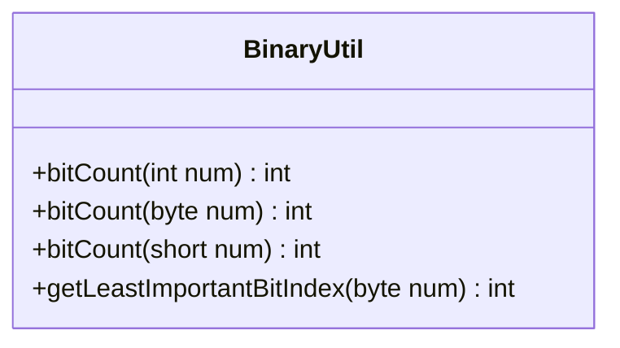

---
aliases:
  - BinaryUtil
tags:
  - java/class
  - module/forge-core
  - pkg/forge/util
fqn: forge.util.BinaryUtil
package: forge.util
module: forge-core
kind: Class
---

# BinaryUtil

**Package:** `forge.util`   **Module:** `forge-core`   **Kind:** Class



## Design Description

BinaryUtil is a stateless utility class in the `forge.util` package providing static helper methods for low-level bit manipulation on integral primitives. It offers overloaded `bitCount` methods for `int`, `byte`, and `short` values—each using Kernighan's algorithm (`v &= v - 1`) to count set bits in time proportional to the number of ones rather than the word width—plus `getLeastImportantBitIndex`, which locates the lowest set bit in a byte or returns -1 when none exists.

As a final class of purely static methods with no fields, constructors, or inheritance, BinaryUtil collaborates with no other types and serves as a self-contained helper, presumably supporting bitmask-based encoding elsewhere in forge-core. The primitive-specific overloads reflect deliberate intent to avoid widening conversions and operate directly on the caller's chosen data width.

## Source
`forge-core/src/main/java/forge/util/BinaryUtil.java`

```java
package forge.util;

/** 
 * TODO: Write javadoc for this type.
 *
 */
public class BinaryUtil {

    public static int bitCount(final int num) {
        int v = num;
        int c = 0;
        for (; v != 0; c++) {
            v &= v - 1;
        }
        return c;
    } // bit count

    public static int bitCount(final byte num) {
        byte v = num;
        int c = 0;
        for (; v != 0; c++) {
            v &= v - 1;
        }
        return c;
    } // bit count

    public static int bitCount(final short num) {
        short v = num;
        int c = 0;
        for (; v != 0; c++) {
            v &= v - 1;
        }
        return c;
    } // bit count
    
    public static int getLeastImportantBitIndex(final byte num) {
        if( num == 0 ) return -1;
        byte mask = 1;
        for(int i = 0; mask != 0; i++) {
            if( (mask & num) != 0)
                return i;
            mask = (byte) (mask << 1);
        }
        return -1;
    }
}
```

## Python
`forge/util/BinaryUtil.py`

```python
class BinaryUtil:
    """
    TODO: Write javadoc for this type.
    """

    @staticmethod
    def bitCount(num: int) -> int:
        v = num
        c = 0
        while v != 0:
            v &= v - 1
            c += 1
        return c
    # bit count

    @staticmethod
    def getLeastImportantBitIndex(num: int) -> int:
        if num == 0:
            return -1
        mask = 1
        i = 0
        while mask != 0:
            if (mask & num) != 0:
                return i
            mask = (mask << 1) & 0xFF
            i += 1
        return -1
```
