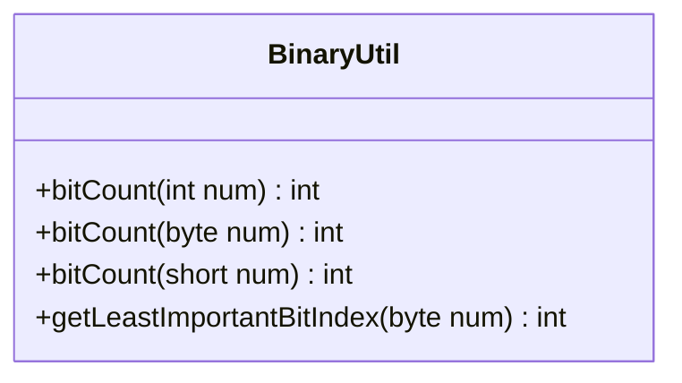

---
aliases:
  - BinaryUtil
tags:
  - java/class
  - module/forge-core
  - pkg/forge/util
fqn: forge.util.BinaryUtil
package: forge.util
module: forge-core
kind: Class
---

# BinaryUtil

**Package:** `forge.util` &nbsp; **Module:** `forge-core` &nbsp; **Kind:** Class



## Source
`forge-core/src/main/java/forge/util/BinaryUtil.java`

```java
package forge.util;

/** 
 * TODO: Write javadoc for this type.
 *
 */
public class BinaryUtil {

    public static int bitCount(final int num) {
        int v = num;
        int c = 0;
        for (; v != 0; c++) {
            v &= v - 1;
        }
        return c;
    } // bit count

    public static int bitCount(final byte num) {
        byte v = num;
        int c = 0;
        for (; v != 0; c++) {
            v &= v - 1;
        }
        return c;
    } // bit count

    public static int bitCount(final short num) {
        short v = num;
        int c = 0;
        for (; v != 0; c++) {
            v &= v - 1;
        }
        return c;
    } // bit count
    
    public static int getLeastImportantBitIndex(final byte num) {
        if( num == 0 ) return -1;
        byte mask = 1;
        for(int i = 0; mask != 0; i++) {
            if( (mask & num) != 0)
                return i;
            mask = (byte) (mask << 1);
        }
        return -1;
    }
}
```
