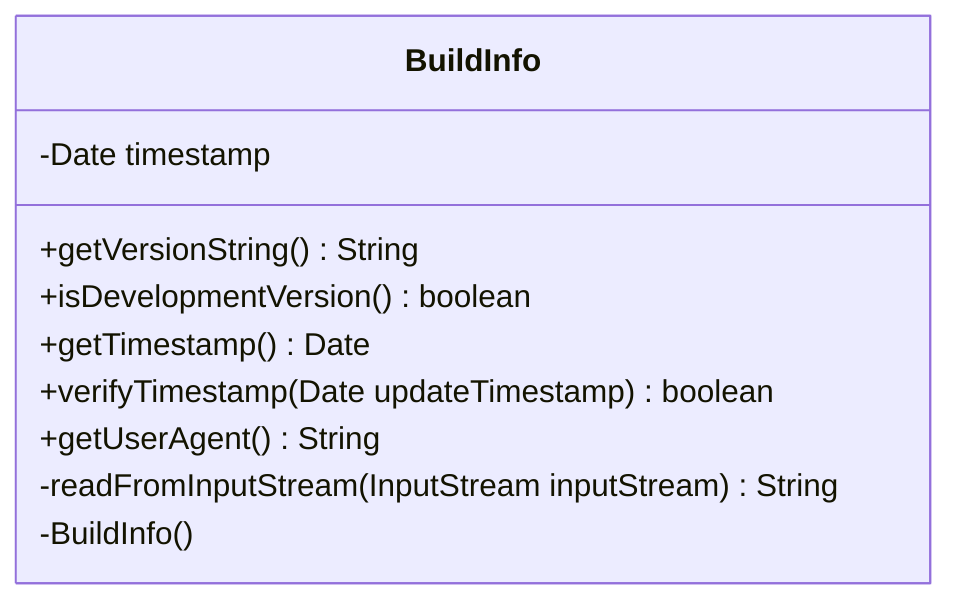

---
aliases:
  - BuildInfo
tags:
  - java/class
  - module/forge-core
  - pkg/forge/util
fqn: forge.util.BuildInfo
package: forge.util
module: forge-core
kind: Class
---

# BuildInfo

**Package:** `forge.util`   **Module:** `forge-core`   **Kind:** Class



## Design Description

BuildInfo is a stateless utility class in `forge.util` that exposes the running application's version and build metadata. As a final-style helper with a private constructor and only static members, it is never instantiated; instead it answers queries about the current release—reporting the version string (falling back to "GIT" when unknown), flagging development or snapshot builds, and constructing the HTTP User-Agent header.

It also derives the build timestamp by lazily reading and parsing a bundled `/build.txt` classpath resource, caching the result in a static field. Collaborating with `StringUtils` for version checks and `DateUtil` for elapsed-time math, its `verifyTimestamp` method compares the build time against an update timestamp to decide—using a 23-hour threshold—whether an update should be permitted, making it the central source of truth for version-gated update logic.

## Source
`forge-core/src/main/java/forge/util/BuildInfo.java`

```java
/*
 * Forge: Play Magic: the Gathering.
 * Copyright (C) 2011  Forge Team
 *
 * This program is free software: you can redistribute it and/or modify
 * it under the terms of the GNU General Public License as published by
 * the Free Software Foundation, either version 3 of the License, or
 * (at your option) any later version.
 *
 * This program is distributed in the hope that it will be useful,
 * but WITHOUT ANY WARRANTY; without even the implied warranty of
 * MERCHANTABILITY or FITNESS FOR A PARTICULAR PURPOSE.  See the
 * GNU General Public License for more details.
 *
 * You should have received a copy of the GNU General Public License
 * along with this program.  If not, see <http://www.gnu.org/licenses/>.
 */

package forge.util;

import org.apache.commons.lang3.StringUtils;

import java.io.BufferedReader;
import java.io.IOException;
import java.io.InputStream;
import java.io.InputStreamReader;
import java.text.SimpleDateFormat;
import java.util.Date;

/**
 * Provides access to information about the current version and build ID.
 */
public class BuildInfo {
    private static Date timestamp = null;

    // disable instantiation
    private BuildInfo() {
    }

    /**
     * Get the current version of Forge.
     *
     * @return a String representing the version specifier, or "GIT" if unknown.
     */
    public static String getVersionString() {
        String version = BuildInfo.class.getPackage().getImplementationVersion();
        if (StringUtils.isEmpty(version)) {
            return "GIT";
        }
        return version;
    }

    public static boolean isDevelopmentVersion() {
        String forgeVersion = getVersionString();
        return StringUtils.containsIgnoreCase(forgeVersion, "git") ||
                StringUtils.containsIgnoreCase(forgeVersion, "snapshot");
    }

    public static Date getTimestamp() {
        if (timestamp != null)
            return timestamp;
        try {
            SimpleDateFormat simpleDateFormat = new SimpleDateFormat("yyyy-MM-dd HH:mm:ss");
            InputStream inputStream = BuildInfo.class.getResourceAsStream("/build.txt");
            String data = readFromInputStream(inputStream);
            timestamp = simpleDateFormat.parse(data);
        } catch (Exception e) {
            e.printStackTrace();
        }
        return timestamp;
    }

    public static boolean verifyTimestamp(Date updateTimestamp) {
        if (updateTimestamp == null)
            return false;
        if (getTimestamp() == null)
            return false;
        // System.err.println("Update Timestamp: " + updateTimestamp + "\nBuild Timestamp: " + getTimestamp());
        // if morethan 23 hours the difference, then allow to update.
        return DateUtil.getElapsedHours(getTimestamp(), updateTimestamp) > 23;
    }

    public static String getUserAgent() {
        return "Forge/" + getVersionString();
    }

    private static String readFromInputStream(InputStream inputStream) throws IOException {
        StringBuilder resultStringBuilder = new StringBuilder();
        try (BufferedReader br = new BufferedReader(new InputStreamReader(inputStream))) {
            String line;
            while ((line = br.readLine()) != null) {
                resultStringBuilder.append(line).append("\n");
            }
        }
        return resultStringBuilder.toString();
    }
}
```

## Python
`forge/util/BuildInfo.py`

```python
from forge.util.DateUtil import DateUtil
from org.apache.commons.lang3.StringUtils import StringUtils

import io
import traceback
from datetime import datetime


class BuildInfo:
    """
    Provides access to information about the current version and build ID.
    """

    timestamp = None

    # disable instantiation
    def __init__(self):
        raise RuntimeError("BuildInfo is not instantiable")

    @staticmethod
    def getVersionString() -> str:
        """
        Get the current version of Forge.

        :return: a String representing the version specifier, or "GIT" if unknown.
        """
        version = BuildInfo.__class__.getPackage().getImplementationVersion()
        if StringUtils.isEmpty(version):
            return "GIT"
        return version

    @staticmethod
    def isDevelopmentVersion() -> bool:
        forgeVersion = BuildInfo.getVersionString()
        return StringUtils.containsIgnoreCase(forgeVersion, "git") or \
            StringUtils.containsIgnoreCase(forgeVersion, "snapshot")

    @staticmethod
    def getTimestamp() -> datetime:
        if BuildInfo.timestamp is not None:
            return BuildInfo.timestamp
        try:
            inputStream = BuildInfo._getResourceAsStream("/build.txt")
            data = BuildInfo.readFromInputStream(inputStream)
            BuildInfo.timestamp = datetime.strptime(data.strip(), "%Y-%m-%d %H:%M:%S")
        except Exception:
            traceback.print_exc()
        return BuildInfo.timestamp

    @staticmethod
    def verifyTimestamp(updateTimestamp: datetime) -> bool:
        if updateTimestamp is None:
            return False
        if BuildInfo.getTimestamp() is None:
            return False
        # System.err.println("Update Timestamp: " + updateTimestamp + "\nBuild Timestamp: " + getTimestamp());
        # if morethan 23 hours the difference, then allow to update.
        return DateUtil.getElapsedHours(BuildInfo.getTimestamp(), updateTimestamp) > 23

    @staticmethod
    def getUserAgent() -> str:
        return "Forge/" + BuildInfo.getVersionString()

    @staticmethod
    def readFromInputStream(inputStream) -> str:
        resultStringBuilder = []
        br = io.TextIOWrapper(inputStream)
        try:
            line = br.readline()
            while line:
                resultStringBuilder.append(line.rstrip("\n"))
                resultStringBuilder.append("\n")
                line = br.readline()
        finally:
            br.close()
        return "".join(resultStringBuilder)

    @staticmethod
    def _getResourceAsStream(name: str):
        import os
        path = name[1:] if name.startswith("/") else name
        return open(path, "rb")
```
