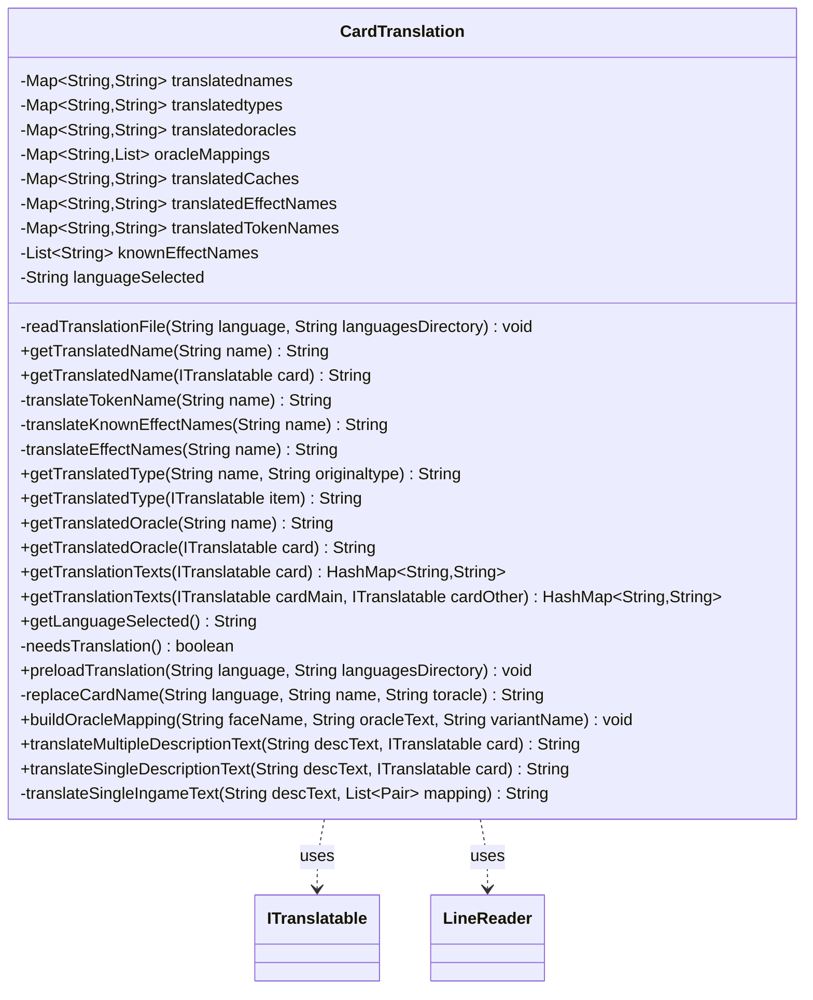

---
aliases:
  - CardTranslation
tags:
  - java/class
  - module/forge-core
  - pkg/forge/util
fqn: forge.util.CardTranslation
package: forge.util
module: forge-core
kind: Class
---

# CardTranslation

**Package:** `forge.util`   **Module:** `forge-core`   **Kind:** Class



## Relationships
**Uses:**
- [[forge.util.ITranslatable|ITranslatable]]
- [[forge.util.LineReader|LineReader]]

## Design Description

CardTranslation is a static utility in `forge-core` that centralizes localization of card text, providing the engine's single point for retrieving translated names, type lines, and oracle text for a chosen language. It lazily loads a pipe-delimited `cardnames-<language>.txt` file via LineReader into in-memory maps, short-circuiting all work when the selected language is the "en-US" default. It accepts either raw strings or any ITranslatable (cards, tokens, emblems), from which it pulls translation keys and untranslated fallbacks.

The class encodes considerable domain-specific intent: it handles split (`//`) names, functional variants, token and effect names through the Localizer, and reminder-text stripping. Notably, in-game description text is matched to stored oracle lines by Levenshtein distance rather than exact equality, tolerating runtime formatting differences, while result caches (`translatedCaches`, per-name maps) keep repeated lookups cheap.

## Source
`forge-core/src/main/java/forge/util/CardTranslation.java`

```java
package forge.util;

import org.apache.commons.lang3.StringUtils;
import org.apache.commons.lang3.tuple.Pair;

import java.io.IOException;
import java.nio.charset.StandardCharsets;
import java.nio.file.Files;
import java.nio.file.Paths;
import java.util.*;

public class CardTranslation {

    private static Map <String, String> translatednames;
    private static Map <String, String> translatedtypes;
    private static Map <String, String> translatedoracles;
    private static Map <String, List <Pair <String, String> > > oracleMappings;
    private static Map <String, String> translatedCaches;
    private static Map <String, String> translatedEffectNames;
    private static Map <String, String> translatedTokenNames;
    private static final List <String> knownEffectNames = Arrays.asList("The Ring", "The Monarch", "The Initiative", "City's Blessing", "Keyword Effects");
    private static String languageSelected = "en-US";

    private static void readTranslationFile(String language, String languagesDirectory) {
        String filename = "cardnames-" + language + ".txt";

        try (LineReader translationFile = new LineReader(Files.newInputStream(Paths.get(languagesDirectory + filename)), StandardCharsets.UTF_8)) {
            for (String line : translationFile.readLines()) {
                String[] matches = line.split("\\|");
                if (matches.length >= 2) {
                    if (matches[0].indexOf('$') > 0) {
                        //Functional variant, e.g. "Garbage Elemental $C"
                        String[] variantSplit = matches[0].split("\\s*\\$", 2);
                        if(variantSplit.length > 1) {
                            //Add the base name to the translated names.
                            translatednames.put(variantSplit[0], matches[1]);
                            matches[0] = variantSplit[0] + " $" + variantSplit[1]; //Standardize storage.
                        }
                    }
                    translatednames.put(matches[0], matches[1]);
                }
                if (matches.length >= 3) {
                    translatedtypes.put(matches[0], matches[2]);
                }
                if (matches.length >= 4) {
                    String toracle = matches[3];
                    // Workaround to remove additional //Level_2// and //Level_3// lines from non-English Class cards
                    toracle = toracle.replace("//Level_2//\\n", "").replace("//Level_3//\\n", "");
                    // Workaround for roll dice cards
                    toracle = toracle.replace("\\n", "\r\n\r\n").replace("VERT", "|");
                    translatedoracles.put(matches[0], toracle);
                }
            }
        } catch (IOException e) {
            if (!"en-US".equalsIgnoreCase(language))
                System.err.println("Error reading translation file: cardnames-" + language + ".txt");
        }
    }

    public static String getTranslatedName(String name) {
        if (needsTranslation()) {
            if (name.contains(" // ")) {
                int splitIndex = name.indexOf(" // ");
                String leftname = name.substring(0, splitIndex);
                String rightname = name.substring(splitIndex + 4);
                return translatednames.getOrDefault(leftname, leftname) + " // " + translatednames.getOrDefault(rightname, rightname);
            }
            try {
                if (name.endsWith(" Token")) {
                    return translateTokenName(name);
                } else if (name.startsWith("Emblem — ") || name.contains("'s Effect") || name.contains("'s Boon")) {
                    return translateEffectNames(name);
                } else if (knownEffectNames.contains(name)) {
                    return translateKnownEffectNames(name);
                } else {
                    String tname = translatednames.get(name);
                    return (tname == null || tname.isEmpty()) ? name : tname;
                }
            } catch (Exception e) {
                return name;
            }
        }
        return name;
    }

    public static String getTranslatedName(ITranslatable card) {
        return getTranslatedName(card.getUntranslatedName());
    }

    private static String translateTokenName(String name) {
        if (translatedTokenNames == null)
            translatedTokenNames = new HashMap<>();
        String ttype = translatedTokenNames.get(name);
        if (ttype == null) {
            String sub = name.replace(" Token", "");
            ttype = Localizer.getInstance().getMessageorUseDefault("lbl" + sub, "");
            if (ttype == null || ttype.isEmpty()) {
                ttype = name;
            } else {
                ttype = ttype  + " " + Localizer.getInstance().getMessage("lblToken");
            }
            translatedTokenNames.put(name, ttype);
            return ttype;
        } else {
            return ttype;
        }
    }

    private static String translateKnownEffectNames(String name) {
        if (translatedEffectNames == null)
            translatedEffectNames = new HashMap<>();
        String fname = translatedEffectNames.get(name);
        if (fname == null) {
            switch (name) {
                case "The Ring":
                    fname = Localizer.getInstance().getMessage("lblTheRing");
                    translatedEffectNames.put(name, fname);
                    return fname;
                case "The Monarch":
                    fname = Localizer.getInstance().getMessage("lblTheMonarch");
                    translatedEffectNames.put(name, fname);
                    return fname;
                case "The Initiative":
                    fname = Localizer.getInstance().getMessage("lblTheInitiative");
                    translatedEffectNames.put(name, fname);
                    return fname;
                case "City's Blessing":
                    fname = Localizer.getInstance().getMessage("lblCityBlessing");
                    translatedEffectNames.put(name, fname);
                    return fname;
                case "Keyword Effects":
                    fname = Localizer.getInstance().getMessage("lblKeywordEffects");
                    translatedEffectNames.put(name, fname);
                    return fname;
                default:
                    return name;
            }
        } else {
            return fname;
        }
    }

    private static String translateEffectNames(String name) {
        if (translatedEffectNames == null)
            translatedEffectNames = new HashMap<>();
        String fname = translatedEffectNames.get(name);
        if (fname == null) {
            String finalname = name.replaceAll("\\([^()]*\\)", "");
            if (finalname.contains(" 's Effect")) {
                finalname = finalname.replace( " 's Effect", "");
                fname = translatednames.get(finalname);
                if (fname == null || fname.isEmpty())
                    fname = finalname;
                else {
                    fname = fname + " " + Localizer.getInstance().getMessage("lblEffect");
                }
                translatedEffectNames.put(name, fname);
                return fname;
            } else if (finalname.contains("'s Effect")) {
                finalname = finalname.replace( "'s Effect", "");
                fname = translatednames.get(finalname);
                if (fname == null || fname.isEmpty())
                    fname = finalname;
                else {
                    fname = fname + " " + Localizer.getInstance().getMessage("lblEffect");
                }
                translatedEffectNames.put(name, fname);
                return fname;
            } else if (finalname.contains(" 's Boon")) {
                finalname = finalname.replace( " 's Boon", "");
                fname = translatednames.get(finalname);
                if (fname == null || fname.isEmpty())
                    fname = finalname;
                else {
                    fname = fname + " " + Localizer.getInstance().getMessage("lblBoon");
                }
                translatedEffectNames.put(name, fname);
                return fname;
            } else if (finalname.contains("'s Boon")) {
                finalname = finalname.replace( "'s Boon", "");
                fname = translatednames.get(finalname);
                if (fname == null || fname.isEmpty())
                    fname = finalname;
                else {
                    fname = fname + " " + Localizer.getInstance().getMessage("lblBoon");
                }
                translatedEffectNames.put(name, fname);
                return fname;
            } else if (finalname.startsWith("Emblem — ")) {
                String []s = finalname.split(" — ");
                try {
                    fname = translatednames.get(s[1].endsWith(" ") ? s[1].substring(0, s[1].lastIndexOf(" ")) : s[1]);
                    if (fname == null || fname.isEmpty())
                        fname = finalname;
                    else {
                        fname = fname + " " + Localizer.getInstance().getMessage("lblEmblem");
                    }
                    translatedEffectNames.put(name, fname);
                    return fname;
                } catch (Exception e) {
                    //e.printStackTrace();
                }
            }
            return name;
        } else {
            return fname;
        }
    }

    public static String getTranslatedType(String name, String originaltype) {
        if (needsTranslation()) {
            String ttype = translatedtypes.get(name);
            return ttype == null ? originaltype : ttype;
        }

        return originaltype;
    }

    public static String getTranslatedType(ITranslatable item) {
        if (!needsTranslation())
            return item.getUntranslatedType();
        return translatedtypes.getOrDefault(item.getTranslationKey(), item.getUntranslatedType());
    }

    public static String getTranslatedOracle(String name) {
        if (needsTranslation()) {
            String toracle = translatedoracles.get(name);
            return toracle == null ? "" : toracle;
        }

        return "";
    }

    public static String getTranslatedOracle(ITranslatable card) {
        if(!needsTranslation())
            return ""; //card.getUntranslatedOracle();
        //Fallbacks and english versions of oracle texts are handled elsewhere.
        return translatedoracles.getOrDefault(card.getTranslationKey(), "");
    }

    public static HashMap<String, String> getTranslationTexts(ITranslatable card) {
        return getTranslationTexts(card, null);
    }

    public static HashMap<String, String> getTranslationTexts(ITranslatable cardMain, ITranslatable cardOther) {
        if(!needsTranslation()) return null;
        HashMap<String, String> translations = new HashMap<>();
        translations.put("name", getTranslatedName(cardMain));
        translations.put("oracle", getTranslatedOracle(cardMain));
        if(cardOther == null) {
            translations.put("altname", "");
            translations.put("altoracle", "");
        }
        else {
            translations.put("altname", getTranslatedName(cardOther));
            translations.put("altoracle", getTranslatedOracle(cardOther));
        }
        return translations;
    }

    public static String getLanguageSelected() {
        return languageSelected;
    }

    private static boolean needsTranslation() {
        return !languageSelected.equals("en-US");
    }

    public static void preloadTranslation(String language, String languagesDirectory) {
        languageSelected = language;

        if (needsTranslation()) {
            translatednames = new HashMap<>();
            translatedtypes = new HashMap<>();
            translatedoracles = new HashMap<>();
            oracleMappings = new HashMap<>();
            translatedCaches = new HashMap<>();
            readTranslationFile(languageSelected, languagesDirectory);
        }
    }

    private static String replaceCardName(String language, String name, String toracle) {
        String nickName = language.equals("en-US") ? Lang.getEnglishInstance().getNickName(name) : Lang.getInstance().getNickName(name);
        String result = TextUtil.fastReplace(toracle, name, "CARDNAME");
        if (!nickName.equals(name)) {
            result = TextUtil.fastReplace(result, nickName, "NICKNAME");
        }
        return result;
    }

    public static void buildOracleMapping(String faceName, String oracleText, String variantName) {
        String translationKey = faceName;
        if(variantName != null)
            translationKey = faceName + " $" + variantName;
        if (!needsTranslation() || oracleMappings.containsKey(translationKey)) return;
        String translatedText = getTranslatedOracle(translationKey);
        if (translatedText.isEmpty()) {
            // english card only, fall back
            return;
        }
        String translatedName = getTranslatedName(translationKey);
        List <Pair <String, String> > mapping = new ArrayList<>();
        String [] splitOracleText = oracleText.split("\\\\n");
        String [] splitTranslatedText = translatedText.split("\r\n\r\n");

        for (int i = 0; i < splitOracleText.length && i < splitTranslatedText.length; i++) {
            String toracle = replaceCardName("en-US", faceName, splitOracleText[i]);
            String ttranslated = replaceCardName(languageSelected, translatedName, splitTranslatedText[i]);
            // Remove reminder text in English oracle text unless entire line is reminder text
            if (!toracle.startsWith("(")) {
                toracle = toracle.replaceAll("\\(.*\\)", "");
            }
            mapping.add(Pair.of(toracle, ttranslated));
        }
        oracleMappings.put(translationKey, mapping);
    }

    public static String translateMultipleDescriptionText(String descText, ITranslatable card) {
        if (!needsTranslation()) return descText;
        String [] splitDescText = descText.split("\n");
        String result = descText;
        for (String text : splitDescText) {
            text = text.trim();
            if (text.isEmpty()) continue;
            String translated = translateSingleDescriptionText(text, card);
            if (!text.equals(translated)) {
                result = TextUtil.fastReplace(result, text, translated);
            } else {
                // keywords maybe combined into one line, split them and try translate again
                String [] splitKeywords = text.split(", ");
                if (splitKeywords.length <= 1) continue;
                for (String keyword : splitKeywords) {
                    if (keyword.contains(" ")) continue;
                    translated = translateSingleDescriptionText(keyword, card);
                    if (!keyword.equals(translated)) {
                        result = TextUtil.fastReplace(result, keyword, translated);
                    }
                }
            }
        }
        return result;
    }

    public static String translateSingleDescriptionText(String descText, ITranslatable card) {
        if (descText == null)
            return "";
        if (!needsTranslation()) return descText;
        if (translatedCaches.containsKey(descText)) return translatedCaches.get(descText);

        List <Pair <String, String> > mapping = oracleMappings.get(card.getTranslationKey());
        if (mapping == null) return descText;
        String result = descText;
        if (!mapping.isEmpty()) {
            result = translateSingleIngameText(descText, mapping);
        }
        translatedCaches.put(descText, result);
        return result;
    }

    private static String translateSingleIngameText(String descText, List <Pair <String, String> > mapping) {
        String tcompare = descText.startsWith("(") ? descText : descText.replaceAll("\\(.*\\)", "");

        // Use Levenshtein Distance to find matching oracle text and replace it with translated text
        int candidateIndex = mapping.size();
        int minDistance = tcompare.length();
        for (int i = 0; i < mapping.size(); i++) {
            String toracle = mapping.get(i).getLeft();
            int threshold = Math.min(toracle.length(), tcompare.length()) / 3;
            int distance = StringUtils.getLevenshteinDistance(toracle, tcompare, threshold);
            if (distance != -1 && distance < minDistance) {
                minDistance = distance;
                candidateIndex = i;
            }
        }

        if (candidateIndex < mapping.size()) {
            return mapping.get(candidateIndex).getRight();
        }

        return descText;
    }

}
```

## Python
`forge/util/CardTranslation.py`

````python
forge/util/CardTranslation.py:

```python
import re

from forge.util.ITranslatable import ITranslatable
from forge.util.LineReader import LineReader
from forge.util.Localizer import Localizer
from forge.util.Lang import Lang
from forge.util.TextUtil import TextUtil

INT_MAX = 2 ** 31 - 1

_SENTINEL = object()


def _java_split(s, pattern, limit=0):
    if limit > 0:
        return re.split(pattern, s, maxsplit=limit - 1)
    parts = re.split(pattern, s)
    while len(parts) > 1 and parts[-1] == "":
        parts.pop()
    return parts


def _getLevenshteinDistance(s, t, threshold):
    n = len(s)
    m = len(t)
    if n == 0:
        return m if m <= threshold else -1
    if m == 0:
        return n if n <= threshold else -1
    if n > m:
        s, t = t, s
        n, m = m, n
    p = [0] * (n + 1)
    d = [0] * (n + 1)
    boundary = min(n, threshold) + 1
    for i in range(boundary):
        p[i] = i
    for i in range(boundary, len(p)):
        p[i] = INT_MAX
    for i in range(len(d)):
        d[i] = INT_MAX
    for j in range(1, m + 1):
        t_j = t[j - 1]
        d[0] = j
        min_ = max(1, j - threshold)
        max_ = n if j > INT_MAX - threshold else min(n, j + threshold)
        if min_ > max_:
            return -1
        if min_ > 1:
            d[min_ - 1] = INT_MAX
        for i in range(min_, max_ + 1):
            if s[i - 1] == t_j:
                d[i] = p[i - 1]
            else:
                d[i] = 1 + min(d[i - 1], p[i], p[i - 1])
        p, d = d, p
    return p[n] if p[n] <= threshold else -1


class CardTranslation:

    translatednames = None
    translatedtypes = None
    translatedoracles = None
    oracleMappings = None
    translatedCaches = None
    translatedEffectNames = None
    translatedTokenNames = None
    knownEffectNames = ["The Ring", "The Monarch", "The Initiative", "City's Blessing", "Keyword Effects"]
    languageSelected = "en-US"

    @staticmethod
    def readTranslationFile(language, languagesDirectory):
        filename = "cardnames-" + language + ".txt"

        try:
            with LineReader(Files.newInputStream(Paths.get(languagesDirectory + filename)), StandardCharsets.UTF_8) as translationFile:
                for line in translationFile.readLines():
                    matches = _java_split(line, r"\|")
                    if len(matches) >= 2:
                        if matches[0].find('$') > 0:
                            # Functional variant, e.g. "Garbage Elemental $C"
                            variantSplit = re.split(r"\s*\$", matches[0], maxsplit=1)
                            if len(variantSplit) > 1:
                                # Add the base name to the translated names.
                                CardTranslation.translatednames[variantSplit[0]] = matches[1]
                                matches[0] = variantSplit[0] + " $" + variantSplit[1]  # Standardize storage.
                        CardTranslation.translatednames[matches[0]] = matches[1]
                    if len(matches) >= 3:
                        CardTranslation.translatedtypes[matches[0]] = matches[2]
                    if len(matches) >= 4:
                        toracle = matches[3]
                        # Workaround to remove additional //Level_2// and //Level_3// lines from non-English Class cards
                        toracle = toracle.replace("//Level_2//\\n", "").replace("//Level_3//\\n", "")
                        # Workaround for roll dice cards
                        toracle = toracle.replace("\\n", "\r\n\r\n").replace("VERT", "|")
                        CardTranslation.translatedoracles[matches[0]] = toracle
        except IOError:
            if not "en-US".lower() == language.lower():
                import sys
                print("Error reading translation file: cardnames-" + language + ".txt", file=sys.stderr)

    @staticmethod
    def getTranslatedName(name):
        if not isinstance(name, str):
            return CardTranslation.getTranslatedName(name.getUntranslatedName())
        if CardTranslation.needsTranslation():
            if " // " in name:
                splitIndex = name.find(" // ")
                leftname = name[0:splitIndex]
                rightname = name[splitIndex + 4:]
                return CardTranslation.translatednames.get(leftname, leftname) + " // " + CardTranslation.translatednames.get(rightname, rightname)
            try:
                if name.endswith(" Token"):
                    return CardTranslation.translateTokenName(name)
                elif name.startswith("Emblem ???????? ") or "'s Effect" in name or "'s Boon" in name:
                    return CardTranslation.translateEffectNames(name)
                elif name in CardTranslation.knownEffectNames:
                    return CardTranslation.translateKnownEffectNames(name)
                else:
                    tname = CardTranslation.translatednames.get(name)
                    return name if (tname is None or tname == "") else tname
            except Exception:
                return name
        return name

    @staticmethod
    def translateTokenName(name):
        if CardTranslation.translatedTokenNames is None:
            CardTranslation.translatedTokenNames = {}
        ttype = CardTranslation.translatedTokenNames.get(name)
        if ttype is None:
            sub = name.replace(" Token", "")
            ttype = Localizer.getInstance().getMessageorUseDefault("lbl" + sub, "")
            if ttype is None or ttype == "":
                ttype = name
            else:
                ttype = ttype + " " + Localizer.getInstance().getMessage("lblToken")
            CardTranslation.translatedTokenNames[name] = ttype
            return ttype
        else:
            return ttype

    @staticmethod
    def translateKnownEffectNames(name):
        if CardTranslation.translatedEffectNames is None:
            CardTranslation.translatedEffectNames = {}
        fname = CardTranslation.translatedEffectNames.get(name)
        if fname is None:
            if name == "The Ring":
                fname = Localizer.getInstance().getMessage("lblTheRing")
                CardTranslation.translatedEffectNames[name] = fname
                return fname
            elif name == "The Monarch":
                fname = Localizer.getInstance().getMessage("lblTheMonarch")
                CardTranslation.translatedEffectNames[name] = fname
                return fname
            elif name == "The Initiative":
                fname = Localizer.getInstance().getMessage("lblTheInitiative")
                CardTranslation.translatedEffectNames[name] = fname
                return fname
            elif name == "City's Blessing":
                fname = Localizer.getInstance().getMessage("lblCityBlessing")
                CardTranslation.translatedEffectNames[name] = fname
                return fname
            elif name == "Keyword Effects":
                fname = Localizer.getInstance().getMessage("lblKeywordEffects")
                CardTranslation.translatedEffectNames[name] = fname
                return fname
            else:
                return name
        else:
            return fname

    @staticmethod
    def translateEffectNames(name):
        if CardTranslation.translatedEffectNames is None:
            CardTranslation.translatedEffectNames = {}
        fname = CardTranslation.translatedEffectNames.get(name)
        if fname is None:
            finalname = re.sub(r"\([^()]*\)", "", name)
            if " 's Effect" in finalname:
                finalname = finalname.replace(" 's Effect", "")
                fname = CardTranslation.translatednames.get(finalname)
                if fname is None or fname == "":
                    fname = finalname
                else:
                    fname = fname + " " + Localizer.getInstance().getMessage("lblEffect")
                CardTranslation.translatedEffectNames[name] = fname
                return fname
            elif "'s Effect" in finalname:
                finalname = finalname.replace("'s Effect", "")
                fname = CardTranslation.translatednames.get(finalname)
                if fname is None or fname == "":
                    fname = finalname
                else:
                    fname = fname + " " + Localizer.getInstance().getMessage("lblEffect")
                CardTranslation.translatedEffectNames[name] = fname
                return fname
            elif " 's Boon" in finalname:
                finalname = finalname.replace(" 's Boon", "")
                fname = CardTranslation.translatednames.get(finalname)
                if fname is None or fname == "":
                    fname = finalname
                else:
                    fname = fname + " " + Localizer.getInstance().getMessage("lblBoon")
                CardTranslation.translatedEffectNames[name] = fname
                return fname
            elif "'s Boon" in finalname:
                finalname = finalname.replace("'s Boon", "")
                fname = CardTranslation.translatednames.get(finalname)
                if fname is None or fname == "":
                    fname = finalname
                else:
                    fname = fname + " " + Localizer.getInstance().getMessage("lblBoon")
                CardTranslation.translatedEffectNames[name] = fname
                return fname
            elif finalname.startswith("Emblem ???????? "):
                s = finalname.split(" ???????? ")
                try:
                    fname = CardTranslation.translatednames.get(s[1][0:s[1].rfind(" ")] if s[1].endswith(" ") else s[1])
                    if fname is None or fname == "":
                        fname = finalname
                    else:
                        fname = fname + " " + Localizer.getInstance().getMessage("lblEmblem")
                    CardTranslation.translatedEffectNames[name] = fname
                    return fname
                except Exception:
                    # e.printStackTrace();
                    pass
            return name
        else:
            return fname

    @staticmethod
    def getTranslatedType(name, originaltype=_SENTINEL):
        if originaltype is _SENTINEL:
            item = name
            if not CardTranslation.needsTranslation():
                return item.getUntranslatedType()
            return CardTranslation.translatedtypes.get(item.getTranslationKey(), item.getUntranslatedType())
        if CardTranslation.needsTranslation():
            ttype = CardTranslation.translatedtypes.get(name)
            return originaltype if ttype is None else ttype
        return originaltype

    @staticmethod
    def getTranslatedOracle(name):
        if isinstance(name, str):
            if CardTranslation.needsTranslation():
                toracle = CardTranslation.translatedoracles.get(name)
                return "" if toracle is None else toracle
            return ""
        card = name
        if not CardTranslation.needsTranslation():
            return ""  # card.getUntranslatedOracle();
        # Fallbacks and english versions of oracle texts are handled elsewhere.
        return CardTranslation.translatedoracles.get(card.getTranslationKey(), "")

    @staticmethod
    def getTranslationTexts(cardMain, cardOther=None):
        if not CardTranslation.needsTranslation():
            return None
        translations = {}
        translations["name"] = CardTranslation.getTranslatedName(cardMain)
        translations["oracle"] = CardTranslation.getTranslatedOracle(cardMain)
        if cardOther is None:
            translations["altname"] = ""
            translations["altoracle"] = ""
        else:
            translations["altname"] = CardTranslation.getTranslatedName(cardOther)
            translations["altoracle"] = CardTranslation.getTranslatedOracle(cardOther)
        return translations

    @staticmethod
    def getLanguageSelected():
        return CardTranslation.languageSelected

    @staticmethod
    def needsTranslation():
        return CardTranslation.languageSelected != "en-US"

    @staticmethod
    def preloadTranslation(language, languagesDirectory):
        CardTranslation.languageSelected = language

        if CardTranslation.needsTranslation():
            CardTranslation.translatednames = {}
            CardTranslation.translatedtypes = {}
            CardTranslation.translatedoracles = {}
            CardTranslation.oracleMappings = {}
            CardTranslation.translatedCaches = {}
            CardTranslation.readTranslationFile(CardTranslation.languageSelected, languagesDirectory)

    @staticmethod
    def replaceCardName(language, name, toracle):
        nickName = Lang.getEnglishInstance().getNickName(name) if language == "en-US" else Lang.getInstance().getNickName(name)
        result = TextUtil.fastReplace(toracle, name, "CARDNAME")
        if nickName != name:
            result = TextUtil.fastReplace(result, nickName, "NICKNAME")
        return result

    @staticmethod
    def buildOracleMapping(faceName, oracleText, variantName):
        translationKey = faceName
        if variantName is not None:
            translationKey = faceName + " $" + variantName
        if not CardTranslation.needsTranslation() or translationKey in CardTranslation.oracleMappings:
            return
        translatedText = CardTranslation.getTranslatedOracle(translationKey)
        if translatedText == "":
            # english card only, fall back
            return
        translatedName = CardTranslation.getTranslatedName(translationKey)
        mapping = []
        splitOracleText = _java_split(oracleText, re.escape("\\n"))
        splitTranslatedText = _java_split(translatedText, re.escape("\r\n\r\n"))

        i = 0
        while i < len(splitOracleText) and i < len(splitTranslatedText):
            toracle = CardTranslation.replaceCardName("en-US", faceName, splitOracleText[i])
            ttranslated = CardTranslation.replaceCardName(CardTranslation.languageSelected, translatedName, splitTranslatedText[i])
            # Remove reminder text in English oracle text unless entire line is reminder text
            if not toracle.startswith("("):
                toracle = re.sub(r"\(.*\)", "", toracle)
            mapping.append((toracle, ttranslated))
            i += 1
        CardTranslation.oracleMappings[translationKey] = mapping

    @staticmethod
    def translateMultipleDescriptionText(descText, card):
        if not CardTranslation.needsTranslation():
            return descText
        splitDescText = descText.split("\n")
        result = descText
        for text in splitDescText:
            text = text.strip()
            if text == "":
                continue
            translated = CardTranslation.translateSingleDescriptionText(text, card)
            if text != translated:
                result = TextUtil.fastReplace(result, text, translated)
            else:
                # keywords maybe combined into one line, split them and try translate again
                splitKeywords = text.split(", ")
                if len(splitKeywords) <= 1:
                    continue
                for keyword in splitKeywords:
                    if " " in keyword:
                        continue
                    translated = CardTranslation.translateSingleDescriptionText(keyword, card)
                    if keyword != translated:
                        result = TextUtil.fastReplace(result, keyword, translated)
        return result

    @staticmethod
    def translateSingleDescriptionText(descText, card):
        if descText is None:
            return ""
        if not CardTranslation.needsTranslation():
            return descText
        if descText in CardTranslation.translatedCaches:
            return CardTranslation.translatedCaches[descText]

        mapping = CardTranslation.oracleMappings.get(card.getTranslationKey())
        if mapping is None:
            return descText
        result = descText
        if len(mapping) != 0:
            result = CardTranslation.translateSingleIngameText(descText, mapping)
        CardTranslation.translatedCaches[descText] = result
        return result

    @staticmethod
    def translateSingleIngameText(descText, mapping):
        tcompare = descText if descText.startswith("(") else re.sub(r"\(.*\)", "", descText)

        # Use Levenshtein Distance to find matching oracle text and replace it with translated text
        candidateIndex = len(mapping)
        minDistance = len(tcompare)
        for i in range(len(mapping)):
            toracle = mapping[i][0]
            threshold = min(len(toracle), len(tcompare)) // 3
            distance = _getLevenshteinDistance(toracle, tcompare, threshold)
            if distance != -1 and distance < minDistance:
                minDistance = distance
                candidateIndex = i

        if candidateIndex < len(mapping):
            return mapping[candidateIndex][1]

        return descText
````
