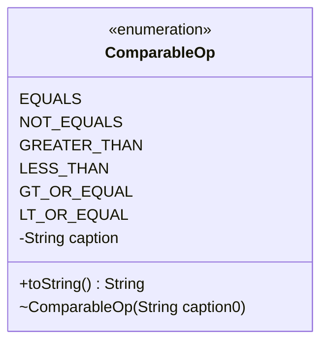

---
aliases:
  - ComparableOp
tags:
  - java/enum
  - module/forge-core
  - pkg/forge/util
fqn: forge.util.ComparableOp
package: forge.util
module: forge-core
kind: Enum
---

# ComparableOp

**Package:** `forge.util`   **Module:** `forge-core`   **Kind:** Enum



## Design Description

Comparison operators for use with comparable values in Forge. This simple Java enum defines six relational operators—equality, inequality, and the four ordering comparisons—each carrying a symbolic caption string (such as `==`, `>`, or `<=`) supplied through its private constructor and stored in an immutable `caption` field.

Living in `forge.util`, it serves as a small, self-contained vocabulary that other engine code references when expressing or evaluating comparison conditions, for example in card restrictions or query predicates. The overridden `toString()` returns the operator's symbol rather than the constant name, signaling design intent to render these values directly in human-readable or serialized form. By centralizing the operator set in a type-safe enum, the class avoids scattering magic comparison strings throughout the codebase.

## Source
`forge-core/src/main/java/forge/util/ComparableOp.java`

```java
/*
 * Forge: Play Magic: the Gathering.
 * Copyright (C) 2011  MaxMtg
 *
 * This program is free software: you can redistribute it and/or modify
 * it under the terms of the GNU General Public License as published by
 * the Free Software Foundation, either version 3 of the License, or
 * (at your option) any later version.
 * 
 * This program is distributed in the hope that it will be useful,
 * but WITHOUT ANY WARRANTY; without even the implied warranty of
 * MERCHANTABILITY or FITNESS FOR A PARTICULAR PURPOSE.  See the
 * GNU General Public License for more details.
 * 
 * You should have received a copy of the GNU General Public License
 * along with this program.  If not, see <http://www.gnu.org/licenses/>.
 */
package forge.util;

/**
 * Possible operators for comparables.
 * 
 * @author Max
 * 
 */
public enum ComparableOp {
    EQUALS("=="),
    NOT_EQUALS("!="),
    GREATER_THAN(">"),
    LESS_THAN("<"),
    GT_OR_EQUAL(">="),
    LT_OR_EQUAL("<=");
    
    private final String caption;
    
    ComparableOp(String caption0) {
        caption = caption0;
    }

    @Override
    public String toString() {
        return caption;
    }
}
```

## Python
`forge/util/ComparableOp.py`

```python
#
# Forge: Play Magic: the Gathering.
# Copyright (C) 2011  MaxMtg
#
# This program is free software: you can redistribute it and/or modify
# it under the terms of the GNU General Public License as published by
# the Free Software Foundation, either version 3 of the License, or
# (at your option) any later version.
#
# This program is distributed in the hope that it will be useful,
# but WITHOUT ANY WARRANTY; without even the implied warranty of
# MERCHANTABILITY or FITNESS FOR A PARTICULAR PURPOSE.  See the
# GNU General Public License for more details.
#
# You should have received a copy of the GNU General Public License
# along with this program.  If not, see <http://www.gnu.org/licenses/>.
#

from enum import Enum


class ComparableOp(Enum):
    """
    Possible operators for comparables.

    @author Max
    """
    EQUALS = "=="
    NOT_EQUALS = "!="
    GREATER_THAN = ">"
    LESS_THAN = "<"
    GT_OR_EQUAL = ">="
    LT_OR_EQUAL = "<="

    def __init__(self, caption0):
        self.caption = caption0

    def __str__(self):
        return self.caption
```
