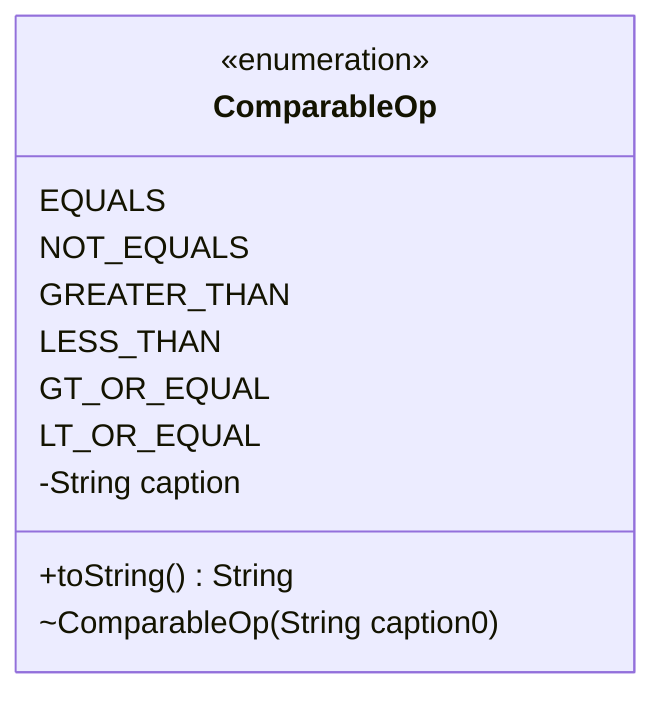

---
aliases:
  - ComparableOp
tags:
  - java/enum
  - module/forge-core
  - pkg/forge/util
fqn: forge.util.ComparableOp
package: forge.util
module: forge-core
kind: Enum
---

# ComparableOp

**Package:** `forge.util` &nbsp; **Module:** `forge-core` &nbsp; **Kind:** Enum



## Source
`forge-core/src/main/java/forge/util/ComparableOp.java`

```java
/*
 * Forge: Play Magic: the Gathering.
 * Copyright (C) 2011  MaxMtg
 *
 * This program is free software: you can redistribute it and/or modify
 * it under the terms of the GNU General Public License as published by
 * the Free Software Foundation, either version 3 of the License, or
 * (at your option) any later version.
 * 
 * This program is distributed in the hope that it will be useful,
 * but WITHOUT ANY WARRANTY; without even the implied warranty of
 * MERCHANTABILITY or FITNESS FOR A PARTICULAR PURPOSE.  See the
 * GNU General Public License for more details.
 * 
 * You should have received a copy of the GNU General Public License
 * along with this program.  If not, see <http://www.gnu.org/licenses/>.
 */
package forge.util;

/**
 * Possible operators for comparables.
 * 
 * @author Max
 * 
 */
public enum ComparableOp {
    EQUALS("=="),
    NOT_EQUALS("!="),
    GREATER_THAN(">"),
    LESS_THAN("<"),
    GT_OR_EQUAL(">="),
    LT_OR_EQUAL("<=");
    
    private final String caption;
    
    ComparableOp(String caption0) {
        caption = caption0;
    }

    @Override
    public String toString() {
        return caption;
    }
}
```
