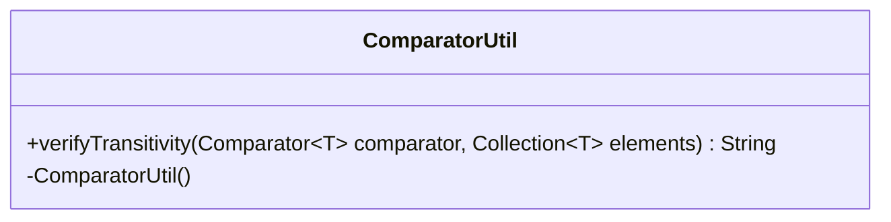

---
aliases:
  - ComparatorUtil
tags:
  - java/class
  - module/forge-core
  - pkg/forge/util
fqn: forge.util.ComparatorUtil
package: forge.util
module: forge-core
kind: Class
---

# ComparatorUtil

**Package:** `forge.util`   **Module:** `forge-core`   **Kind:** Class



## Design Description

ComparatorUtil is a final, non-instantiable utility class in `forge.util` (forge-core) that provides a single static helper, `verifyTransitivity`, for validating that a supplied `Comparator<T>` behaves correctly over a given collection of elements. It checks the two core invariants of a well-formed comparator: antisymmetry (compare(a,b) equals the negation of compare(b,a)) and transitivity of the greater-than relation across element triples, returning a descriptive message string identifying the first violation, or an empty string when the comparator is sound.

Rather than acting as a domain entity, it is a stateless diagnostic tool that collaborates only with the standard `Comparator` and `Collection` types it receives as parameters. The private constructor enforces the static-only design, and the originally exception-throwing logic has been softened to return error text and print to stderr—signalling its intended use as a non-fatal development and testing aid for verifying comparator implementations elsewhere in the engine.

## Source
`forge-core/src/main/java/forge/util/ComparatorUtil.java`

```java
package forge.util;

import java.util.Collection;
import java.util.Comparator;

/**
 * @author Gili Tzabari
 */
public final class ComparatorUtil
{
    /**
     * Verify that a comparator is transitive.
     *
     * @param <T>        the type being compared
     * @param comparator the comparator to test
     * @param elements   the elements to test against
     * @throws AssertionError if the comparator is not transitive
     */
    public static <T> String verifyTransitivity(Comparator<T> comparator, Collection<T> elements)
    {
        String exception = "";
        for (T first: elements)
        {
            for (T second: elements)
            {
                int result1 = comparator.compare(first, second);
                int result2 = comparator.compare(second, first);
                if (result1 != -result2)
                {
                    // Uncomment the following line to step through the failed case
                    //comparator.compare(first, second);
                    /*throw new AssertionError("compare(" + first + ", " + second + ") == " + result1 +
                        " but swapping the parameters returns " + result2);*/
                    exception = "compare(" + first + ", " + second + ") == " + result1 +
                            " but swapping the parameters returns " + result2;
                    System.err.println(exception);
                    return exception;
                }
            }
        }
        for (T first: elements)
        {
            for (T second: elements)
            {
                int firstGreaterThanSecond = comparator.compare(first, second);
                if (firstGreaterThanSecond <= 0)
                    continue;
                for (T third: elements)
                {
                    int secondGreaterThanThird = comparator.compare(second, third);
                    if (secondGreaterThanThird <= 0)
                        continue;
                    int firstGreaterThanThird = comparator.compare(first, third);
                    if (firstGreaterThanThird <= 0)
                    {
                        // Uncomment the following line to step through the failed case
                        //comparator.compare(first, third);
                        /*throw new AssertionError("compare(" + first + ", " + second + ") > 0, " +
                            "compare(" + second + ", " + third + ") > 0, but compare(" + first + ", " + third + ") == " +
                            firstGreaterThanThird);*/
                        exception = "compare(" + first + ", " + second + ") > 0, " +
                                "compare(" + second + ", " + third + ") > 0, but compare(" + first + ", " + third + ") == " +
                                firstGreaterThanThird;
                        System.err.println(exception);
                        return exception;
                    }
                }
            }
        }
        return exception;
    }

    /**
     * Prevent construction.
     */
    private ComparatorUtil()
    {
    }
}
```

## Python
`forge/util/ComparatorUtil.py`

```python
package = None

from typing import Callable, Iterable, TypeVar
import sys

T = TypeVar("T")


class ComparatorUtil:
    """
    @author Gili Tzabari
    """

    @staticmethod
    def verifyTransitivity(comparator: Callable[[T, T], int], elements: Iterable[T]) -> str:
        """
        Verify that a comparator is transitive.

        :param comparator: the comparator to test
        :param elements:   the elements to test against
        :return: a descriptive message identifying the first violation, or an empty string
        """
        exception = ""
        for first in elements:
            for second in elements:
                result1 = comparator(first, second)
                result2 = comparator(second, first)
                if result1 != -result2:
                    # Uncomment the following line to step through the failed case
                    # comparator(first, second)
                    # raise AssertionError("compare(" + first + ", " + second + ") == " + result1 +
                    #     " but swapping the parameters returns " + result2)
                    exception = ("compare(" + str(first) + ", " + str(second) + ") == " + str(result1) +
                                 " but swapping the parameters returns " + str(result2))
                    print(exception, file=sys.stderr)
                    return exception
        for first in elements:
            for second in elements:
                firstGreaterThanSecond = comparator(first, second)
                if firstGreaterThanSecond <= 0:
                    continue
                for third in elements:
                    secondGreaterThanThird = comparator(second, third)
                    if secondGreaterThanThird <= 0:
                        continue
                    firstGreaterThanThird = comparator(first, third)
                    if firstGreaterThanThird <= 0:
                        # Uncomment the following line to step through the failed case
                        # comparator(first, third)
                        # raise AssertionError("compare(" + first + ", " + second + ") > 0, " +
                        #     "compare(" + second + ", " + third + ") > 0, but compare(" + first + ", " + third + ") == " +
                        #     firstGreaterThanThird)
                        exception = ("compare(" + str(first) + ", " + str(second) + ") > 0, " +
                                     "compare(" + str(second) + ", " + str(third) + ") > 0, but compare(" +
                                     str(first) + ", " + str(third) + ") == " + str(firstGreaterThanThird))
                        print(exception, file=sys.stderr)
                        return exception
        return exception

    def __init__(self):
        """
        Prevent construction.
        """
        pass
```
