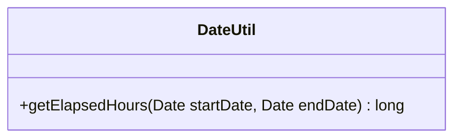

---
aliases:
  - DateUtil
tags:
  - java/class
  - module/forge-core
  - pkg/forge/util
fqn: forge.util.DateUtil
package: forge.util
module: forge-core
kind: Class
---

# DateUtil

**Package:** `forge.util` &nbsp; **Module:** `forge-core` &nbsp; **Kind:** Class



## Source
`forge-core/src/main/java/forge/util/DateUtil.java`

```java
package forge.util;

import java.util.Date;

public class DateUtil {
    public static long getElapsedHours(Date startDate, Date endDate){

        //milliseconds
        long different = endDate.getTime() - startDate.getTime();

        //System.out.println("startDate : " + startDate);
        //System.out.println("endDate : "+ endDate);
        //System.out.println("different : " + different);

        long secondsInMilli = 1000;
        long minutesInMilli = secondsInMilli * 60;
        long hoursInMilli = minutesInMilli * 60;
        //long daysInMilli = hoursInMilli * 24;

        //long elapsedDays = different / daysInMilli;
        //different = different % daysInMilli;

        long elapsedHours = different / hoursInMilli;
        different = different % hoursInMilli;

        long elapsedMinutes = different / minutesInMilli;
        different = different % minutesInMilli;

        long elapsedSeconds = different / secondsInMilli;

        //System.out.printf("%d hours, %d minutes, %d seconds%n", elapsedHours, elapsedMinutes, elapsedSeconds);
        return elapsedHours;
    }
}
```
