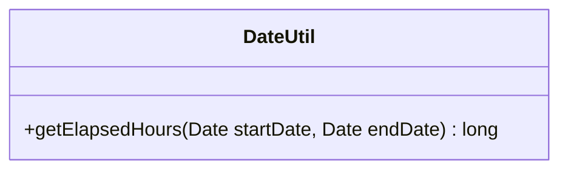

---
aliases:
  - DateUtil
tags:
  - java/class
  - module/forge-core
  - pkg/forge/util
fqn: forge.util.DateUtil
package: forge.util
module: forge-core
kind: Class
---

# DateUtil

**Package:** `forge.util` &nbsp; **Module:** `forge-core` &nbsp; **Kind:** Class



## Design Description

DateUtil is a stateless utility class in the `forge.util` package of the forge-core module. Its sole responsibility is date arithmetic: the single static method `getElapsedHours(Date, Date)` computes the difference between two `java.util.Date` instances and returns the whole number of hours elapsed. As a final-style helper exposing only a static method, it holds no state and participates in no inheritance hierarchy, collaborating only with the standard library `java.util.Date` type.

The implementation works in milliseconds, deriving per-unit constants (seconds, minutes, hours) and using successive division-and-modulo steps. The commented-out code for days, intermediate println tracing, and the computed-but-unused minute and second values reveal the method's origin as a more general elapsed-time breakdown that was pared down to return only hours, leaving the broader scaffolding in place.

## Source
`forge-core/src/main/java/forge/util/DateUtil.java`

```java
package forge.util;

import java.util.Date;

public class DateUtil {
    public static long getElapsedHours(Date startDate, Date endDate){

        //milliseconds
        long different = endDate.getTime() - startDate.getTime();

        //System.out.println("startDate : " + startDate);
        //System.out.println("endDate : "+ endDate);
        //System.out.println("different : " + different);

        long secondsInMilli = 1000;
        long minutesInMilli = secondsInMilli * 60;
        long hoursInMilli = minutesInMilli * 60;
        //long daysInMilli = hoursInMilli * 24;

        //long elapsedDays = different / daysInMilli;
        //different = different % daysInMilli;

        long elapsedHours = different / hoursInMilli;
        different = different % hoursInMilli;

        long elapsedMinutes = different / minutesInMilli;
        different = different % minutesInMilli;

        long elapsedSeconds = different / secondsInMilli;

        //System.out.printf("%d hours, %d minutes, %d seconds%n", elapsedHours, elapsedMinutes, elapsedSeconds);
        return elapsedHours;
    }
}
```

## Python
`forge/util/DateUtil.py`

```python
from datetime import datetime


class DateUtil:
    @staticmethod
    def getElapsedHours(startDate: datetime, endDate: datetime) -> int:

        # milliseconds
        different = int(endDate.timestamp() * 1000) - int(startDate.timestamp() * 1000)

        # print("startDate : " + str(startDate))
        # print("endDate : " + str(endDate))
        # print("different : " + str(different))

        secondsInMilli = 1000
        minutesInMilli = secondsInMilli * 60
        hoursInMilli = minutesInMilli * 60
        # daysInMilli = hoursInMilli * 24

        # elapsedDays = different // daysInMilli
        # different = different % daysInMilli

        elapsedHours = different // hoursInMilli
        different = different % hoursInMilli

        elapsedMinutes = different // minutesInMilli
        different = different % minutesInMilli

        elapsedSeconds = different // secondsInMilli

        # print("%d hours, %d minutes, %d seconds" % (elapsedHours, elapsedMinutes, elapsedSeconds))
        return elapsedHours
```
