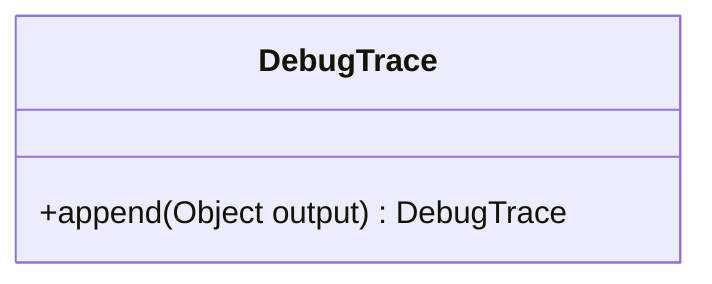

---
aliases:
  - DebugTrace
tags:
  - java/class
  - module/forge-core
  - pkg/forge/util
fqn: forge.util.DebugTrace
package: forge.util
module: forge-core
kind: Class
---

# DebugTrace

**Package:** `forge.util` &nbsp; **Module:** `forge-core` &nbsp; **Kind:** Class



## Source
`forge-core/src/main/java/forge/util/DebugTrace.java`

```java
package forge.util;

//simple class to simulate a StringBuilder but simply output to the console
public class DebugTrace {
    public DebugTrace append(Object output) {
        //System.out.print(output); //Uncomment to show trace output
        return this;
    }
}
```
