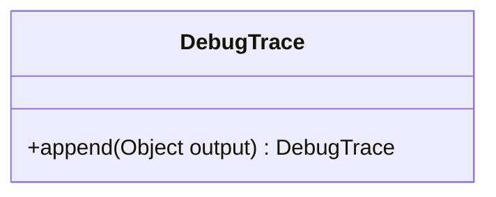

---
aliases:
  - DebugTrace
tags:
  - java/class
  - module/forge-core
  - pkg/forge/util
fqn: forge.util.DebugTrace
package: forge.util
module: forge-core
kind: Class
---

# DebugTrace

**Package:** `forge.util` &nbsp; **Module:** `forge-core` &nbsp; **Kind:** Class



## Design Description

DebugTrace is a deliberately inert, no-op stand-in for a `StringBuilder`-style trace accumulator within the `forge.util` package of the forge-core module. Its single `append(Object)` method accepts arbitrary output yet discards it, returning `this` to preserve the fluent, chainable call style callers expect from a builder.

The class exists to let trace-emitting code throughout the engine remain in place at zero runtime cost: the actual `System.out.print` is commented out and can be re-enabled for debugging. By mirroring a familiar builder contract while doing nothing, it acts as a lightweight toggle that strips diagnostic console output from production paths without requiring callers to be modified or guarded by conditionals.

## Source
`forge-core/src/main/java/forge/util/DebugTrace.java`

```java
package forge.util;

//simple class to simulate a StringBuilder but simply output to the console
public class DebugTrace {
    public DebugTrace append(Object output) {
        //System.out.print(output); //Uncomment to show trace output
        return this;
    }
}
```

## Python
`forge/util/DebugTrace.py`

```python
package = "forge.util"


#simple class to simulate a StringBuilder but simply output to the console
class DebugTrace:
    def append(self, output) -> "DebugTrace":
        #print(output)  #Uncomment to show trace output
        return self
```
