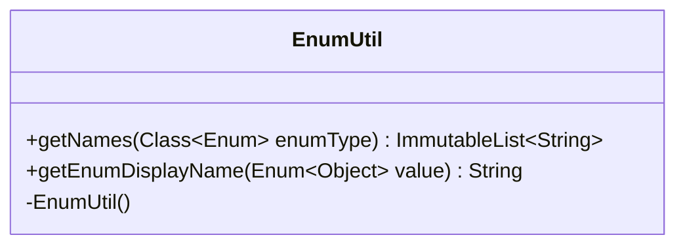

---
aliases:
  - EnumUtil
tags:
  - java/class
  - module/forge-core
  - pkg/forge/util
fqn: forge.util.EnumUtil
package: forge.util
module: forge-core
kind: Class
---

# EnumUtil

**Package:** `forge.util` &nbsp; **Module:** `forge-core` &nbsp; **Kind:** Class



## Design Description

EnumUtil is a final, non-instantiable utility class in the `forge.util` package of the forge-core module, providing static helpers for working with Java enum types. It exposes two stateless operations: `getNames`, which collects an enum type's constant names into a Guava `ImmutableList<String>`, and `getEnumDisplayName`, which converts an `ALL_CAPS` enum constant name into a human-readable display string by replacing underscores with spaces and lowercasing all but the leading letter of each word.

As a stateless helper, it has no supertype beyond `Object` and declares a private constructor to enforce its utility-class role. Its primary collaborators are the JDK `Enum` API and Guava's `ImmutableList`, the latter chosen to return immutable, defensively-shareable results that reflect the engine's preference for unmodifiable collections.

## Source
`forge-core/src/main/java/forge/util/EnumUtil.java`

```java
package forge.util;

import com.google.common.collect.ImmutableList;

public final class EnumUtil {

    private EnumUtil() {
    }

    /**
     * Get the names of the values of an enum type.
     * 
     * @param enumType
     *            an {@link Enum} type.
     * @return an {@link ImmutableList} of strings representing the names of the
     *         enum's values.
     */
    public static ImmutableList<String> getNames(final Class<? extends Enum<?>> enumType) {
        final ImmutableList.Builder<String> builder = ImmutableList.builder();
        for (final Enum<?> type : enumType.getEnumConstants()) {
            builder.add(type.name());
        }
        return builder.build();
    }

    public static String getEnumDisplayName(Enum<?> value) {
        boolean uppercase = true;
        String name = value.name();
        StringBuilder builder = new StringBuilder();
        for (int i = 0; i < name.length(); i++) {
            char ch = name.charAt(i);
            if (ch == '_') {
                builder.append(' ');
                uppercase = true;
            }
            else if (uppercase) {
                builder.append(ch); //assume enum name is ALL_CAPS format
                uppercase = false;
            }
            else {
                builder.append(Character.toLowerCase(ch));
            }
        }
        return builder.toString();
    }
}
```

## Python
`forge/util/EnumUtil.py`

```python
from forge.util.ImmutableList import ImmutableList


class EnumUtil:

    def __init__(self):
        pass

    @staticmethod
    def getNames(enumType):
        """
        Get the names of the values of an enum type.

        :param enumType: an Enum type.
        :return: an ImmutableList of strings representing the names of the
                 enum's values.
        """
        builder = ImmutableList.builder()
        for type in enumType.getEnumConstants():
            builder.add(type.name())
        return builder.build()

    @staticmethod
    def getEnumDisplayName(value):
        uppercase = True
        name = value.name()
        builder = []
        for i in range(len(name)):
            ch = name[i]
            if ch == '_':
                builder.append(' ')
                uppercase = True
            elif uppercase:
                builder.append(ch)  # assume enum name is ALL_CAPS format
                uppercase = False
            else:
                builder.append(ch.lower())
        return ''.join(builder)
```
