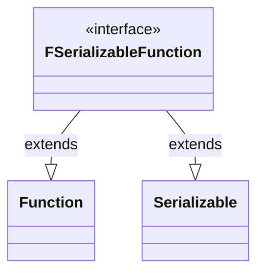

---
aliases:
  - FSerializableFunction
tags:
  - java/interface
  - module/forge-core
  - pkg/forge/util
fqn: forge.util.FSerializableFunction
package: forge.util
module: forge-core
kind: Interface
---

# FSerializableFunction

**Package:** `forge.util`   **Module:** `forge-core`   **Kind:** Interface



## Design Description

The FSerializableFunction interface defines a serializable variant of the standard `java.util.function.Function`, marrying functional transformation semantics with Java serialization. By extending both `Function<T, V>` and `Serializable`, it lets a function that maps an input of type `T` to a result of type `V` be persisted or transmitted across process boundaries—capabilities the JDK's `Function` lacks on its own.

As a marker-style composite interface, it introduces no methods of its own, instead inheriting `apply` from `Function` and the serialization contract from `Serializable`. The deliberate design intent is to constrain lambda expressions used as functions to be serializable at compile time, enabling Forge to store or send transformation logic—such as in saved game state or network messaging—wherever a plain `Function` would not survive serialization.

## Source
`forge-core/src/main/java/forge/util/FSerializableFunction.java`

```java
package forge.util;

import java.io.Serializable;
import java.util.function.Function;

public interface FSerializableFunction<T, V> extends Function<T, V>, Serializable {

}
```

## Python
`forge/util/FSerializableFunction.py`

```python
from forge.util.Function import Function
from forge.util.Serializable import Serializable


class FSerializableFunction(Function, Serializable):
    pass
```
