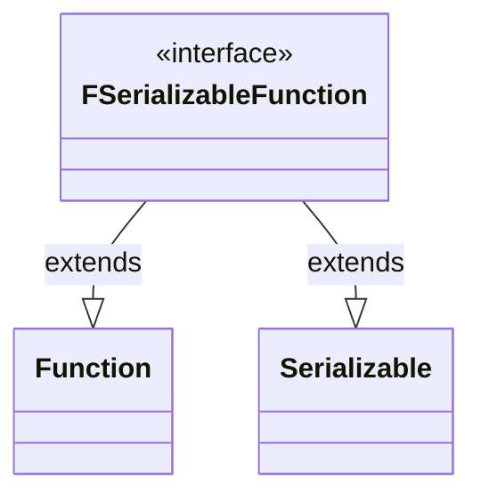

---
aliases:
  - FSerializableFunction
tags:
  - java/interface
  - module/forge-core
  - pkg/forge/util
fqn: forge.util.FSerializableFunction
package: forge.util
module: forge-core
kind: Interface
---

# FSerializableFunction

**Package:** `forge.util` &nbsp; **Module:** `forge-core` &nbsp; **Kind:** Interface



## Source
`forge-core/src/main/java/forge/util/FSerializableFunction.java`

```java
package forge.util;

import java.io.Serializable;
import java.util.function.Function;

public interface FSerializableFunction<T, V> extends Function<T, V>, Serializable {

}
```
