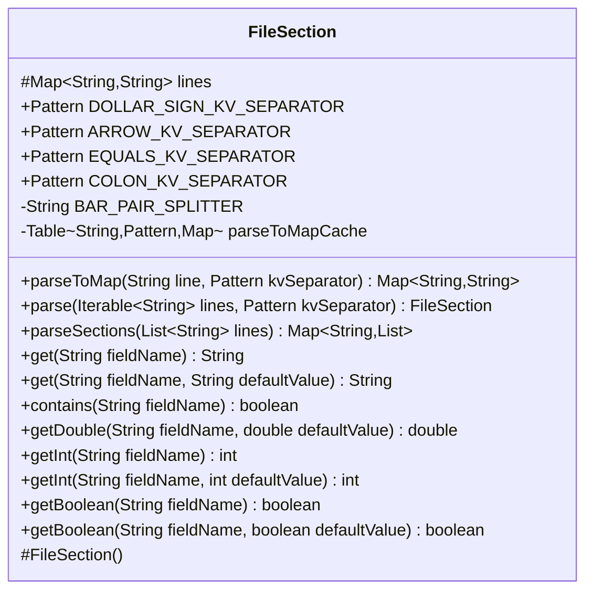

---
aliases:
  - FileSection
tags:
  - java/class
  - module/forge-core
  - pkg/forge/util
fqn: forge.util.FileSection
package: forge.util
module: forge-core
kind: Class
---

# FileSection

**Package:** `forge.util` &nbsp; **Module:** `forge-core` &nbsp; **Kind:** Class



## Design Description

FileSection is a `forge-core` utility that parses configuration-style text into key/value data and named sections. Its core responsibility is splitting bar-delimited lines into trimmed key/value pairs against a configurable separator (`$`, `->`, `=`, or `:`, exposed as reusable `Pattern` constants), storing them in a case-insensitive `TreeMap`, and exposing typed accessors (`getInt`, `getDouble`, `getBoolean`, `get`) with default-value fallbacks that swallow parse errors. The static `parseSections` extracts `[section]` blocks into an order-preserving `LinkedHashMap`, skipping comments.

As a standalone base class with only a protected constructor, instances are created exclusively through the static `parse` factory, while `parseToMap` serves as a stateless helper. It collaborates with Guava's `Table` to cache `parseToMap` results as unmodifiable maps keyed by line and separator, reflecting design intent toward immutability and avoiding repeated parsing of frequently encountered lines.

## Source
`forge-core/src/main/java/forge/util/FileSection.java`

```java
/*
 * Forge: Play Magic: the Gathering.
 * Copyright (C) 2011  Forge Team
 *
 * This program is free software: you can redistribute it and/or modify
 * it under the terms of the GNU General Public License as published by
 * the Free Software Foundation, either version 3 of the License, or
 * (at your option) any later version.
 * 
 * This program is distributed in the hope that it will be useful,
 * but WITHOUT ANY WARRANTY; without even the implied warranty of
 * MERCHANTABILITY or FITNESS FOR A PARTICULAR PURPOSE.  See the
 * GNU General Public License for more details.
 * 
 * You should have received a copy of the GNU General Public License
 * along with this program.  If not, see <http://www.gnu.org/licenses/>.
 */
package forge.util;

import com.google.common.collect.HashBasedTable;
import com.google.common.collect.Table;
import org.apache.commons.lang3.StringUtils;

import java.text.NumberFormat;
import java.text.ParseException;
import java.util.*;
import java.util.regex.Pattern;

/**
 * Parse text file to extract [sections] and key/value data.
 * Store the result in a HashMap
 */
public class FileSection {

    /** The lines. */
    protected final Map<String, String> lines;

    /**
     * Instantiates a new file section.
     */
    protected FileSection() {
        lines = new TreeMap<>(String.CASE_INSENSITIVE_ORDER);
    }

    public static final Pattern DOLLAR_SIGN_KV_SEPARATOR = Pattern.compile(Pattern.quote("$"));
    public static final Pattern ARROW_KV_SEPARATOR = Pattern.compile(Pattern.quote("->"));
    public static final Pattern EQUALS_KV_SEPARATOR = Pattern.compile(Pattern.quote("="));
    public static final Pattern COLON_KV_SEPARATOR = Pattern.compile(Pattern.quote(":"));
    private static final String BAR_PAIR_SPLITTER = Pattern.quote("|");

    private static final Table<String, Pattern, Map<String, String>> parseToMapCache = HashBasedTable.create();

    /**
     * Parses the key=value text line and return a HashMap
     *
     * @param line the text line to parse
     * @param kvSeparator the key/value separator
     * @return a HashMap
     */
    public static Map<String, String> parseToMap(final String line, final Pattern kvSeparator) {
        Map<String, String> cached = parseToMapCache.get(line, kvSeparator);
        if (cached != null) {
            return cached;
        }

        Map<String, String> result = new TreeMap<>(String.CASE_INSENSITIVE_ORDER);
        if (!StringUtils.isEmpty(line)) {
            for (final String dd : line.split(BAR_PAIR_SPLITTER)) {
                final String[] v = kvSeparator.split(dd, 2);
                result.put(v[0].trim(), v.length > 1 ? v[1].trim() : "");
            }
        }
        cached = Collections.unmodifiableMap(result);
        parseToMapCache.put(line, kvSeparator, cached);
        return cached;
    }

    /**
     * Parses the key=value text lines and return a HashMap
     *
     * @param lines the text lines to parse
     * @param kvSeparator the key/value separator
     * @return a FileSection Object containing the HashMap
     */
    public static FileSection parse(final Iterable<String> lines, final Pattern kvSeparator) {
        final FileSection result = new FileSection();
        for (final String dd : lines) {
            final String[] v = kvSeparator.split(dd, 2);
            result.lines.put(v[0].trim(), v.length > 1 ? v[1].trim() : "");
        }

        return result;
    }

    /**
     * Parses the sections ([sectionName]) from a list of text line
     *
     * @param lines
     *            the text lines to parse
     * @return a LinkedHashMap containing the sections and text line associated. The order of the sections is preserved
     */
    public static Map<String, List<String>> parseSections(final List<String> lines) {
        final Map<String, List<String>> result = new LinkedHashMap<>();
        String section = null;

        if(null != lines && !lines.isEmpty()){
            for(String l : lines) {
                String line = l.trim();
                if (line.startsWith("#")) continue;
                if (line.startsWith("[") && line.endsWith("]")) {
                    section = line.substring(1, line.length() - 1);
                    if (!result.containsKey(section)) {
                        result.put(section, new ArrayList<>());
                    }
                } else if (null != section && !line.isEmpty()) {
                    result.get(section).add(line);
                }
            }
        }

        return result;
    }

    public String get(final String fieldName) {
        return this.lines.get(fieldName);
    }

    public String get(final String fieldName, final String defaultValue) {
        return lines.containsKey(fieldName) ? this.lines.get(fieldName) : defaultValue;
    }

    public boolean contains(String fieldName) {
        return lines.containsKey(fieldName);
    }

    public double getDouble(final String fieldName, final double defaultValue) {
        final String field = this.get(fieldName);
        if (null == field)  return defaultValue;
        try {
            NumberFormat format = NumberFormat.getInstance(Locale.US);
            Number number = format.parse(field);
            return number.doubleValue();
        } catch (final NumberFormatException | ParseException ex) {
            return defaultValue;
        }
    }

    public int getInt(final String fieldName) {
        return this.getInt(fieldName, 0);
    }
    public int getInt(final String fieldName, final int defaultValue) {
        try {
            return Integer.parseInt(this.get(fieldName));
        } catch (final NumberFormatException ex) {
            return defaultValue;
        }
    }

    public boolean getBoolean(final String fieldName) {
        return this.getBoolean(fieldName, false);
    }
    public boolean getBoolean(final String fieldName, final boolean defaultValue) {
        final String field = this.get(fieldName);
        if (field == null) return defaultValue;
        return "true".equalsIgnoreCase(field);
    }
}
```

## Python
`forge/util/FileSection.py`

```python
from __future__ import annotations

import re
from types import MappingProxyType
from typing import Iterable, List, Map  # noqa: F401

import locale


class _CaseInsensitiveMap(dict):
    """A dict that compares keys case-insensitively, emulating Java's
    TreeMap(String.CASE_INSENSITIVE_ORDER)."""

    @staticmethod
    def _k(key):
        return key.lower() if isinstance(key, str) else key

    def __init__(self):
        super().__init__()
        self._orig = {}

    def __setitem__(self, key, value):
        super().__setitem__(self._k(key), value)
        self._orig[self._k(key)] = key

    def __getitem__(self, key):
        return super().__getitem__(self._k(key))

    def __delitem__(self, key):
        super().__delitem__(self._k(key))
        del self._orig[self._k(key)]

    def __contains__(self, key):
        return super().__contains__(self._k(key))

    def get(self, key, default=None):
        return super().get(self._k(key), default)

    def put(self, key, value):
        self[key] = value

    def containsKey(self, key):
        return self.__contains__(key)


class FileSection:
    """Parse text file to extract [sections] and key/value data.
    Store the result in a HashMap."""

    DOLLAR_SIGN_KV_SEPARATOR = re.compile(re.escape("$"))
    ARROW_KV_SEPARATOR = re.compile(re.escape("->"))
    EQUALS_KV_SEPARATOR = re.compile(re.escape("="))
    COLON_KV_SEPARATOR = re.compile(re.escape(":"))
    _BAR_PAIR_SPLITTER = re.escape("|")

    _parseToMapCache: dict = {}

    def __init__(self):
        # The lines.
        self.lines = _CaseInsensitiveMap()

    @staticmethod
    def parseToMap(line: str, kvSeparator) -> dict[str, str]:
        cached = FileSection._parseToMapCache.get((line, kvSeparator))
        if cached is not None:
            return cached

        result = _CaseInsensitiveMap()
        if line:
            for dd in re.split(FileSection._BAR_PAIR_SPLITTER, line):
                v = kvSeparator.split(dd, 1)
                result.put(v[0].strip(), v[1].strip() if len(v) > 1 else "")
        cached = MappingProxyType(result)
        FileSection._parseToMapCache[(line, kvSeparator)] = cached
        return cached

    @staticmethod
    def parse(lines: Iterable[str], kvSeparator) -> "FileSection":
        result = FileSection()
        for dd in lines:
            v = kvSeparator.split(dd, 1)
            result.lines.put(v[0].strip(), v[1].strip() if len(v) > 1 else "")

        return result

    @staticmethod
    def parseSections(lines: List[str]) -> dict[str, list[str]]:
        result: dict[str, list[str]] = {}
        section = None

        if lines is not None and len(lines) != 0:
            for l in lines:
                line = l.strip()
                if line.startswith("#"):
                    continue
                if line.startswith("[") and line.endswith("]"):
                    section = line[1:len(line) - 1]
                    if section not in result:
                        result[section] = []
                elif section is not None and line != "":
                    result[section].append(line)

        return result

    def get(self, fieldName: str, defaultValue: str = None) -> str:
        if defaultValue is None:
            return self.lines.get(fieldName)
        return self.lines.get(fieldName) if self.lines.containsKey(fieldName) else defaultValue

    def contains(self, fieldName: str) -> bool:
        return self.lines.containsKey(fieldName)

    def getDouble(self, fieldName: str, defaultValue: float) -> float:
        field = self.get(fieldName)
        if field is None:
            return defaultValue
        try:
            saved = locale.setlocale(locale.LC_NUMERIC)
            try:
                locale.setlocale(locale.LC_NUMERIC, "en_US")
                return locale.atof(field)
            finally:
                locale.setlocale(locale.LC_NUMERIC, saved)
        except (ValueError, locale.Error):
            return defaultValue

    def getInt(self, fieldName: str, defaultValue: int = 0) -> int:
        try:
            return int(self.get(fieldName))
        except (ValueError, TypeError):
            return defaultValue

    def getBoolean(self, fieldName: str, defaultValue: bool = False) -> bool:
        field = self.get(fieldName)
        if field is None:
            return defaultValue
        return field.lower() == "true"
```
